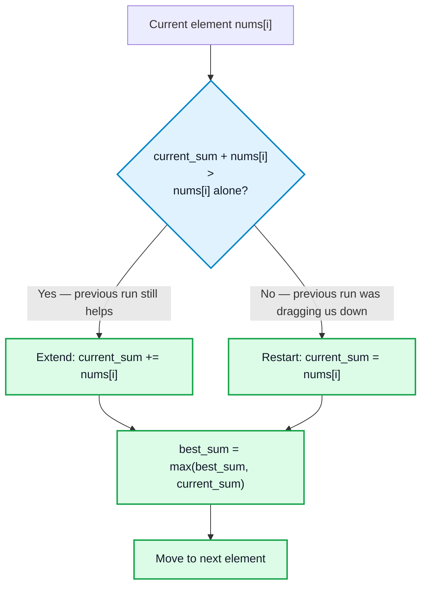

# Kadane's Algorithm

## What problem does it solve?

Given an array of numbers (positive and negative), find the **maximum sum of a contiguous subarray** — a subarray meaning a run of *consecutive* elements (not any arbitrary subset).

Example: `[-2, 1, -3, 4, -1, 2, 1, -5, 4]` → the best contiguous subarray is `[4, -1, 2, 1]`, summing to `6`.

This is the classic **"Maximum Subarray"** problem (LeetCode 53).

## Why does it exist? (the naive way first)

Brute force: try every possible subarray (every pair of start/end indices), sum each, keep the max. There are O(n²) subarrays; summing each naively costs O(n), giving O(n³) — or O(n²) if you maintain a running sum while extending the end pointer. Both are too slow for large arrays.

Kadane's algorithm computes the answer in a **single pass** — O(n) time, O(1) space.

## The core intuition

Walk through the array left to right. At each position, ask one question:

> "Should I extend the subarray ending at the previous position by including this element, or should I abandon it and start a brand-new subarray from this element?"

This is one comparison: if the sum of the subarray ending just before the current element is **negative**, it's only dragging the total down — so restart fresh from the current element. If it's positive (or zero), keep extending, since it's still adding value.

Track `current_sum` = the maximum sum of a subarray *ending exactly at* the current index:

```
current_sum = max(nums[i], current_sum + nums[i])
```

- `nums[i]` alone → "start fresh here."
- `current_sum + nums[i]` → "extend the existing run."

Take whichever is bigger. Separately track `best_sum` = the best `current_sum` seen so far across the whole array — this is the actual answer, since the best subarray might end at any index, not necessarily the last one.




This is the entire algorithm distilled into one repeated decision — every element asks "extend or restart?", and `best_sum` just remembers the best answer seen across all of those decisions.

## Why this works — it's really 1-D DP

Define `dp[i]` = the maximum sum of a subarray that *ends at index i*. Then:

```
dp[i] = max(nums[i], dp[i-1] + nums[i])
```

This has both DP ingredients: **optimal substructure** (the best subarray ending at `i` is built directly from the best one ending at `i-1`) and a clean recurrence relation. Kadane's algorithm is this exact DP, space-optimized — since `dp[i]` only ever depends on `dp[i-1]`, no array is needed, just one rolling variable (`current_sum`). See [[Dynamic Programming]] for the general technique this is a special case of.

The final answer isn't `dp[n-1]` alone (the subarray ending at the *last* index) — it's `max(dp[0], dp[1], ..., dp[n-1])` across all positions, which is what `best_sum` accumulates.

## Step-by-step walkthrough

`[-2, 1, -3, 4, -1, 2, 1, -5, 4]`

| i | nums[i] | current_sum = max(nums[i], current_sum+nums[i]) | best_sum |
|---|---|---|---|
| 0 | -2 | -2 | -2 |
| 1 | 1  | max(1, -2+1=-1) = **1** | 1 |
| 2 | -3 | max(-3, 1-3=-2) = **-2** | 1 |
| 3 | 4  | max(4, -2+4=2) = **4** | 4 |
| 4 | -1 | max(-1, 4-1=3) = **3** | 4 |
| 5 | 2  | max(2, 3+2=5) = **5** | 5 |
| 6 | 1  | max(1, 5+1=6) = **6** | 6 |
| 7 | -5 | max(-5, 6-5=1) = **1** | 6 |
| 8 | 4  | max(4, 1+4=5) = **5** | 6 |

Final answer: `best_sum = 6` ✓ — matches `[4, -1, 2, 1]`.

## Implementation

```cpp
int maxSubArray(vector<int>& nums) {
    int current_sum = nums[0];
    int best_sum = nums[0];

    for (int i = 1; i < nums.size(); i++) {
        current_sum = max(nums[i], current_sum + nums[i]); // extend or restart
        best_sum = max(best_sum, current_sum);              // track global best
    }
    return best_sum;
}
```

## Complexity
- **Time:** O(n) — single pass.
- **Space:** O(1) — two variables, no array.

## When to use it
Whenever a problem asks for the maximum (or minimum, with sign flipped) sum of a **contiguous** subarray or sub-segment. Recognize the pattern from phrases like "maximum sum subarray," "best contiguous run," "max profit over a window of consecutive days."

## When NOT to use it
- If the problem allows **non-contiguous** selection (any subset, not consecutive elements) — that's a different, simpler problem: just sum all positive numbers.
- If the problem needs the subarray with additional constraints (e.g. fixed length, or "at most k negative numbers allowed") — those need a modified sliding-window or DP approach, not vanilla Kadane's.

## Common mistakes / edge cases
- **All-negative arrays**: e.g. `[-3, -1, -2]`. Correct answer is `-1` (least negative single element), **not** `0`. Don't clamp `current_sum` to 0 unless the problem explicitly allows an empty subarray — doing so silently breaks all-negative inputs.
- **Off-by-one initialization**: start both `current_sum` and `best_sum` at `nums[0]`, and loop from index `1` — starting both at `0` breaks the all-negative case.
- **Needing the actual subarray (not just its sum)**: track a `start` index that resets to the current position whenever `current_sum` restarts, and a `best_start`/`best_end` pair updated alongside `best_sum`.
- Don't confuse this with "maximum subsequence sum" (non-contiguous) — different problem entirely.

## Related concepts
- [[Dynamic Programming]] — Kadane's is a space-optimized 1-D DP; understanding it is a good bridge into the general DP mental model.
- [[Recursion]] — background for how DP evolves from plain recursion.
