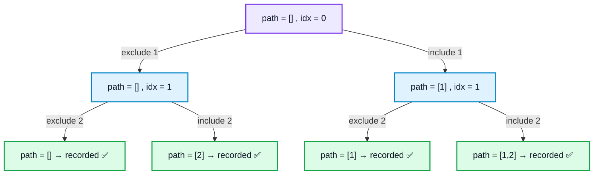

# Backtracking

## What is it?

Backtracking is a refinement of [[Recursion & Backtracking|Recursion]] for exploring **all** possible configurations (subsets, permutations, combinations, paths, placements). At each step you try a choice, recurse deeper with that choice in effect, and then **undo the choice** ("backtrack") before trying the next option. It's brute-force search with early pruning of invalid branches.

## Why does it exist?

Some problems don't ask for a single answer — they ask you to generate or count **every** valid arrangement satisfying a constraint (all subsets, all permutations, all ways to place N queens). Backtracking systematically explores the full space of possibilities while abandoning ("pruning") branches as soon as they're known to be invalid, avoiding wasted work on paths that can't possibly lead to a valid solution.


## 🧭 Visualizing the Exploration Tree

Backtracking's "choose → recurse → undo" structure is easiest to see as a decision tree. Here's the full subsets exploration for `[1, 2]` — every path from root to a leaf is one recorded subset:



Every branch point is one recursive call; every leaf is one `result.push_back(path)`. The "undo" step (`pop_back()`) is what lets the algorithm walk back up from a leaf and try the *other* branch from the same parent — without it, `path` would carry stale elements from an already-explored branch into the next one.

## When to apply backtracking

Need to generate/count **all** valid configurations — permutations, combinations, subsets, N-Queens, Sudoku, path-finding with constraints. Signal words: **"all possible," "every arrangement," "find all solutions," "count the number of ways."**

---

## Pattern 1 — The Backtracking Template

The general skeleton every backtracking problem follows:

```cpp
void backtrack(/* state */, vector<int>& path, vector<vector<int>>& result) {
    if (/* goal reached */) {
        result.push_back(path);   // record a valid solution (copy needed!)
        return;
    }
    for (/* each choice */) {
        path.push_back(choice);        // make choice
        backtrack(/* updated state */, path, result);
        path.pop_back();               // undo choice — THE key backtracking step
    }
}
```

**Critical detail:** `result.push_back(path)` copies `path` by value — necessary because `path` keeps getting mutated after this line runs. Pushing a reference/pointer instead would leave every entry in `result` pointing to the same (eventually empty) vector.

## Pattern 2 — Subsets (Power Set)

Generate all possible subsets of a set. At each element, make a binary choice: include it or exclude it.

```cpp
void subsets(vector<int>& nums, int idx, vector<int>& path, vector<vector<int>>& result) {
    if (idx == nums.size()) {
        result.push_back(path);
        return;
    }
    subsets(nums, idx + 1, path, result);        // choice 1: exclude nums[idx]

    path.push_back(nums[idx]);                    // choice 2: include nums[idx]
    subsets(nums, idx + 1, path, result);
    path.pop_back();
}
```

- Time: O(2ⁿ · n) — 2ⁿ subsets, O(n) to copy each into result. Space: O(n) recursion depth.
- The "include or exclude" binary choice at each element is the same structural idea behind 0/1 Knapsack DP.

## Pattern 3 — Permutations

Generate all orderings of a set of elements.

```cpp
void permute(vector<int>& nums, vector<bool>& used, vector<int>& path, vector<vector<int>>& result) {
    if (path.size() == nums.size()) {
        result.push_back(path);
        return;
    }
    for (int i = 0; i < nums.size(); i++) {
        if (used[i]) continue;
        used[i] = true;
        path.push_back(nums[i]);
        permute(nums, used, path, result);
        path.pop_back();
        used[i] = false;              // undo — backtrack
    }
}
```

- Time: O(n! · n), Space: O(n).
- `used[]` tracks which elements are already in the current path — without it, elements would repeat within a single permutation. Alternative: swap-based in-place permutation (swap elements into position, swap back — no extra `used` array).

## Pattern 4 — Combinations / Combination Sum

Choose k elements from n (order doesn't matter), or find all combinations summing to a target (with or without reuse of elements).

```cpp
void combinationSum(vector<int>& candidates, int target, int idx, vector<int>& path, vector<vector<int>>& result) {
    if (target == 0) { result.push_back(path); return; }
    if (target < 0 || idx == candidates.size()) return;

    path.push_back(candidates[idx]);                              // reuse allowed — stay at idx
    combinationSum(candidates, target - candidates[idx], idx, path, result);
    path.pop_back();

    combinationSum(candidates, target, idx + 1, path, result);    // move on without using candidates[idx]
}
```

- Time: exponential (bounded by branching factor and target size). Space: O(target / min-value) recursion depth.
- **Key difference from permutations:** **not resetting `idx` to 0** avoids counting `[2,3]` and `[3,2]` as different combinations. Staying at `idx` (vs moving to `idx+1`) controls whether elements can be reused — if reuse isn't allowed, both branches move to `idx+1`.

## Pattern 5 — Pruning / Early Termination

Pruning is what makes backtracking tractable instead of pure brute force. Check constraints as early as possible instead of generating a full invalid path and discarding it at the end.

```cpp
// Bad: generate full path, check validity only at the end
// Good: check validity incrementally, stop exploring a branch the moment it's invalid
if (target < 0) return;   // prune immediately, don't keep recursing deeper
```

The difference between a backtracking solution that passes and one that times out is almost always pruning quality — always ask "can I detect this branch is invalid before recursing further?"

## Pattern 6 — N-Queens (Constraint Satisfaction)

Classic constraint-satisfaction backtracking: place N non-attacking queens on an N×N board. Represents the general pattern for grid/board placement problems with row/column/diagonal constraints.

```cpp
bool isSafe(vector<string>& board, int row, int col, int n) {
    for (int i = 0; i < row; i++)
        if (board[i][col] == 'Q') return false;
    for (int i = row - 1, j = col - 1; i >= 0 && j >= 0; i--, j--)
        if (board[i][j] == 'Q') return false;
    for (int i = row - 1, j = col + 1; i >= 0 && j < n; i--, j++)
        if (board[i][j] == 'Q') return false;
    return true;
}

void solveNQueens(vector<string>& board, int row, int n, vector<vector<string>>& result) {
    if (row == n) { result.push_back(board); return; }
    for (int col = 0; col < n; col++) {
        if (isSafe(board, row, col, n)) {
            board[row][col] = 'Q';
            solveNQueens(board, row + 1, n, result);
            board[row][col] = '.';        // backtrack
        }
    }
}
```

- Time: roughly O(n!), heavily pruned by `isSafe`. Space: O(n²) board + O(n) recursion.
- **Optimization:** use hash sets/bitmasks for column and both diagonals (`col`, `row-col`, `row+col`) instead of re-scanning the board in `isSafe`, turning an O(n) check into O(1) — important for larger N.

## Pattern 7 — Sudoku Solver (Grid Backtracking, boolean success signal)

Fill a grid respecting row/column/box constraints — same family as N-Queens but with more complex constraint checking, and a different return-type requirement.

**Intuition:** find an empty cell, try digits 1–9, recurse if valid, undo if the recursive call fails to find a full solution.

- Time: worst-case exponential, but heavily pruned in practice by constraint checking.
- **Key structural difference from Patterns 2–4:** return `true`/`false` from the recursive call (not `void`), so a filled cell that leads to a dead end can be undone and a different digit tried. This "signal success/failure back up the call stack" pattern is essential whenever backtracking needs to know if **a single complete solution exists**, rather than enumerate all solutions.

---

## When to apply — quick reference

- Need ALL subsets of a set → **Subsets (include/exclude)**
- Need ALL orderings of elements → **Permutations (with `used[]` tracking)**
- Need ALL combinations summing to a target, reuse allowed → **Combination sum (stay at idx)**
- Need ALL combinations, no reuse → **Combination sum variant (move to idx+1 on include too)**
- Grid/board placement with row/col/diagonal constraints → **N-Queens style constraint backtracking**
- Need to know if *a* complete valid solution exists (not enumerate all) → **Boolean-returning backtracking (Sudoku style)**
- Any solution-space exploration where invalid branches can be detected early → **prune constraints as early as possible, always**

## Common mistakes

- Pushing `path` (a mutable reference/vector being reused) into `result` without copying — later mutations corrupt already-stored "solutions." Always push a **copy**.
- Forgetting to undo state (`pop_back()`, `used[i] = false`, unmark a grid cell) after the recursive call returns — breaks backtracking's core guarantee that sibling branches explore independently.
- Combination sum: resetting `idx` to 0 when reuse should be prevented — silently turns "combinations" into over-counted "permutations."
- Late validity checking (generate a full invalid path, discard at the end) instead of pruning early — turns tractable backtracking into a timeout.
- Sudoku/N-Queens style problems: using `void` return type when you actually need to stop at the *first* valid solution — should return `bool` and check it after each recursive call to short-circuit further exploration.

## When NOT to use backtracking

- The problem only needs the **count or optimal value**, not the actual configurations, **and** it has overlapping subproblems → [[Dynamic Programming]] is usually far faster (backtracking without memoization re-explores identical states).
- A greedy locally-optimal choice is provably always safe → greedy is simpler and faster than exploring all configurations.

## Related concepts
- [[Recursion & Backtracking|Recursion]] — backtracking is recursion with an explicit "make choice → recurse → undo choice" structure.
- [[Dynamic Programming]] — when backtracking's subproblems overlap and only a count/optimum (not every configuration) is needed, DP is the faster tool.
