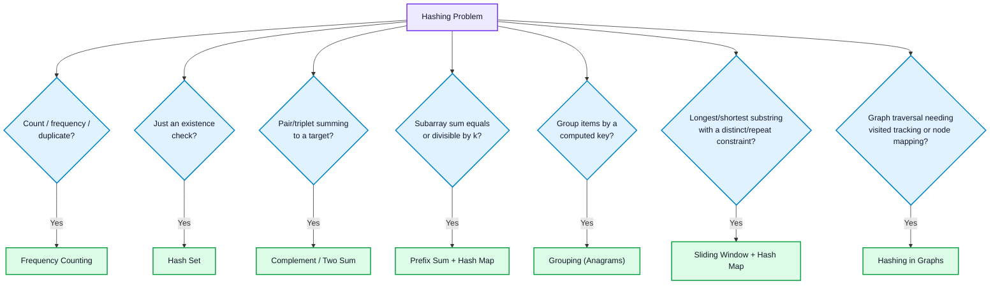

# Hashing

## What is it?

Hashing is a technique that lets you check "does this value exist?", "how many times has it appeared?", or "what's paired with it?" in **O(1) average time**, instead of scanning through data in O(n). It's implemented via **hash maps** (key → value) and **hash sets** (just keys, existence only).

## Why does it exist?

Arrays give O(1) access **by index**, but answering "is X present?" or "how many times does X occur?" requires scanning the whole array — O(n) per query. A hash table trades a bit of space for near-instant lookup **by value**. This single trade — turning O(n) search into O(1) search — is why hashing appears in an enormous fraction of DSA problems, especially ones with an O(n²) brute force that can drop to O(n).

Internally, a hash function converts a key into an array index; collisions (two keys mapping to the same index) are handled via chaining or open addressing. In interviews you rarely need to implement this — just know that lookups are O(1) *average case*, but can degrade to O(n) worst case under heavy collisions (rarely relevant in practice).

## 🧭 Hashing Pattern Decision Flow



## Recognizing the pattern

| If the problem says... | Use... |
|---|---|
| "count of X", "frequency", "duplicate", "majority element" | Frequency Counting |
| "does an element exist", "first unique" | Existence Check (hash set) |
| "pair/triplet that sums to target" | Complement / Two Sum |
| "subarray sum equals/divisible by k" | Prefix Sum + Hash Map |
| "group by...", "anagrams", "same category" | Grouping by Computed Key |
| "longest/shortest substring or subarray with a constraint on distinct/repeated elements" | Sliding Window + Hash Map |
| Graph traversal needing "visited" tracking or node-to-node mapping | Hashing in Graphs |
| Key is a pair/tuple/struct, not a primitive | Custom Hashing |

---

## Pattern 1 — Frequency Counting

Store `value → count` in one pass. Answers questions about how often something occurs.

```cpp
unordered_map<int,int> freq;
for (int x : nums) freq[x]++;
```

**Example — Valid Anagram:** build a frequency map from string A, then decrement while scanning string B. If every count returns to zero, they're anagrams.

## Pattern 2 — Existence Check ("have I seen this before?")

When you don't care about count, just presence, use a hash **set** — cheaper and clearer than a map.

```cpp
unordered_set<int> seen;
for (int x : nums) {
    if (seen.count(x)) return true;  // duplicate found
    seen.insert(x);
}
```

**Example — Contains Duplicate:** exactly the snippet above.

## Pattern 3 — Complement / Two Sum Pattern

**The single most important hashing pattern for interviews.** Instead of checking every pair (O(n²)), store what's been seen and check whether its **complement** (`target - current`) already exists — one O(n) pass.

```cpp
unordered_map<int,int> seenIndex; // value -> index
for (int i = 0; i < nums.size(); i++) {
    int need = target - nums[i];
    if (seenIndex.count(need)) return {seenIndex[need], i};
    seenIndex[nums[i]] = i;
}
```

This generalizes: **3Sum** fixes one number, then runs two-sum on the rest; **4Sum** fixes two.

## Pattern 4 — Prefix Sum + Hash Map (Subarray Sum Problems)

**Key insight:** if `prefixSum[j] - prefixSum[i] = k`, then the subarray strictly between `i` and `j` sums to `k`. So while scanning, store `prefixSum → number of times seen`, and at each step check whether `prefixSum - k` has occurred before.

```cpp
unordered_map<int,int> prefixCount{{0,1}}; // empty prefix counts as sum 0, seen once
int sum = 0, count = 0;
for (int x : nums) {
    sum += x;
    if (prefixCount.count(sum - k)) count += prefixCount[sum - k];
    prefixCount[sum]++;
}
```

**Why `{0,1}` matters:** it accounts for subarrays that start from index 0 (prefix sum of 0 before any elements). Forgetting this base case is the most common bug in this pattern.

**Example — Subarray Sum Equals K, Longest Subarray With Sum 0** (special case: k = 0).

## Pattern 5 — Grouping by a Computed Key

Compute a canonical "signature" per item and bucket items sharing that signature.

```cpp
unordered_map<string, vector<string>> groups;
for (string& s : strs) {
    string key = s;
    sort(key.begin(), key.end());   // canonical form: sorted letters
    groups[key].push_back(s);
}
```

**Example — Group Anagrams:** words with the same sorted-letter signature are anagrams of each other.

## Pattern 6 — Sliding Window + Hash Map

Combines a hash map (frequency inside the *current window*) with two pointers. Expand the window from the right; when a constraint is violated, shrink from the left until valid again.

```cpp
unordered_map<char,int> window;
int left = 0, best = 0;
for (int right = 0; right < s.size(); right++) {
    window[s[right]]++;
    while (/* constraint violated, e.g. window[s[right]] > 1 */) {
        window[s[left]]--;
        left++;
    }
    best = max(best, right - left + 1);
}
```

**Examples — Longest Substring Without Repeating Characters, Longest Substring with At Most K Distinct Characters, Minimum Window Substring.**

## Pattern 7 — Hashing in Graph/Tree Problems

A hash map/set tracks **visited nodes** (avoiding infinite loops on cycles) or maps **original → cloned** nodes.

**Example — Clone Graph:** `unordered_map<Node*, Node*> oldToNew` maps each original node to its clone, so if a node is revisited via a different path, you reuse the existing clone instead of creating a duplicate (which would break the graph structure).

## Pattern 8 — Custom Hashing (Non-Trivial Keys)

C++'s `unordered_map`/`unordered_set` hash primitives (`int`, `string`) out of the box, but **not** `pair<int,int>` or custom structs — you'll get a compile error without a custom hash function.

**Workaround (when bounds are known):** encode the compound key into a single integer.
```cpp
// Hashing a 2D point (x, y) where 0 <= x, y < 100000
long long key = (long long)x * 100000 + y;
unordered_map<long long, int> pointCount;
```

**Proper way (custom hash struct, for general pairs):**
```cpp
struct PairHash {
    size_t operator()(const pair<int,int>& p) const {
        return hash<long long>()(((long long)p.first << 32) ^ p.second);
    }
};
unordered_map<pair<int,int>, int, PairHash> m;
```
Interviewers sometimes specifically probe this — knowing default hashers don't cover compound keys shows real understanding, not memorized patterns.

---

## Common mistakes (across all patterns)

- **Using `map` instead of `unordered_map`** when order doesn't matter — `map` is O(log n) per operation (it's a balanced BST), `unordered_map` is O(1) average. Only use `map` when you need sorted iteration or ordered keys.
- **Off-by-one on the prefix-sum base case** — forgetting `{0, 1}` breaks subarrays starting at index 0 (Pattern 4).
- **Assuming hash lookups are always O(1)** — true on average; worst case (heavy collisions) degrades to O(n). Rarely matters in interviews but worth knowing.
- **Not resetting a hash map between test cases** in a loop — leaks stale state into the next iteration.
- **Reaching for a hash map when a simpler fixed-size array works** — e.g. counting lowercase letters only needs `int freq[26]`, which is faster than a hash map (no hashing overhead, better cache locality).

## When NOT to use hashing

- When the key space is small and known (e.g. only lowercase letters, only digits 0–9) — a plain fixed-size array is faster and simpler than a hash map.
- When you need sorted order of keys — use `map`/`set` (ordered) or sort explicitly instead.
- When two-pointer or sliding window alone (without needing frequency tracking) already solves the problem in O(n) — don't add hashing complexity you don't need.

## Related concepts
- [[Kadane's Algorithm]] — a different O(n) single-pass technique (no hashing), useful contrast for recognizing when hashing is/isn't the right tool.
- [[Dynamic Programming]] — some DP problems use a hash map instead of an array for memoization when the state space is sparse or non-integer.
