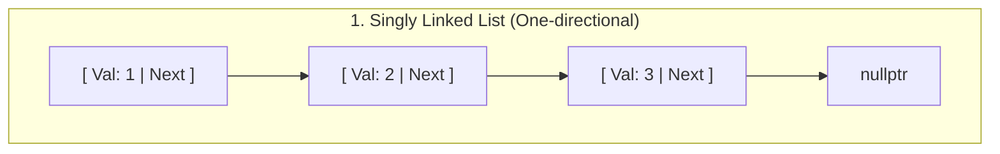
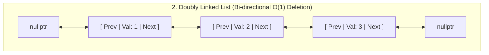
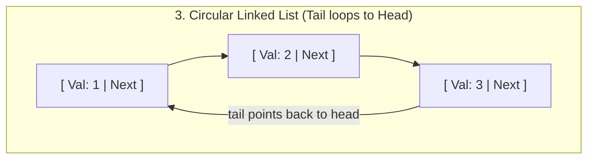
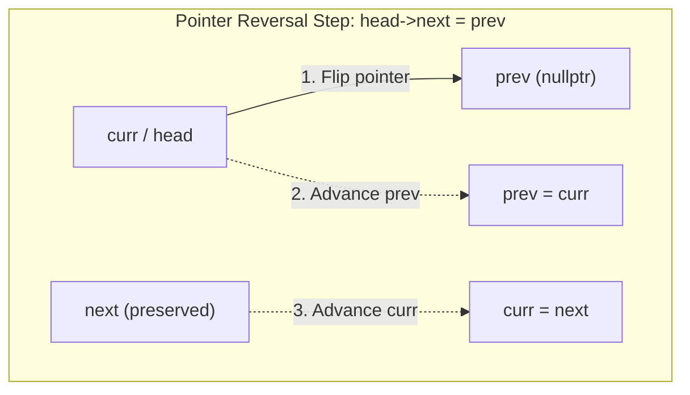
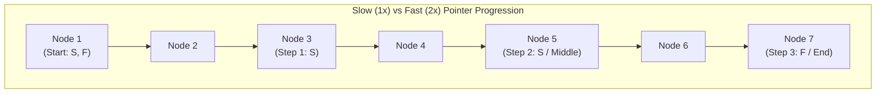
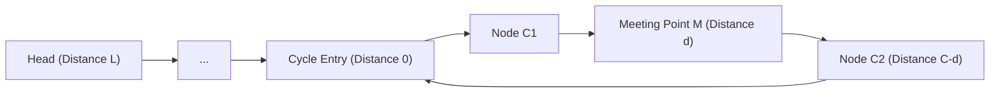
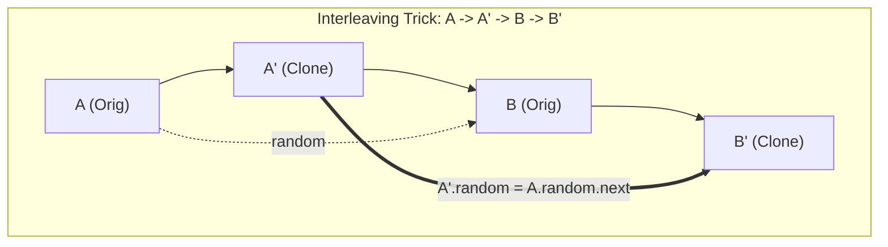
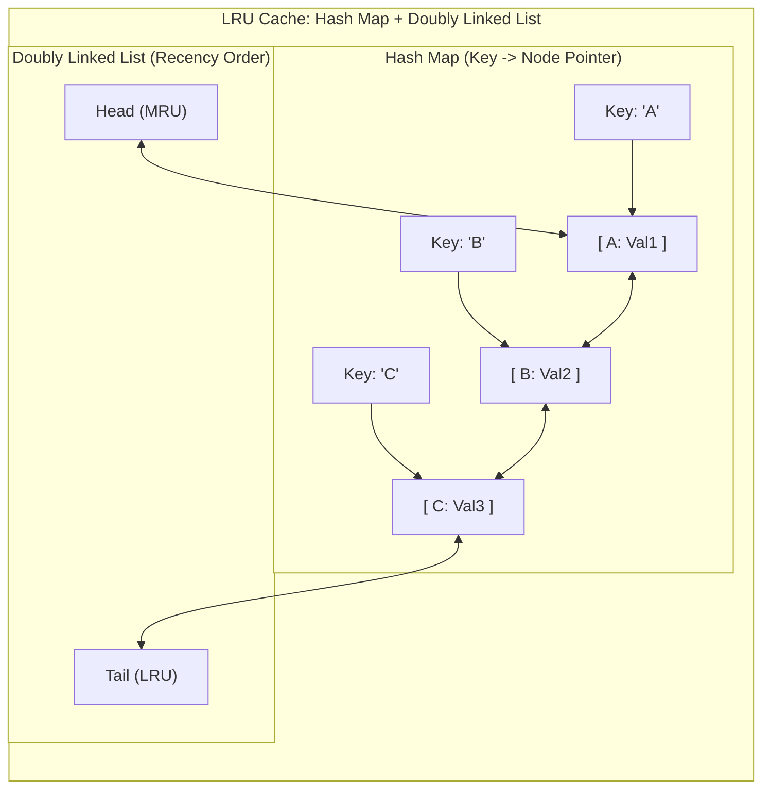

# Linked List

## Concept
A sequence of nodes where each node stores data + a pointer to the next node. Unlike arrays, memory isn't contiguous — no random access (O(n) to reach index i), but O(1) insertion/deletion once you're at the right node (no shifting needed).

**When to apply linked lists over arrays:** frequent insertions/deletions at arbitrary positions, unknown/unbounded size, or when you specifically need O(1) splice/merge operations (no shifting cost).

## Visualizing Node Structures & Types







## Node structure
```cpp
struct Node {
    int val;
    Node* next;
    Node(int x) : val(x), next(nullptr) {}
};
struct DNode {           // doubly linked list
    int val;
    DNode *next, *prev;
    DNode(int x) : val(x), next(nullptr), prev(nullptr) {}
};
```

## Types
- **Singly linked list:** each node points only forward. Traversal one-directional.
- **Doubly linked list:** each node has `next` and `prev`. O(1) deletion given only a node pointer (no need to find predecessor), enables backward traversal. Used internally by `std::list`, LRU caches.
- **Circular linked list:** last node points back to head instead of `nullptr`. Used for round-robin scheduling, circular buffers.

---

## Pattern 1: Traversal & Basic Insert/Delete
**When to apply:** foundational — almost every other pattern builds on this.
```cpp
void traverse(Node* head) {
    while (head) { cout << head->val << " "; head = head->next; }
}
Node* insertAtHead(Node* head, int val) {
    Node* newNode = new Node(val);
    newNode->next = head;
    return newNode;               // new head
}
Node* deleteHead(Node* head) {
    if (!head) return nullptr;
    Node* temp = head;
    head = head->next;
    delete temp;
    return head;
}
```
- Time: O(n) traversal, O(1) head insert/delete.
- **Remember:** Always return/update the head pointer after head-modifying operations — the caller's original head reference becomes stale otherwise.

## Pattern 2: Reverse a Linked List
**When to apply:** whenever a problem needs the list processed back-to-front, or as a subroutine (e.g. palindrome check, reverse in groups, add two numbers).



**Iterative** (preferred — O(1) space):
```cpp
Node* reverseList(Node* head) {
    Node* prev = nullptr;
    while (head) {
        Node* next = head->next;
        head->next = prev;
        prev = head;
        head = next;
    }
    return prev;   // new head
}
```
**Recursive** (O(n) space due to call stack — good to know but avoid for huge lists, risk of stack overflow):
```cpp
Node* reverseRecursive(Node* head) {
    if (!head || !head->next) return head;
    Node* newHead = reverseRecursive(head->next);
    head->next->next = head;
    head->next = nullptr;
    return newHead;
}
```
- Time: O(n), Space: O(1) iterative / O(n) recursive.
- **Remember:** In the recursive version, you must set `head->next->next = head` then `head->next = nullptr` — forgetting the second line creates a cycle.

## Pattern 3: Slow-Fast Pointers (Floyd's Algorithm) — Find Middle
**When to apply:** need the middle node in a single pass, without knowing the length upfront (avoids a separate length-counting pass).



```cpp
Node* findMiddle(Node* head) {
    Node* slow = head; Node* fast = head;
    while (fast && fast->next) {
        slow = slow->next;
        fast = fast->next->next;
    }
    return slow;   // middle (2nd middle for even-length list)
}
```
- Time: O(n) single pass, Space: O(1)
- **Remember:** Fast moves 2x speed — when fast reaches the end, slow is at the middle. For even-length lists, this lands on the second middle node (adjust the `while` condition to `fast->next && fast->next->next` if you need the first middle).

## Pattern 4: Cycle Detection (Floyd's Tortoise and Hare)
**When to apply:** need to detect if a list has a cycle, and optionally find where the cycle begins — without extra space (hashset would work too but costs O(n) space).



```cpp
bool hasCycle(Node* head) {
    Node* slow = head; Node* fast = head;
    while (fast && fast->next) {
        slow = slow->next; fast = fast->next->next;
        if (slow == fast) return true;
    }
    return false;
}
Node* detectCycleStart(Node* head) {
    Node* slow = head; Node* fast = head;
    while (fast && fast->next) {
        slow = slow->next; fast = fast->next->next;
        if (slow == fast) {                 // cycle found
            slow = head;
            while (slow != fast) { slow = slow->next; fast = fast->next; }
            return slow;                     // start of cycle
        }
    }
    return nullptr;
}
```
- Time: O(n), Space: O(1)
- **Remember:** Why resetting `slow` to `head` finds the cycle start: the distance from head to cycle start equals the distance from the meeting point to the cycle start (provable via the math of when slow/fast meet) — this is the same core idea as the "find duplicate number" array pattern.

## Pattern 5: Merge Two Sorted Linked Lists
**When to apply:** classic building block for merge sort on linked lists, and standalone "merge k lists" problems (do pairwise or use a heap).
```cpp
Node* mergeTwoLists(Node* l1, Node* l2) {
    Node dummy(0);
    Node* tail = &dummy;
    while (l1 && l2) {
        if (l1->val <= l2->val) { tail->next = l1; l1 = l1->next; }
        else { tail->next = l2; l2 = l2->next; }
        tail = tail->next;
    }
    tail->next = l1 ? l1 : l2;
    return dummy.next;
}
```
- Time: O(n+m), Space: O(1) — pure pointer rewiring.
- **Remember:** The **dummy node** trick avoids special-casing "what if the merged list is empty at the start" — always start with a dummy and return `dummy.next`. Use this trick constantly in linked list problems.

## Pattern 6: Merge Sort on Linked List
**When to apply:** need to sort a linked list — merge sort is preferred over quicksort here because linked lists don't have random access (no O(1) pivot access), and merge sort naturally works with sequential access, achieving O(1) extra space (unlike array merge sort's O(n)).
```cpp
Node* sortList(Node* head) {
    if (!head || !head->next) return head;
    Node* slow = head; Node* fast = head->next;   // find middle
    while (fast && fast->next) { slow = slow->next; fast = fast->next->next; }
    Node* mid = slow->next;
    slow->next = nullptr;                          // split
    return mergeTwoLists(sortList(head), sortList(mid));
}
```
- Time: O(n log n), Space: O(log n) recursion stack.

## Pattern 7: Remove Nth Node From End
**When to apply:** need the nth-from-end node in one pass without first computing list length.
```cpp
Node* removeNthFromEnd(Node* head, int n) {
    Node dummy(0); dummy.next = head;
    Node* fast = &dummy; Node* slow = &dummy;
    for (int i = 0; i < n; i++) fast = fast->next;  // advance fast n steps
    while (fast->next) { fast = fast->next; slow = slow->next; }
    slow->next = slow->next->next;                   // skip the target node
    return dummy.next;
}
```
- Time: O(n) single pass, Space: O(1)
- **Remember:** Gap-of-n technique — advance one pointer n steps first, then move both together; when the lead pointer hits the end, the trailing pointer is exactly n from the end. Same gap-pointer idea generalizes to many "kth from end" problems.

## Pattern 8: Palindrome Check
**When to apply:** need to check if list reads the same forward and backward, ideally in O(1) space.
```cpp
bool isPalindrome(Node* head) {
    Node* mid = findMiddle(head);
    Node* secondHalf = reverseList(mid);
    Node* p1 = head; Node* p2 = secondHalf;
    bool result = true;
    while (p2) {
        if (p1->val != p2->val) { result = false; break; }
        p1 = p1->next; p2 = p2->next;
    }
    reverseList(secondHalf);   // restore original list (good practice)
    return result;
}
```
- Time: O(n), Space: O(1)
- **Remember:** Combines Pattern 3 (find middle) + Pattern 2 (reverse) — this composability is why those two patterns are worth memorizing cold.

## Pattern 9: Reverse in Groups of K
**When to apply:** reverse the list in fixed-size chunks (e.g. K=3: reverse first 3, next 3, ...) — common as a "hard" interview variant of basic reversal.
```cpp
Node* reverseKGroup(Node* head, int k) {
    Node* node = head;
    int count = 0;
    while (node && count < k) { node = node->next; count++; }  // check k nodes exist
    if (count < k) return head;   // fewer than k left, leave as-is

    Node* prev = nullptr; Node* curr = head;
    for (int i = 0; i < k; i++) {
        Node* next = curr->next;
        curr->next = prev;
        prev = curr;
        curr = next;
    }
    head->next = reverseKGroup(curr, k);   // recurse on the rest
    return prev;   // new head of this group
}
```
- Time: O(n), Space: O(n/k) recursion stack.
- **Remember:** Must first verify k nodes actually exist before reversing — otherwise you'd reverse a partial final group, which is usually incorrect per problem spec.

## Pattern 10: Intersection Point of Two Linked Lists
**When to apply:** two lists may merge at some node and share a tail — find that node in O(1) space without knowing list lengths upfront.
```cpp
Node* getIntersectionNode(Node* headA, Node* headB) {
    Node* a = headA; Node* b = headB;
    while (a != b) {
        a = a ? a->next : headB;   // switch to other list's head when reaching end
        b = b ? b->next : headA;
    }
    return a;   // intersection node, or nullptr if none
}
```
- Time: O(m+n), Space: O(1)
- **Remember:** The elegant trick: switching heads equalizes the total distance both pointers travel (m+n for each), so they arrive at the intersection point simultaneously. If no intersection, both hit `nullptr` at the same time and loop exits.

## Pattern 11: Add Two Numbers (represented as linked lists, digit by digit)
**When to apply:** numbers stored digit-by-digit in linked list nodes (common for arbitrary-precision arithmetic without overflow) — need to add them.
```cpp
Node* addTwoNumbers(Node* l1, Node* l2) {
    Node dummy(0); Node* tail = &dummy;
    int carry = 0;
    while (l1 || l2 || carry) {
        int sum = carry + (l1 ? l1->val : 0) + (l2 ? l2->val : 0);
        carry = sum / 10;
        tail->next = new Node(sum % 10);
        tail = tail->next;
        if (l1) l1 = l1->next;
        if (l2) l2 = l2->next;
    }
    return dummy.next;
}
```
- Time: O(max(m,n)), Space: O(max(m,n)) for result.
- **Remember:** Dummy node trick again + don't forget the final leftover carry (e.g. 5+5=10 needs one more node).

## Pattern 12: Clone a Linked List with Random Pointer
**When to apply:** each node has an extra `random` pointer to any node in the list (or null) — need a deep copy.



```cpp
struct RNode { int val; RNode *next, *random; };

RNode* copyRandomList(RNode* head) {
    if (!head) return nullptr;
    // Step 1: interleave cloned nodes: A -> A' -> B -> B' -> ...
    for (RNode* curr = head; curr; curr = curr->next->next) {
        RNode* copy = new RNode{curr->val, curr->next, nullptr};
        curr->next = copy;
    }
    // Step 2: assign random pointers using the interleaving
    for (RNode* curr = head; curr; curr = curr->next->next)
        if (curr->random) curr->next->random = curr->random->next;
    // Step 3: detach interleaved list into original and copy
    RNode* newHead = head->next;
    for (RNode* curr = head; curr; curr = curr->next) {
        RNode* copy = curr->next;
        curr->next = copy->next;
        if (copy->next) copy->next = copy->next->next;
    }
    return newHead;
}
```
- Time: O(n), Space: O(1) extra (excluding output) — beats the naive O(n) hashmap approach on space.
- **Remember:** The interleaving trick (`original -> clone -> original -> clone`) lets you access "the clone of X's random target" as `X->random->next` without a hashmap. This is a distinctive, reusable trick worth remembering by name.

## Pattern 13: Flatten a Multilevel Linked List
**When to apply:** nodes have both `next` and `child` pointers (child points to a separate sub-list) — need to flatten into a single-level list.
**Intuition:** Recursively/iteratively flatten each child list and splice it in place between the current node and its next.
- Time: O(n) total nodes, Space: O(d) recursion depth (d = nesting depth) or O(1) with iterative stack-based approach.
- **Remember:** Use a stack (iterative DFS) to avoid deep recursion on heavily nested lists; push `next` before descending into `child` so `child` is processed first (LIFO order matches desired traversal).

## Pattern 14: LRU Cache (Doubly Linked List + Hash Map)
**When to apply:** need O(1) get/put with eviction of the least-recently-used item — classic combination pattern, not just "linked list" but demonstrates DLL's key strength (O(1) removal from middle).
**Intuition:** DLL keeps items ordered by recency (head = most recent, tail = least recent); hashmap maps key → node pointer for O(1) lookup. On access, unlink node and move to head (O(1) because DLL). On overflow, remove tail.



- Time: O(1) get/put, Space: O(capacity)
- **Remember:** This is why doubly linked lists exist — O(1) removal of an arbitrary known node (no need to find its predecessor, unlike singly linked lists which need O(n) to find the predecessor for removal).

## Pattern 15: Rotate List by K Positions
**When to apply:** rotate the list right (or left) by k positions.
**Intuition:** Find length, make it circular (tail->next = head), find the new tail at position `(length - k % length - 1)`, break the circle there.
```cpp
Node* rotateRight(Node* head, int k) {
    if (!head || !head->next) return head;
    int len = 1;
    Node* tail = head;
    while (tail->next) { tail = tail->next; len++; }
    k %= len;
    if (k == 0) return head;
    tail->next = head;                          // make circular
    Node* newTail = head;
    for (int i = 0; i < len - k - 1; i++) newTail = newTail->next;
    Node* newHead = newTail->next;
    newTail->next = nullptr;                     // break the circle
    return newHead;
}
```
- Time: O(n), Space: O(1)
- **Remember:** `k %= len` first — same overflow-avoidance idea as array rotation.

---

## When to apply — quick reference
- Need middle in one pass → **Slow-fast pointers**
- Detect/locate a cycle → **Floyd's cycle detection**
- Reverse whole list or subroutine for other problems → **Iterative reversal**
- Merge two sorted lists → **Dummy node + two-pointer merge**
- Sort a list → **Merge sort (not quicksort — no random access)**
- Kth-from-end without length pass → **Gap-of-k two pointers**
- Palindrome check in O(1) space → **Find middle + reverse second half**
- Fixed-size chunk reversal → **Reverse in groups of k**
- Two lists sharing a tail → **Switch-heads two pointer**
- Digit-wise arithmetic → **Dummy node + carry propagation**
- Deep copy with extra pointer → **Interleaving trick**
- Nested sub-lists → **Stack-based flattening**
- O(1) LRU eviction → **DLL + hashmap combo**
- Rotate by k → **Circular trick + break point**

## Common mistakes
- Losing the head pointer after in-place modifications — always track/return the (possibly new) head.
- Recursive reversal: forgetting to set `head->next = nullptr`, creating a cycle.
- Off-by-one in slow-fast pointer for middle: first-middle vs second-middle depends on the `while` condition — be explicit about which one the problem wants.
- Not handling edge cases: empty list, single node, k larger than list length (always `k %= len`).
- Forgetting the dummy-node trick and special-casing "empty result list" manually — error-prone compared to always initializing with a dummy.
- Memory leaks: `delete`-ing nodes properly when actually removing them (matters more in production C++ than in interviews, but worth mentioning).
- Cycle detection: applying Floyd's without checking `fast && fast->next` in the loop condition — causes null pointer dereference.

## Related concepts
- [[Arrays]]
- [[Sorting Techniques]]
- [[Binary Search]]
- [[CPP Complete Revision]]
