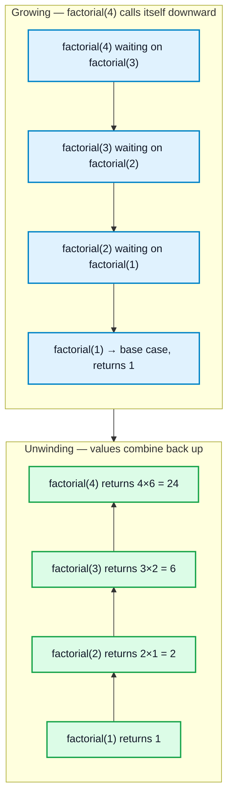
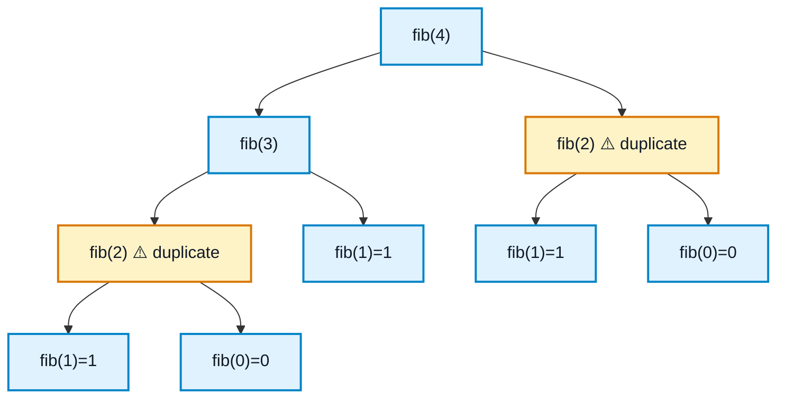
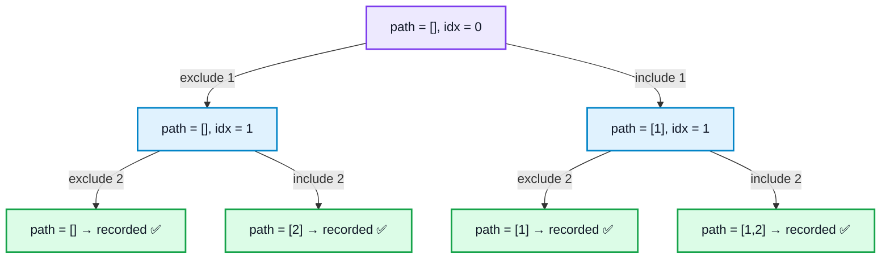
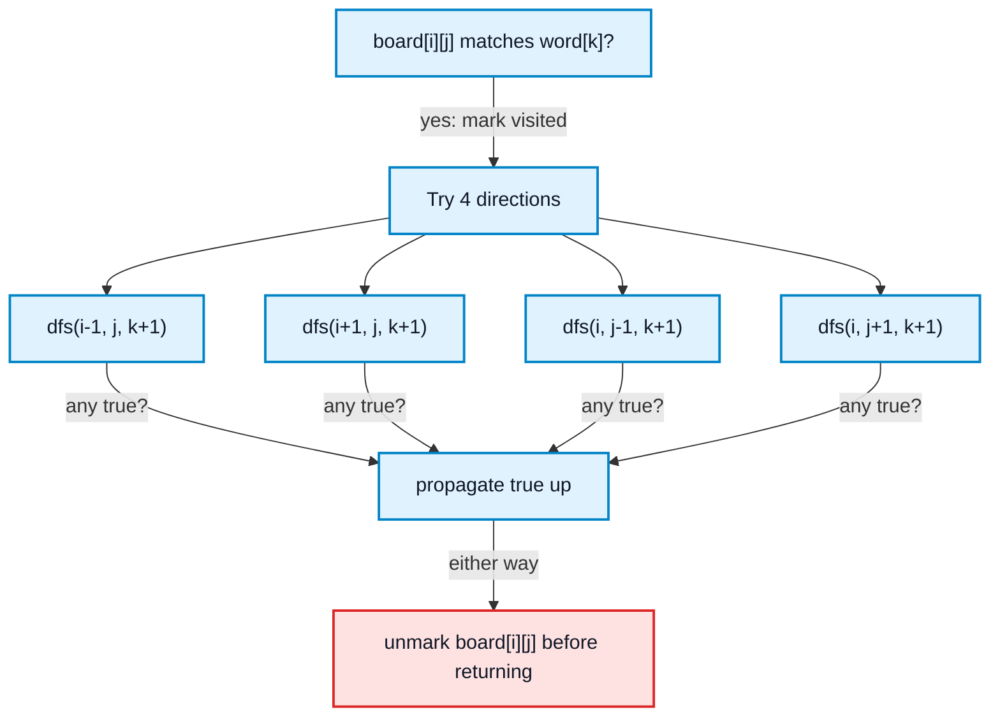

flowchart TD
Start --> Stop
# Recursion & Backtracking

## What is it?

**Recursion** is a function solving a problem by calling **itself** on a smaller version of the same problem, until it hits a case simple enough to answer directly (the **base case**). Every call gets its own stack frame — this is why recursion has O(depth) space cost even with no explicit data structure.

**Backtracking** is recursion's specialization for exploring **every** possible configuration (subsets, permutations, paths, placements). At each step: try a choice → recurse deeper with that choice in effect → **undo the choice** before trying the next one. It's brute force with early pruning of dead branches.

**One-line difference:** plain recursion usually returns *one* answer per call (a sum, a boolean, a height). Backtracking's recursive calls are a `for` loop over *choices*, and the function's job is to mutate shared state, recurse, then undo — so the next choice starts clean.

## Why do they exist?

Many problems are naturally self-similar (a tree is a node + two smaller trees; `n!` is `n × (n-1)!`) — recursion lets you write the solution the way you'd *describe* the problem. Some problems go further and ask for **every** valid arrangement satisfying a constraint (all subsets, all N-Queens placements) — backtracking systematically walks that whole space while abandoning branches the moment they're known invalid.

---

## 🧭 How recursion actually works — two mental models

### Model 1: A stack of waiting frames (linear recursion)

Each call pauses and waits for the one below it. Nothing computes until the base case is hit — then results flow back up ("unwind"), each frame combining its own value with what it got from below.



### Model 2: A branching tree (recursion that calls itself more than once)

The moment a function calls itself **twice** (like `fib(n-1) + fib(n-2)`), you no longer get a single line of stack frames — you get a *tree*. This is the shape almost every backtracking problem takes.



Every ⚠️ node is the **same subproblem recomputed from scratch**. This is *why* memoization exists (Pattern 4 below), and it's the same branching shape backtracking uses to enumerate answers — except backtracking's branches are *choices*, not overlapping subproblems.

**Rule of thumb:** if a function calls itself once → think "stack of frames." If it calls itself in a loop or multiple times → think "tree" and ask whether the branches overlap (→ memoize) or need to each be explored fully (→ backtrack).

---

# PART A — Plain Recursion (returns one answer)

## Pattern 1 — Basic structure

```cpp
int factorial(int n) {
    if (n <= 1) return 1;          // base case
    return n * factorial(n - 1);   // recursive case, shrinks toward base
}
```
**Common mistake:** missing base case, or a recursive case that doesn't shrink → infinite recursion → stack overflow. Always find the base case **first**.

## Pattern 2 — Reduce problem size by 1 (arrays/strings)

"Solve for the first element + recurse on the rest."

```cpp
int sumArray(vector<int>& a, int i) {
    if (i == a.size()) return 0;
    return a[i] + sumArray(a, i + 1);
}
```
Time O(n), Space O(n) call stack. Generalizes directly to [[Linked List]] reversal.

**Reverse a Stack using recursion** (no extra stack/array allowed):
```cpp
void insertAtBottom(stack<int>& st, int x) {
    if (st.empty()) { st.push(x); return; }
    int top = st.top(); st.pop();
    insertAtBottom(st, x);
    st.push(top);
}
void reverseStack(stack<int>& st) {
    if (st.empty()) return;
    int top = st.top(); st.pop();
    reverseStack(st);          // reverse what's below first
    insertAtBottom(st, top);   // then insert this element at the bottom
}
```

**Sort a Stack using recursion** — same skeleton, `insertAtBottom` becomes "insert in sorted position":
```cpp
void insertSorted(stack<int>& st, int x) {
    if (st.empty() || st.top() <= x) { st.push(x); return; }
    int top = st.top(); st.pop();
    insertSorted(st, x);
    st.push(top);
}
void sortStack(stack<int>& st) {
    if (st.empty()) return;
    int top = st.top(); st.pop();
    sortStack(st);
    insertSorted(st, top);
}
```

**Recursive Implementation of atoi()** — recurse over digit characters, carrying the accumulated value:
```cpp
long atoiHelper(string& s, int i, long acc, int sign) {
    if (i == s.size() || !isdigit(s[i])) return acc * sign;
    long next = acc * 10 + (s[i] - '0');
    if (next * sign > INT_MAX) return INT_MAX;
    if (next * sign < INT_MIN) return INT_MIN;
    return atoiHelper(s, i + 1, next, sign);
}
int myAtoi(string s) {
    int i = 0, sign = 1;
    while (i < (int)s.size() && s[i] == ' ') i++;
    if (i < (int)s.size() && (s[i] == '+' || s[i] == '-')) sign = (s[i++] == '-') ? -1 : 1;
    return (int)atoiHelper(s, i, 0, sign);
}
```

## Pattern 3 — Divide and conquer (halve instead of shrink by 1)

**Pow(x, n)** — turns O(n) recursion into O(log n) by splitting in half each call:
```cpp
double power(double x, long long n) {
    if (n == 0) return 1;
    double half = power(x, n / 2);
    if (n % 2 == 0) return half * half;
    return x * half * half;
}
double myPow(double x, int n) {
    long long N = n;
    if (N < 0) { x = 1 / x; N = -N; }   // must cast before negating: INT_MIN has no positive int counterpart
    return power(x, N);
}
```

**Count Good Numbers** — same fast-exponentiation idea, combined with combinatorics (even indices: 5 even-digit choices `{0,2,4,6,8}`; odd indices: 4 prime-digit choices `{2,3,5,7}`):
```cpp
const int MOD = 1e9 + 7;
long long power(long long x, long long n) {
    if (n == 0) return 1;
    long long half = power(x, n / 2) % MOD;
    half = (half * half) % MOD;
    return (n % 2) ? (half * x) % MOD : half;
}
int countGoodNumbers(long long n) {
    long long evenPositions = (n + 1) / 2, oddPositions = n / 2;
    return (power(5, evenPositions) * power(4, oddPositions)) % MOD;
}
```

## Pattern 4 — Memoization (recursion + caching)

Use when a recursive call **recomputes the same subproblem repeatedly** — see the fib(4) tree above; every ⚠️ node becomes an O(1) cache lookup instead.
```cpp
unordered_map<int, long long> memo;
long long fib(int n) {
    if (n <= 1) return n;
    if (memo.count(n)) return memo[n];
    return memo[n] = fib(n - 1) + fib(n - 2);
}
```
O(n) with memo vs O(2ⁿ) without. This is literally top-down DP — see [[Dynamic Programming]].

## Pattern 5 — Recursion on trees (preview)

```cpp
int height(TreeNode* root) {
    if (!root) return 0;
    return 1 + max(height(root->left), height(root->right));
}
```
"A tree is a node + two subtrees" — nearly every tree op is naturally recursive. Full traversal patterns belong in a dedicated Trees note.

---

# PART B — Backtracking (enumerates every valid answer)

**Signal words:** "all possible," "every arrangement," "find all solutions," "count the number of ways."

## The template

```cpp
void backtrack(/* state */, vector<int>& path, vector<vector<int>>& result) {
    if (/* goal reached */) {
        result.push_back(path);   // COPY — path keeps mutating after this
        return;
    }
    for (/* each choice */) {
        path.push_back(choice);         // 1. make the choice
        backtrack(/* updated state */, path, result);   // 2. recurse
        path.pop_back();                // 3. undo — THE backtracking step
    }
}
```
`result.push_back(path)` copies by value. Pushing a reference would leave every stored "solution" pointing at the same, eventually-empty vector.

## 🧭 Visualizing the exploration tree

Full subsets exploration for `[1, 2]` — every root-to-leaf path is one recorded subset:


The "undo" step (`pop_back()`) is what lets the algorithm walk back up from a leaf and try the sibling branch — without it, `path` carries stale elements into the next branch.

## The "take / not-take" subsequence framework (the master pattern)

**This one idea generates most of the patterns below.** At every index, you have exactly two choices: **take** the element into the current subsequence, or **skip** it. Base case: `idx == n`. Whether you *collect* the path, *count* it, or just check *existence* is the only thing that changes.

```cpp
// Generic shape — everything below is a variation of this
void f(vector<int>& a, int idx, /* accumulated state */, /* result */) {
    if (idx == a.size()) { /* handle base case */ return; }
    /* not take */ f(a, idx + 1, ...);
    /* take */     f(a, idx + 1, ...);
}
```

**Count all subsequences with sum K:**
```cpp
int countSubseqSumK(vector<int>& a, int idx, int target) {
    if (idx == a.size()) return target == 0 ? 1 : 0;
    int notTake = countSubseqSumK(a, idx + 1, target);
    int take = (a[idx] <= target) ? countSubseqSumK(a, idx + 1, target - a[idx]) : 0;
    return take + notTake;
}
```

**Check if a subsequence with sum K exists** (short-circuit, boolean signal — same idea as Sudoku's `bool` return below):
```cpp
bool subseqSumKExists(vector<int>& a, int idx, int target) {
    if (idx == a.size()) return target == 0;
    if (subseqSumKExists(a, idx + 1, target)) return true;                          // not take
    if (a[idx] <= target && subseqSumKExists(a, idx + 1, target - a[idx])) return true; // take
    return false;
}
```

**Subsets I** (no duplicates — same take/not-take, but *every* node is a valid answer, not just leaves):
```cpp
void subsets(vector<int>& nums, int idx, vector<int>& path, vector<vector<int>>& result) {
    if (idx == nums.size()) { result.push_back(path); return; }
    subsets(nums, idx + 1, path, result);                 // not take
    path.push_back(nums[idx]);
    subsets(nums, idx + 1, path, result);                 // take
    path.pop_back();
}
```
O(2ⁿ · n) time, O(n) recursion depth. Same "include or exclude" idea underlies 0/1 Knapsack DP.

**Subsets II** (array has duplicates — need unique subsets only): sort first, then at each recursion level skip a duplicate value if it's not the *first* occurrence at that level.
```cpp
void subsetsII(vector<int>& nums, int idx, vector<int>& path, vector<vector<int>>& result) {
    result.push_back(path);
    for (int i = idx; i < (int)nums.size(); i++) {
        if (i > idx && nums[i] == nums[i - 1]) continue;   // skip dup at this level
        path.push_back(nums[i]);
        subsetsII(nums, i + 1, path, result);
        path.pop_back();
    }
}
// call with nums sorted first
```

**Combination Sum I** (reuse elements freely, sums to target):
```cpp
void combinationSum(vector<int>& c, int target, int idx, vector<int>& path, vector<vector<int>>& result) {
    if (target == 0) { result.push_back(path); return; }
    if (target < 0 || idx == (int)c.size()) return;
    path.push_back(c[idx]);
    combinationSum(c, target - c[idx], idx, path, result);   // stay at idx — reuse allowed
    path.pop_back();
    combinationSum(c, target, idx + 1, path, result);        // move on without c[idx]
}
```
**Key lever:** staying at `idx` (vs `idx+1`) is what controls whether reuse is allowed.

**Combination Sum II** (each element used once, array has duplicates, no duplicate combinations):
```cpp
void combinationSum2(vector<int>& c, int target, int idx, vector<int>& path, vector<vector<int>>& result) {
    if (target == 0) { result.push_back(path); return; }
    for (int i = idx; i < (int)c.size() && c[i] <= target; i++) {
        if (i > idx && c[i] == c[i - 1]) continue;    // skip dup at this level
        path.push_back(c[i]);
        combinationSum2(c, target - c[i], i + 1, path, result);   // i+1: no reuse
        path.pop_back();
    }
}
// call with c sorted first
```

**Combination Sum III** (exactly `k` numbers from 1–9 summing to `target`, each used once):
```cpp
void combinationSum3(int k, int target, int idx, vector<int>& path, vector<vector<int>>& result) {
    if ((int)path.size() == k) { if (target == 0) result.push_back(path); return; }
    for (int i = idx; i <= 9 && i <= target; i++) {
        path.push_back(i);
        combinationSum3(k, target - i, i + 1, path, result);
        path.pop_back();
    }
}
```

## Permutations (order matters — different structure from take/not-take)

```cpp
void permute(vector<int>& nums, vector<bool>& used, vector<int>& path, vector<vector<int>>& result) {
    if (path.size() == nums.size()) { result.push_back(path); return; }
    for (int i = 0; i < (int)nums.size(); i++) {
        if (used[i]) continue;
        used[i] = true;
        path.push_back(nums[i]);
        permute(nums, used, path, result);
        path.pop_back();
        used[i] = false;   // undo
    }
}
```
O(n! · n) time. `used[]` prevents repeats within one permutation. (Alternative: swap-based in-place, no extra array.)

## Generate Parentheses

Track how many `(` and `)` are placed; a `)` is only legal while `close < open`.
```cpp
void generate(int open, int close, int n, string& cur, vector<string>& result) {
    if ((int)cur.size() == 2 * n) { result.push_back(cur); return; }
    if (open < n) { cur.push_back('('); generate(open + 1, close, n, cur, result); cur.pop_back(); }
    if (close < open) { cur.push_back(')'); generate(open, close + 1, n, cur, result); cur.pop_back(); }
}
```

## Generate Binary Strings Without Consecutive 1s

Extra state to carry: the **last character placed**, since it constrains the next choice.
```cpp
void generate(int n, char last, string& cur, vector<string>& result) {
    if ((int)cur.size() == n) { result.push_back(cur); return; }
    cur.push_back('0');
    generate(n, '0', cur, result);
    cur.pop_back();
    if (last != '1') {
        cur.push_back('1');
        generate(n, '1', cur, result);
        cur.pop_back();
    }
}
```

## Letter Combinations of a Phone Number

Not a take/not-take binary choice — a `for` loop over *all mapped letters* at the current digit (cartesian product).
```cpp
void combine(string& digits, int idx, string& cur, unordered_map<char,string>& m, vector<string>& result) {
    if (idx == (int)digits.size()) { result.push_back(cur); return; }
    for (char c : m[digits[idx]]) {
        cur.push_back(c);
        combine(digits, idx + 1, cur, m, result);
        cur.pop_back();
    }
}
```

## Palindrome Partitioning

Choice = "where does the next partition end?" — try every possible cut, only recurse into cuts that are palindromes.
```cpp
bool isPalin(string& s, int l, int r) { while (l < r) if (s[l++] != s[r--]) return false; return true; }
void partition(string& s, int idx, vector<string>& path, vector<vector<string>>& result) {
    if (idx == (int)s.size()) { result.push_back(path); return; }
    for (int end = idx; end < (int)s.size(); end++) {
        if (isPalin(s, idx, end)) {
            path.push_back(s.substr(idx, end - idx + 1));
            partition(s, end + 1, path, result);
            path.pop_back();
        }
    }
}
```

## 🧭 Word Search — grid backtracking (mark → recurse → unmark)


The grid *is* the visited-tracker: mark the cell, explore all 4 neighbors, then **always** unmark it on the way back out — even on failure — or a later path can't reuse that cell.

```cpp
bool dfs(vector<vector<char>>& board, string& word, int i, int j, int k) {
    if (k == (int)word.size()) return true;
    if (i < 0 || j < 0 || i >= (int)board.size() || j >= (int)board[0].size() || board[i][j] != word[k]) return false;
    char tmp = board[i][j];
    board[i][j] = '#';   // mark visited
    bool found = dfs(board, word, i + 1, j, k + 1) || dfs(board, word, i - 1, j, k + 1) ||
                 dfs(board, word, i, j + 1, k + 1) || dfs(board, word, i, j - 1, k + 1);
    board[i][j] = tmp;   // undo — critical even when found == true
    return found;
}
```

## Word Break

String segmentation: try every prefix as a "word," recurse on the rest. Memoize on `idx` — it's backtracking with **overlapping subproblems**, so plain recursion times out without a cache.
```cpp
bool wordBreak(string& s, unordered_set<string>& dict, int idx, vector<int>& memo) {
    if (idx == (int)s.size()) return true;
    if (memo[idx] != -1) return memo[idx];
    for (int end = idx + 1; end <= (int)s.size(); end++) {
        if (dict.count(s.substr(idx, end - idx)) && wordBreak(s, dict, end, memo))
            return memo[idx] = true;
    }
    return memo[idx] = false;
}
```

## N-Queens (constraint satisfaction)

Place N non-attacking queens, one per row. The general pattern for board-placement problems with row/column/diagonal constraints.
```cpp
bool isSafe(vector<string>& board, int row, int col, int n) {
    for (int i = 0; i < row; i++) if (board[i][col] == 'Q') return false;
    for (int i = row - 1, j = col - 1; i >= 0 && j >= 0; i--, j--) if (board[i][j] == 'Q') return false;
    for (int i = row - 1, j = col + 1; i >= 0 && j < n; i--, j++) if (board[i][j] == 'Q') return false;
    return true;
}
void solveNQueens(vector<string>& board, int row, int n, vector<vector<string>>& result) {
    if (row == n) { result.push_back(board); return; }
    for (int col = 0; col < n; col++) {
        if (isSafe(board, row, col, n)) {
            board[row][col] = 'Q';
            solveNQueens(board, row + 1, n, result);
            board[row][col] = '.';   // backtrack
        }
    }
}
```
~O(n!), heavily pruned by `isSafe`. **Optimization:** hash sets/bitmasks for column and both diagonals instead of re-scanning — O(1) check instead of O(n).

## Rat in a Maze

Same "choose → recurse → undo" template applied to grid movement instead of inclusion/exclusion — see the dedicated [[Rat in a Maze]] note for the full walkthrough (visited-grid, 4-directional moves, path collection).

## M-Coloring Problem

Assign one of `m` colors to each graph vertex so no edge connects same-colored vertices — same constraint-satisfaction shape as N-Queens, but constraint = adjacency instead of row/col/diagonal.
```cpp
bool isSafeColor(vector<vector<int>>& graph, vector<int>& color, int node, int c, int n) {
    for (int i = 0; i < n; i++) if (graph[node][i] && color[i] == c) return false;
    return true;
}
bool solve(vector<vector<int>>& graph, vector<int>& color, int node, int m, int n) {
    if (node == n) return true;
    for (int c = 1; c <= m; c++) {
        if (isSafeColor(graph, color, node, c, n)) {
            color[node] = c;
            if (solve(graph, color, node + 1, m, n)) return true;
            color[node] = 0;   // backtrack
        }
    }
    return false;
}
```

## Sudoku Solver

Same grid-constraint family as N-Queens, but returns `bool` instead of `void` — needed because we want *the first* complete solution, not every possibility, so a dead end must signal failure back up the call stack to try a different digit at the *previous* cell.
```cpp
bool solveSudoku(vector<vector<char>>& board) {
    for (int i = 0; i < 9; i++) for (int j = 0; j < 9; j++) {
        if (board[i][j] == '.') {
            for (char c = '1'; c <= '9'; c++) {
                if (isValid(board, i, j, c)) {
                    board[i][j] = c;
                    if (solveSudoku(board)) return true;
                    board[i][j] = '.';   // backtrack
                }
            }
            return false;   // no digit worked at this cell → dead end
        }
    }
    return true;   // no empty cells left → solved
}
```

## Expression Add Operators (hard)

Insert `+ - *` between digits of a string to reach a target. Trickiest part: multiplication has higher precedence, so you must track `lastOperand` to "undo and redo" the last term when the next op is `*`.
```cpp
void solve(string& num, long target, int idx, string path, long value, long lastOperand, vector<string>& result) {
    if (idx == (int)num.size()) { if (value == target) result.push_back(path); return; }
    for (int len = 1; idx + len <= (int)num.size(); len++) {
        string part = num.substr(idx, len);
        if (part.size() > 1 && part[0] == '0') break;   // no leading zeros
        long cur = stol(part);
        if (idx == 0) {
            solve(num, target, len, part, cur, cur, result);
        } else {
            solve(num, target, idx + len, path + "+" + part, value + cur, cur, result);
            solve(num, target, idx + len, path + "-" + part, value - cur, -cur, result);
            solve(num, target, idx + len, path + "*" + part, value - lastOperand + lastOperand * cur, lastOperand * cur, result);
        }
    }
}
```

## Pruning — what makes backtracking tractable

Check constraints as early as possible instead of generating a full invalid path and discarding it at the end.
```cpp
if (target < 0) return;   // prune immediately, don't recurse deeper into a doomed branch
```
The gap between a backtracking solution that passes and one that times out is almost always pruning quality.

---

## Quick reference — pattern → trigger

| Trigger in the problem | Pattern |
|---|---|
| Smaller subproblem + combine step | Basic recursion (Part A, 1–2) |
| Halve the problem each call | Divide and conquer (Part A, 3) |
| Same subproblem recomputed repeatedly | Memoization → top-down DP (Part A, 4) |
| Naturally nested structure (trees, lists) | Structural recursion (Part A, 5) |
| ALL subsets / include-exclude over indices | Take/not-take (Subsets I/II) |
| ALL combinations summing to target, reuse OK | Combination Sum (stay at idx) |
| ALL combinations, no reuse, has dupes | Combination Sum II (i+1, skip dup) |
| Exactly k numbers 1–9 summing to target | Combination Sum III |
| Count / check existence only, not enumerate | Return int/bool instead of collecting paths |
| ALL orderings of elements | Permutations (`used[]` tracking) |
| Balanced bracket sequences | Generate Parentheses (open/close counters) |
| Binary strings with an adjacency constraint | Track `last` character as extra state |
| Digit → letters mapping, all combos | Cartesian-product loop (Phone Number) |
| Break string into palindromic pieces | Try every cut point + palindrome check |
| Find word by moving through a grid | Mark/unmark visited cells (Word Search) |
| Segment string into dictionary words | Backtracking + memo on failed indices |
| Board placement, row/col/diagonal constraints | N-Queens style |
| Grid movement, path must avoid revisits | Rat in a Maze style |
| Graph vertex coloring | M-Coloring |
| Fill grid, need first valid solution only | Return `bool`, short-circuit (Sudoku) |
| Build expression to hit a target value | String-building backtracking + operand tracking |

## Common mistakes

- Missing/unreachable base case, or a recursive case that doesn't shrink → infinite recursion → stack overflow.
- Pushing `path` into `result` **without copying** — later mutations corrupt already-stored answers.
- Forgetting to undo state (`pop_back()`, `used[i]=false`, unmark a grid/board cell) — breaks the guarantee that sibling branches explore independently.
- Combination Sum II / Subsets II: forgetting the "skip duplicate at this level" check → duplicate results.
- Late validity checking (build a full invalid path, discard at the end) instead of pruning early → tractable backtracking becomes a timeout.
- Board-fill problems (Sudoku, M-Coloring): using `void` when you need to stop at the *first* solution — should return `bool` and short-circuit.
- Not accounting for recursion's O(depth) space cost — looks O(1) extra space on paper, still O(n) stack space.
- Integer overflow negating bounds near `INT_MIN`/`INT_MAX` in divide-and-conquer (Pow(x,n)).

## When NOT to use backtracking

- Only the **count or optimal value** is needed (not actual configurations) **and** subproblems overlap → [[Dynamic Programming]] is far faster — plain backtracking re-explores identical states.
- A greedy locally-optimal choice is provably always safe → greedy beats exploring everything.

## Related concepts
- [[Dynamic Programming]] — memoized recursion generalized into a full technique (top-down + bottom-up).
- [[Linked List]] — recursive reversal/traversal uses the "reduce by 1" pattern directly.
- [[Rat in a Maze]] — grid-movement backtracking, dedicated walkthrough.
- [[Arrays]], [[Strings]] — most recursive/backtracking patterns operate on these structures.
