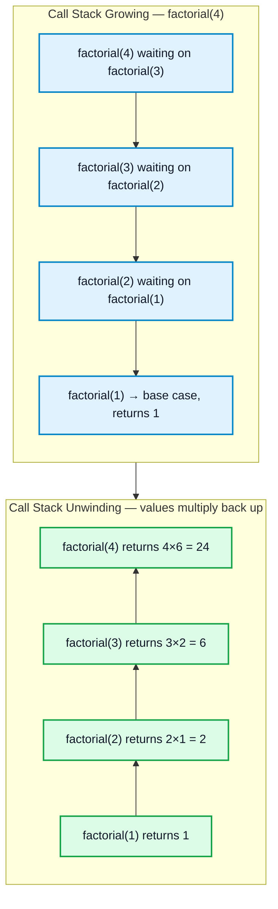

# Recursion

## What is it?

Recursion is when a function solves a problem by calling **itself** on a smaller version of the same problem, until it reaches a case simple enough to answer directly (the **base case**). Each call gets its own stack frame holding its local variables — this is why recursion has O(depth) space cost even when no explicit data structure is used.

## Why does it exist?

Many problems are naturally self-similar: a tree is a node plus two smaller trees; a list is a head plus a smaller list; `n!` is `n × (n-1)!`. Recursion lets you express the solution the same way you'd describe the problem's structure, instead of manually managing loops and state.

## 🧭 Visualizing the Call Stack



Each box in the "Growing" half is a real stack frame sitting in memory, waiting for its recursive call to return — this is the source of recursion's O(depth) space cost. Nothing actually computes until the base case is hit; then results flow back up ("unwind"), each frame combining its own value with what it received from below.

## When to apply recursion

The problem can be broken into a **smaller version of itself** + a way to **combine** the sub-results (divide and conquer), or the problem is naturally defined recursively (trees, nested structures, linked lists).

---

## Pattern 1 — Basic Recursion Structure

Every recursive function needs exactly two things: a **base case** that terminates without further recursion, and a **recursive case** that makes measurable progress toward that base case.

```cpp
int factorial(int n) {
    if (n <= 1) return 1;          // base case
    return n * factorial(n - 1);   // recursive case
}
```

**Common mistake:** forgetting the base case, or writing a recursive case that doesn't actually shrink the problem — both cause infinite recursion → stack overflow. Always identify the base case **first**, before writing the recursive case.

## Pattern 2 — Recursion on Arrays/Strings (reduce problem size by 1)

Problems expressible as "solve for the first element + recurse on the rest": sum of array, reverse a string, check palindrome.

```cpp
int sumArray(vector<int>& a, int i) {
    if (i == a.size()) return 0;             // base case: past the end
    return a[i] + sumArray(a, i + 1);         // combine current + rest
}
```

- Time: O(n), Space: O(n) call stack.
- This pattern directly generalizes to Linked List recursion (see [[Linked List]] reversal) — "process current node/element, recurse on rest, combine."

## Pattern 3 — Divide and Conquer (Fast Exponentiation)

Split the problem in half each call instead of shrinking by 1 — turns O(n) recursion into O(log n).

```cpp
double power(double x, long long n) {
    if (n == 0) return 1;
    double half = power(x, n / 2);
    if (n % 2 == 0) return half * half;
    return x * half * half;             // odd exponent: one extra factor of x
}

double myPow(double x, int n) {
    long long N = n;
    if (N < 0) { x = 1 / x; N = -N; }    // handle negative exponent
    return power(x, N);
}
```

- Time: O(log n) — halving each call. Space: O(log n) recursion depth.
- **Common mistake:** forgetting to cast `n` to `long long` before negating — `INT_MIN` has no positive `int` counterpart, so `-n` overflows if `n` stays `int`.

## Pattern 4 — Memoization (Recursion + Caching)

When a recursive solution **recomputes the same subproblem repeatedly** — classic sign is exponential-time recursion for a problem with only polynomially many distinct subproblem states (Fibonacci, many DP problems before conversion to iterative DP).

```cpp
unordered_map<int,long long> memo;
long long fib(int n) {
    if (n <= 1) return n;
    if (memo.count(n)) return memo[n];
    return memo[n] = fib(n - 1) + fib(n - 2);
}
```

- Time: O(n) with memo vs O(2ⁿ) without. Space: O(n) for memo + recursion stack.
- This is the bridge from plain recursion into [[Dynamic Programming]] — "recursion + memoization" is literally top-down DP.

## Pattern 5 — Recursion on Trees (preview)

Trees are inherently recursive structures — "a tree is a node + two subtrees" — so nearly every tree operation (traversal, height, search) is naturally recursive.

```cpp
int height(TreeNode* root) {
    if (!root) return 0;
    return 1 + max(height(root->left), height(root->right));
}
```

Full tree traversal/recursion patterns belong in a dedicated Trees note (queued next) — flagged here because it's the most common real-world application of "recurse on subproblem, combine results."

---

## When to apply — quick reference

- Smaller-subproblem decomposition with a combine step → **Basic recursion (Pattern 1–2)**
- Splitting in half each call for a log-time solution → **Divide and conquer (Pattern 3)**
- Recursion recomputing the same subproblem repeatedly → **Memoization / top-down DP (Pattern 4)**
- Naturally nested/self-similar structure (trees, nested lists) → **Structural recursion (Pattern 5)**
- Need to generate/enumerate **all** valid configurations under constraints → not this note, see [[Backtracking]]

## Common mistakes

- Missing or unreachable base case → infinite recursion → stack overflow.
- Recursive case that doesn't shrink toward the base case (e.g. calling `f(n)` again instead of `f(n-1)`).
- Deep recursion without memoization on problems with overlapping subproblems (naive Fibonacci) — avoidable exponential blowup.
- Not accounting for recursion's O(depth) space cost — a solution that looks O(1) extra space on paper still uses O(n) stack space if recursive.
- Integer overflow when halving/negating bounds near `INT_MIN`/`INT_MAX` in divide-and-conquer recursion (see Pattern 3).

## Related concepts
- [[Backtracking]] — a specialized form of recursion for exhaustively exploring configurations, with explicit "undo" steps.
- [[Dynamic Programming]] — memoized recursion generalized into a full technique (top-down and bottom-up).
- [[Linked List]] — recursive reversal/traversal directly uses Pattern 2.
- [[Arrays]], [[Strings]] — many recursive patterns operate on these structures.
