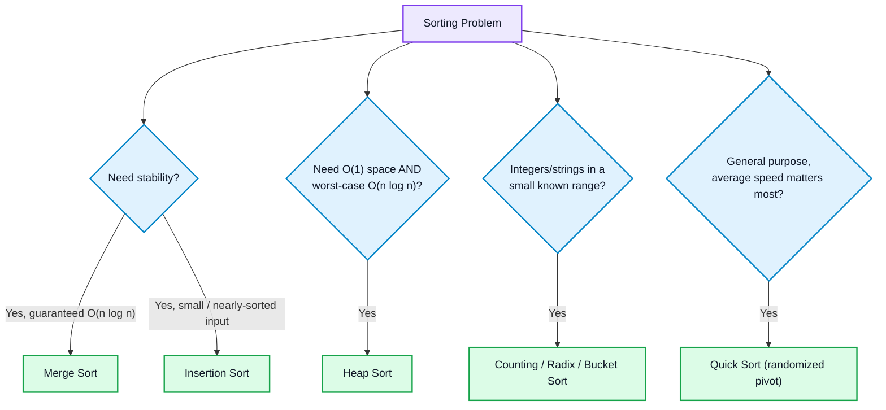

# Sorting Techniques

## Concept
Arranging elements in a defined order (ascending/descending). Every algorithm trades off **time, space, stability, and adaptiveness** (behavior on nearly-sorted data) differently.

**Stable sort** = equal elements keep their relative input order. Matters when sorting objects by one key but needing tie-breaks preserved.

---


## 🧭 Choosing a Sort Algorithm



## 1. Selection Sort
**When to apply:** Swap cost is expensive (e.g. flash memory writes) and minimizing swaps matters more than speed on tiny inputs.
**Intuition:** Find the minimum in the unsorted part, swap it to the front. Repeat.
```cpp
void selectionSort(vector<int>& a) {
    int n = a.size();
    for (int i = 0; i < n - 1; i++) {
        int minIdx = i;
        for (int j = i + 1; j < n; j++)
            if (a[j] < a[minIdx]) minIdx = j;
        swap(a[i], a[minIdx]);
    }
}
```
- Time: O(n²) always. Space: O(1). Stable: **No**.
- **Remember:** Minimum swaps among all sorts (≤ n-1 swaps).

## 2. Bubble Sort
**When to apply:** Rarely in practice — mainly asked to test if you know the adaptive early-exit optimization, or for teaching purposes.
**Intuition:** Repeatedly swap adjacent out-of-order pairs; largest bubbles to the end each pass.
```cpp
void bubbleSort(vector<int>& a) {
    int n = a.size();
    for (int i = 0; i < n - 1; i++) {
        bool swapped = false;
        for (int j = 0; j < n - i - 1; j++)
            if (a[j] > a[j + 1]) { swap(a[j], a[j+1]); swapped = true; }
        if (!swapped) break;
    }
}
```
- Time: O(n²) worst/avg, **O(n) best** (with flag). Space: O(1). Stable: **Yes**.
- **Remember:** Without the `swapped` flag it's never adaptive — always O(n²).

## 3. Insertion Sort
**When to apply:** Small n (< ~20), nearly-sorted data, or online sorting (data arriving one element at a time).
**Intuition:** Like sorting cards in hand — shift larger elements right, insert into correct spot in sorted prefix.
```cpp
void insertionSort(vector<int>& a) {
    int n = a.size();
    for (int i = 1; i < n; i++) {
        int key = a[i], j = i - 1;
        while (j >= 0 && a[j] > key) { a[j+1] = a[j]; j--; }
        a[j + 1] = key;
    }
}
```
- Time: O(n²) worst/avg, **O(n) best** (nearly sorted). Space: O(1). Stable: **Yes**.
- **Remember:** Used as the base case inside hybrid sorts (Timsort, Introsort) below ~16 elements.

## 4. Merge Sort
**When to apply:** Need guaranteed O(n log n) regardless of input, stability required, or sorting a linked list (no random access needed).
**Intuition:** Divide into halves recursively until size 1, merge sorted halves back together.
```cpp
void merge(vector<int>& a, int l, int m, int r) {
    vector<int> temp;
    int i = l, j = m + 1;
    while (i <= m && j <= r) temp.push_back(a[i] <= a[j] ? a[i++] : a[j++]);
    while (i <= m) temp.push_back(a[i++]);
    while (j <= r) temp.push_back(a[j++]);
    for (int k = l; k <= r; k++) a[k] = temp[k - l];
}
void mergeSort(vector<int>& a, int l, int r) {
    if (l >= r) return;
    int m = l + (r - l) / 2;
    mergeSort(a, l, m); mergeSort(a, m + 1, r);
    merge(a, l, m, r);
}
```
- Time: O(n log n) all cases. Space: O(n) auxiliary. Stable: **Yes**.
- **Remember:** Standard tool for counting inversions and external/disk sorting.

## 5. Quick Sort
**When to apply:** General-purpose in-place sort where average-case speed matters more than worst-case guarantee.
**Intuition:** Pick a pivot, partition so smaller go left / larger go right, recurse both sides.
```cpp
int partition(vector<int>& a, int low, int high) {
    int pivot = a[high], i = low - 1;
    for (int j = low; j < high; j++)
        if (a[j] < pivot) swap(a[++i], a[j]);
    swap(a[i + 1], a[high]);
    return i + 1;
}
void quickSort(vector<int>& a, int low, int high) {
    if (low >= high) return;
    int pi = partition(a, low, high);
    quickSort(a, low, pi - 1); quickSort(a, pi + 1, high);
}
```
- Time: O(n log n) avg, **O(n²) worst** (sorted input + fixed pivot). Space: O(log n) avg. Stable: **No**.
- **Remember:** Use random pivot to make worst case practically impossible. Fastest in practice due to cache locality.

## 6. Heap Sort
**When to apply:** Need O(n log n) worst-case guarantee AND O(1) space (memory-constrained systems, embedded).
**Intuition:** Build a max-heap, repeatedly swap root (max) to the end, shrink heap, re-heapify.
```cpp
void heapify(vector<int>& a, int n, int i) {
    int largest = i, l = 2*i+1, r = 2*i+2;
    if (l < n && a[l] > a[largest]) largest = l;
    if (r < n && a[r] > a[largest]) largest = r;
    if (largest != i) { swap(a[i], a[largest]); heapify(a, n, largest); }
}
void heapSort(vector<int>& a) {
    int n = a.size();
    for (int i = n/2 - 1; i >= 0; i--) heapify(a, n, i);
    for (int i = n - 1; i > 0; i--) { swap(a[0], a[i]); heapify(a, i, 0); }
}
```
- Time: O(n log n) all cases. Space: O(1) in-place. Stable: **No**.
- **Remember:** Introsort's fallback when quicksort recursion goes too deep, avoiding O(n²).

## 7. Counting Sort (non-comparison)
**When to apply:** Integers in a small, known range (k = O(n)) — e.g. sorting ages, scores 0-100, grades.
**Intuition:** Count occurrences of each value, place elements directly using cumulative counts.
```cpp
void countingSort(vector<int>& a) {
    int maxVal = *max_element(a.begin(), a.end());
    vector<int> count(maxVal + 1, 0);
    for (int x : a) count[x]++;
    int idx = 0;
    for (int v = 0; v <= maxVal; v++) while (count[v]-- > 0) a[idx++] = v;
}
```
- Time: O(n+k). Space: O(k). Stable: Yes (with cumulative-sum placement).
- **Remember:** Beats O(n log n) comparison bound, but useless if k >> n (e.g. one huge outlier value).

## 8. Radix Sort (non-comparison)
**When to apply:** Fixed-width integers or strings (e.g. phone numbers, IDs) where digit-by-digit sorting is cheap.
**Intuition:** Sort digit by digit (LSD to MSD) using a stable subroutine (counting sort) per digit.
```cpp
void countSortByDigit(vector<int>& a, int exp) {
    vector<int> output(a.size()); int count[10] = {0};
    for (int x : a) count[(x/exp)%10]++;
    for (int i = 1; i < 10; i++) count[i] += count[i-1];
    for (int i = a.size()-1; i >= 0; i--) { int d = (a[i]/exp)%10; output[--count[d]] = a[i]; }
    a = output;
}
void radixSort(vector<int>& a) {
    int mx = *max_element(a.begin(), a.end());
    for (int exp = 1; mx/exp > 0; exp *= 10) countSortByDigit(a, exp);
}
```
- Time: O(d·(n+k)), d = digit count. Space: O(n+k). Stable: Yes (subroutine must be stable).

## 9. Bucket Sort (non-comparison)
**When to apply:** Uniformly distributed floating-point data in a known range [0,1) — e.g. random probabilities.
**Intuition:** Distribute into buckets by value range, sort each bucket (insertion sort), concatenate.
- Time: O(n+k) avg, O(n²) worst (skewed distribution → one overloaded bucket).

---

## Complexity Comparison Table

| Algorithm | Best | Avg | Worst | Space | Stable | In-place |
|---|---|---|---|---|---|---|
| Selection | n² | n² | n² | 1 | No | Yes |
| Bubble | n | n² | n² | 1 | Yes | Yes |
| Insertion | n | n² | n² | 1 | Yes | Yes |
| Merge | n log n | n log n | n log n | n | Yes | No |
| Quick | n log n | n log n | n² | log n | No | Yes |
| Heap | n log n | n log n | n log n | 1 | No | Yes |
| Counting | n+k | n+k | n+k | k | Yes* | No |
| Radix | d(n+k) | d(n+k) | d(n+k) | n+k | Yes | No |

## When to use — quick reference
- Small/nearly-sorted → **Insertion sort**
- Need stability + guaranteed O(n log n) → **Merge sort**
- General-purpose fastest-in-practice → **Quick sort**
- O(n log n) worst-case + O(1) space → **Heap sort**
- Integers/strings, small known range → **Counting / Radix / Bucket**
- `std::sort` in C++ → Introsort (not stable); use `stable_sort` when order of equal elements matters.

## Common mistakes / Interview points
- **O(n log n) comparison-sort lower bound**: no comparison-based sort beats this worst-case (decision-tree proof) — why counting/radix sort (non-comparison) can go faster.
- Assuming `std::sort` is stable — it isn't.
- Quicksort O(n²) on sorted input with fixed pivot — use random/median-of-three pivot.
- Off-by-one in merge sort's `mid` — use `l + (r-l)/2`.
- Bubble sort without `swapped` flag is never adaptive.
- Counting sort space explodes if range k >> n.

## Related concepts
[[Arrays]]
[[Binary Search]]
