# Arrays

## Core Concept

Contiguous block of memory holding same-type elements, accessed via index in O(1). Foundation for almost every other DSA pattern.

## How It Works

- Fixed size in C++ (`int arr[n]`); `vector<int>` is dynamic (capacity doubles on overflow → amortized O(1) `push_back`).
- Random access: O(1) via `base_address + index * element_size`.
- Insert/delete at arbitrary index: O(n) (shifting); at end: O(1) amortized.

---

## 🧭 Array Pattern Decision Flow

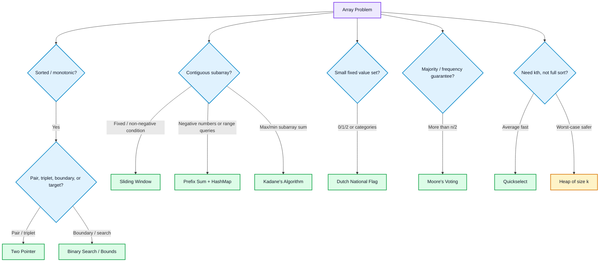

---

## Pattern 1: Two Pointer

> [!info] Difficulty
> Easy–Medium (e.g. Two Sum II = Easy, 3Sum = Medium, Container With Most Water = Medium)

> [!tip] When to apply
> Array is **sorted** (or can be sorted without losing needed info) and you're looking for a pair/triplet matching a target, or comparing from both ends.

> [!note] Intuition
> Two indices move toward/away from each other, exploiting sorted order to avoid nested loops.

```cpp
bool pairSum(vector<int>& a, int target) {
    int l = 0, r = a.size() - 1;
    while (l < r) {
        int sum = a[l] + a[r];
        if (sum == target) return true;
        sum < target ? l++ : r--;
    }
    return false;
}
```

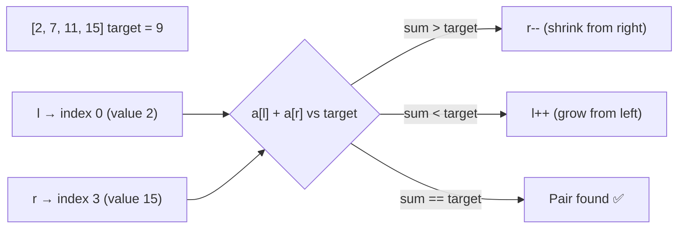

> [!example] Complexity
> O(n), Space: O(1)

> [!warning] Remember
> Requires sorted input or a monotonic property — fails silently on unsorted data.

## Pattern 2: Sliding Window

> [!info] Difficulty
> Medium (e.g. Longest Substring Without Repeating Characters, Minimum Size Subarray Sum)

> [!tip] When to apply
> Problem asks about a **contiguous subarray/substring** with a size constraint ("subarray of size k") or a condition constraint ("longest subarray with sum ≤ k"), and all elements are non-negative (so the sum grows monotonically as the window expands).

> [!note] Intuition
> Maintain window [l, r]; expand r to grow, shrink l when constraint is violated.

```cpp
int maxSumK(vector<int>& a, int k) {   // fixed-size window
    int sum = 0, maxSum = 0;
    for (int i = 0; i < a.size(); i++) {
        sum += a[i];
        if (i >= k - 1) { maxSum = max(maxSum, sum); sum -= a[i - k + 1]; }
    }
    return maxSum;
}
int longestSubarrayWithSumK(vector<int>& a, int k) {  // variable window
    int l = 0, sum = 0, maxLen = 0;
    for (int r = 0; r < a.size(); r++) {
        sum += a[r];
        while (sum > k) sum -= a[l++];
        if (sum == k) maxLen = max(maxLen, r - l + 1);
    }
    return maxLen;
}
```

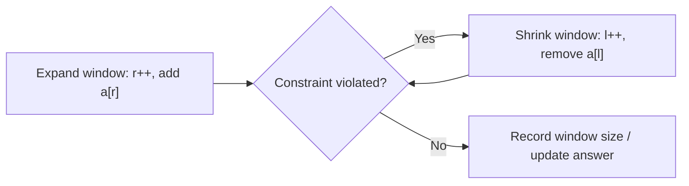

> [!example] Complexity
> O(n) — each pointer moves forward at most n times total.

> [!warning] Remember
> With negative numbers present, sum isn't monotonic — switch to prefix-sum + hashmap instead.

## Pattern 3: Kadane's Algorithm (Max Subarray Sum)

> [!info] Difficulty
> Medium (Maximum Subarray)

> [!tip] When to apply
> Asked for max (or min) sum of a contiguous subarray — the "extend or restart" decision structure.

> [!note] Intuition
> At each index, extend the previous subarray or start fresh — a negative running sum can never help future sums, so drop it.

```cpp
int maxSubArray(vector<int>& a) {
    int maxSum = a[0], curr = a[0];
    for (int i = 1; i < a.size(); i++) {
        curr = max(a[i], curr + a[i]);
        maxSum = max(maxSum, curr);
    }
    return maxSum;
}
```

> [!example] Complexity
> O(n), Space: O(1)

> [!warning] Remember
> Resetting `curr` to 0 instead of `a[i]` breaks all-negative arrays.
- Full walkthrough + decision diagram: [[Kadane's Algorithm]]

## Pattern 4: Prefix Sum

> [!info] Difficulty
> Easy–Medium (Range Sum Query = Easy, Subarray Sum Equals K = Medium)

> [!tip] When to apply
> Multiple range-sum queries on a static (unchanging) array, or subarray-sum problems involving negative numbers where sliding window fails.

> [!note] Intuition
> Precompute cumulative sums once; range sum becomes O(1) subtraction.

```cpp
vector<int> prefix(a.size() + 1, 0);
for (int i = 0; i < a.size(); i++) prefix[i+1] = prefix[i] + a[i];
// sum(l, r) inclusive = prefix[r+1] - prefix[l]
```

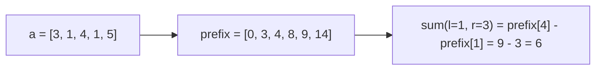

> [!example] Complexity
> O(n), Query: O(1)

> [!warning] Remember
> Basis for "count subarrays with sum = k" via prefix-sum + hashmap (works with negatives, unlike sliding window). See [[Hashing]] Pattern 4.

## Pattern 5: Dutch National Flag (3-way partition)

> [!info] Difficulty
> Medium (Sort Colors)

> [!tip] When to apply
> Array contains only a small fixed set of distinct values (classically 0/1/2) and needs sorting in one pass without extra space.

> [!note] Intuition
> Three pointers (low/mid/high) partition into three zones in a single traversal.

```cpp
void sort012(vector<int>& a) {
    int low = 0, mid = 0, high = a.size() - 1;
    while (mid <= high) {
        if (a[mid] == 0) swap(a[low++], a[mid++]);
        else if (a[mid] == 1) mid++;
        else swap(a[mid], a[high--]);
    }
}
```

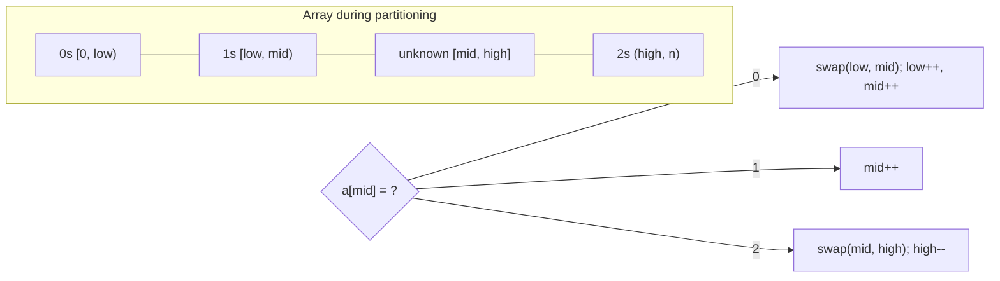

> [!example] Complexity
> O(n), Space: O(1)

> [!warning] Remember
> Don't increment `mid` after the 2-swap — the swapped-in value from `high` isn't classified yet.

## Pattern 6: Moore's Voting Algorithm

> [!info] Difficulty
> Easy (Majority Element); Medium for the "> n/3" variant

> [!tip] When to apply
> Need to find an element that appears **more than n/2 times** (guaranteed majority) in O(n) time, O(1) space.

> [!note] Intuition
> Maintain candidate + count; count 0 → switch candidate. True majority survives cancellation.

```cpp
int majorityElement(vector<int>& a) {
    int count = 0, candidate = 0;
    for (int x : a) {
        if (count == 0) candidate = x;
        count += (x == candidate) ? 1 : -1;
    }
    return candidate;
}
```

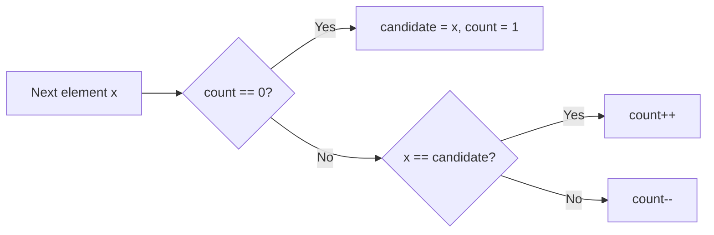

> [!example] Complexity
> O(n), Space: O(1)

> [!warning] Remember
> Only guaranteed correct if majority is guaranteed to exist — otherwise verify with a second pass.

## Pattern 7: Kth Largest/Smallest (Quickselect)

> [!info] Difficulty
> Medium (Kth Largest Element in an Array)

> [!tip] When to apply
> Need only **one** order statistic (kth largest/smallest), not the full sorted array — sorting everything (O(n log n)) is wasteful.

> [!note] Intuition
> Like quicksort, but recurse only into the partition side containing index k.

```cpp
int quickSelect(vector<int>& a, int l, int r, int k) {
    int pivot = a[r], i = l;
    for (int j = l; j < r; j++) if (a[j] < pivot) swap(a[i++], a[j]);
    swap(a[i], a[r]);
    if (i == k) return a[i];
    return i < k ? quickSelect(a, i+1, r, k) : quickSelect(a, l, i-1, k);
}
```

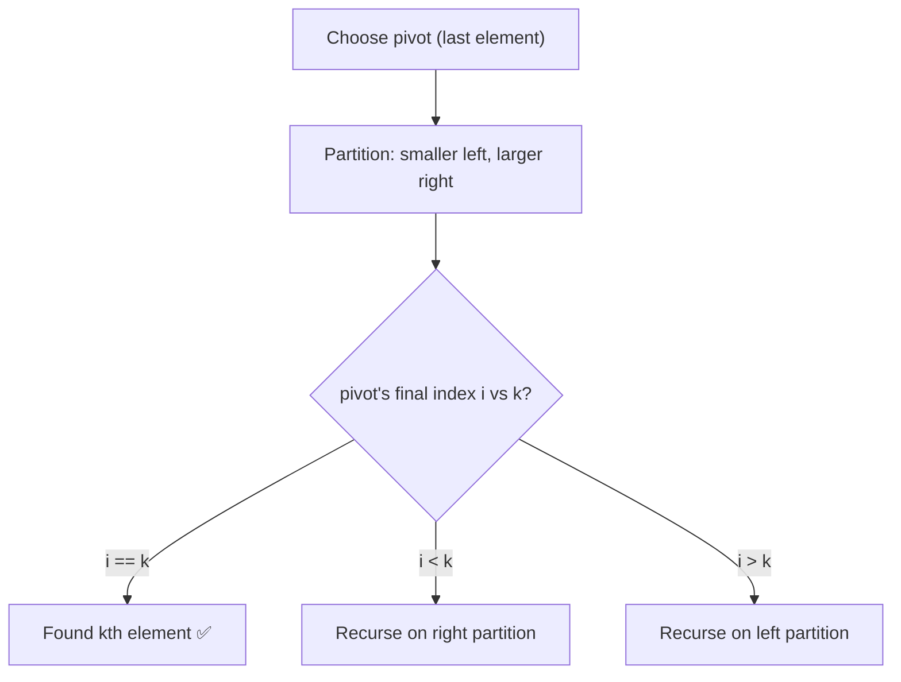

> [!example] Complexity
> O(n) average, O(n²) worst. Space: O(1)

> [!warning] Remember
> Use a max-heap of size k (O(n log k)) instead when a worst-case time guarantee matters more than average speed.

## Pattern 8: Next Permutation

> [!info] Difficulty
> Medium

> [!tip] When to apply
> Need to generate permutations in lexicographic order without generating/storing all of them.

> [!note] Intuition
> Find rightmost ascent, swap with smallest larger element to its right, reverse the suffix.

```cpp
void nextPermutation(vector<int>& a) {
    int n = a.size(), i = n - 2;
    while (i >= 0 && a[i] >= a[i+1]) i--;
    if (i >= 0) {
        int j = n - 1;
        while (a[j] <= a[i]) j--;
        swap(a[i], a[j]);
    }
    reverse(a.begin() + i + 1, a.end());
}
```

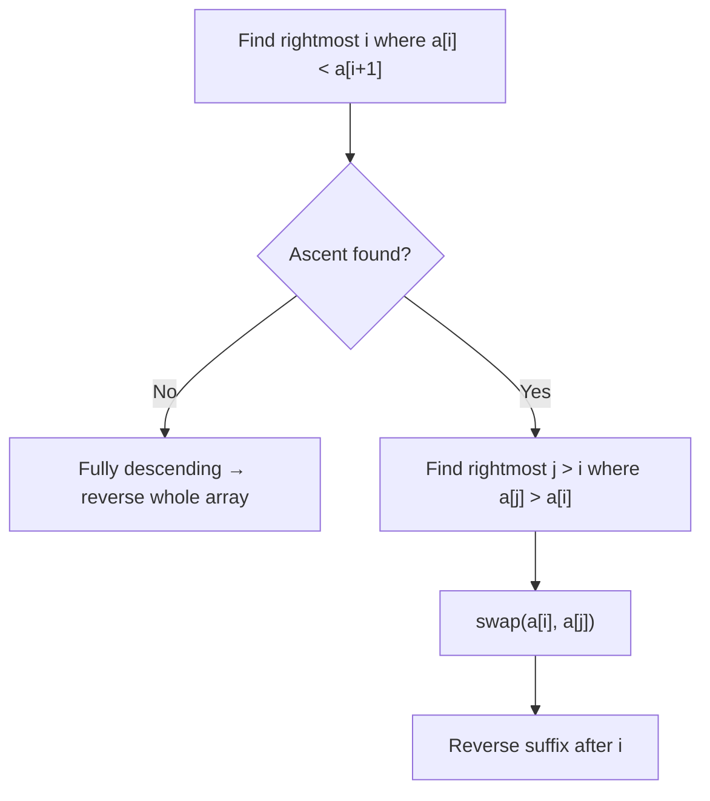

> [!example] Complexity
> O(n), Space: O(1)

> [!warning] Remember
> No ascent found → array fully descending → next permutation is the smallest (handled automatically by the reverse step).

## Pattern 9: Floyd's Cycle Detection (Find Duplicate)

> [!info] Difficulty
> Medium (Find the Duplicate Number)

> [!tip] When to apply
> n+1 integers in range [1,n], find the one duplicate, **without modifying the array or using extra space**.

> [!note] Intuition
> Treat values as pointers (`i → a[i]`); a duplicate creates a cycle, detectable like a linked-list cycle.

```cpp
int findDuplicate(vector<int>& a) {
    int slow = a[0], fast = a[0];
    do { slow = a[slow]; fast = a[a[fast]]; } while (slow != fast);
    slow = a[0];
    while (slow != fast) { slow = a[slow]; fast = a[fast]; }
    return slow;
}
```

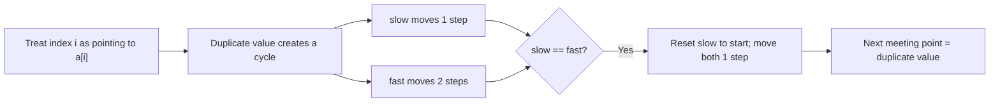

> [!example] Complexity
> O(n), Space: O(1)

> [!warning] Remember
> Only valid under the exact constraint n+1 ints in [1,n] (guarantees a cycle exists). See [[Linked List]] Pattern 4 for the underlying cycle-detection idea.

## Pattern 10: Merge Overlapping Intervals

> [!info] Difficulty
> Medium

> [!tip] When to apply
> Given a list of ranges/intervals, need to combine all overlapping ones into a minimal set.

> [!note] Intuition
> Sort by start; if current start ≤ last merged end, merge; else push as new.

```cpp
vector<vector<int>> merge(vector<vector<int>>& iv) {
    sort(iv.begin(), iv.end());
    vector<vector<int>> res;
    for (auto& in : iv) {
        if (!res.empty() && in[0] <= res.back()[1]) res.back()[1] = max(res.back()[1], in[1]);
        else res.push_back(in);
    }
    return res;
}
```

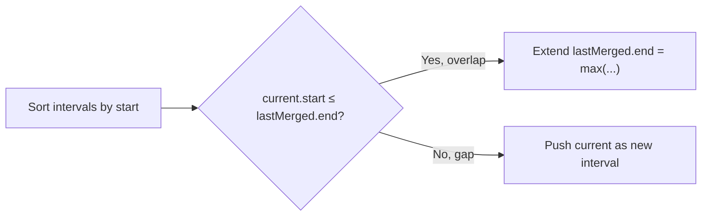

> [!example] Complexity
> O(n log n) sort-dominated. Space: O(n)

> [!warning] Remember
> Sorting by start is essential — without it, overlap checks fail.

## Pattern 11: Rotate Array (in-place, by k)

> [!info] Difficulty
> Medium

> [!tip] When to apply
> Need to rotate an array by k positions using O(1) extra space (not a temp array).

> [!note] Intuition
> Reverse whole array, then reverse each of the two resulting segments.

```cpp
void rotate(vector<int>& a, int k) {
    int n = a.size(); k %= n;
    reverse(a.begin(), a.end());
    reverse(a.begin(), a.begin() + k);
    reverse(a.begin() + k, a.end());
}
```

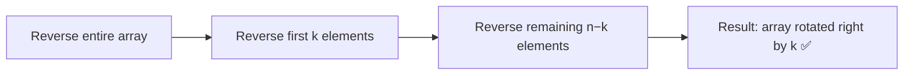

> [!example] Complexity
> O(n), Space: O(1)

> [!warning] Remember
> `k %= n` first — forgetting this wastes work or errors when k > n.

## Pattern 12: Set Matrix Zeroes (O(1) space)

> [!info] Difficulty
> Medium

> [!tip] When to apply
> Need to zero out entire rows/columns based on existing zeros, without allocating new row/col tracking arrays.

> [!note] Intuition
> Use the matrix's own first row/column as marker space.

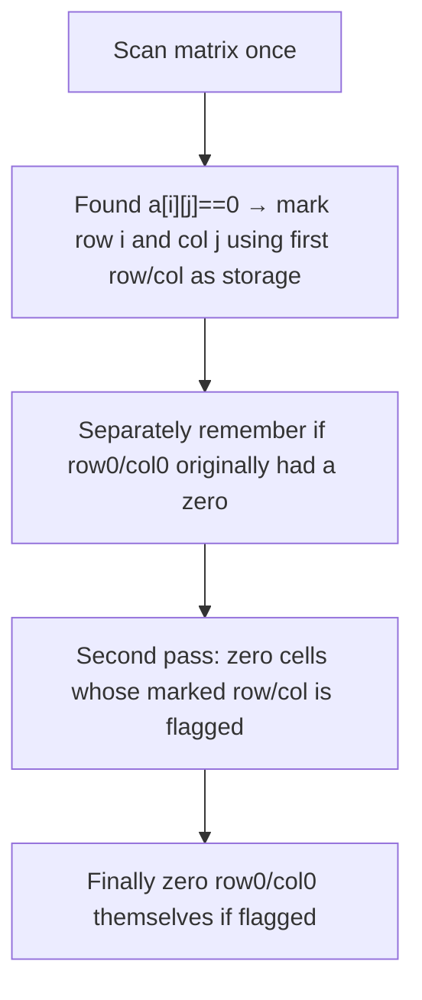

> [!example] Complexity
> O(m·n), Space: O(1)

> [!warning] Remember
> Track whether first row/col originally had a zero separately (since you overwrite them as markers).

---

## When to apply — quick reference

- Sorted array, pair/triplet target → **Two pointer**
- Contiguous subarray/substring, size or sum constraint, non-negative → **Sliding window**
- Max/min contiguous subarray sum → **Kadane's**
- Multiple range-sum queries, or subarray sum with negatives → **Prefix sum**
- Only a few distinct values (0/1/2) to sort → **Dutch flag**
- Element appearing > n/2 times → **Moore's voting**
- Need one order statistic, not full sort → **Quickselect**
- Generate permutations in lexicographic order → **Next permutation**
- Find duplicate, values in [1,n], no extra space → **Floyd's cycle**
- Combine overlapping ranges → **Merge intervals**
- Rotate in-place → **3-reversal trick**
- Zero rows/cols in O(1) space → **Matrix marker trick**

## Common mistakes

- Sliding window: forgetting to shrink window when constraint breaks.
- Kadane's: resetting `curr` to 0 instead of `a[i]`.
- Prefix sum: off-by-one between 0-indexed and 1-indexed prefix array.
- Two pointer: applying to unsorted data where sorted order was a silent precondition.
- Dutch flag: incrementing `mid` after the 2-swap.
- Rotate array: not taking `k % n` first.
- Quickselect: forgetting O(n²) worst case without randomized pivot.

## Related Concepts

[[Sorting Techniques]]
[[Binary Search]]
[[Strings]]
