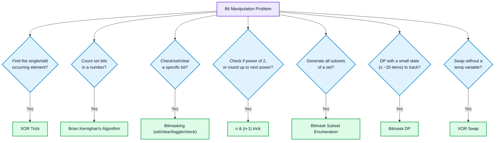
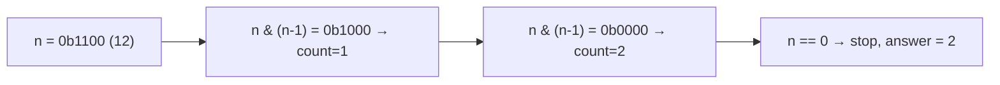
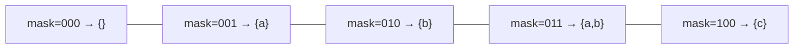

# Bit Manipulation

## Concept
Every integer is stored as a sequence of bits (0s and 1s). Bit manipulation operates directly on these bits using `& | ^ ~ << >>` — often turning an O(n) loop or O(n) extra space into O(1), since CPUs do bitwise operations in a single cycle.

## The Operators
```cpp
a & b   // AND — 1 only if both bits are 1
a | b   // OR  — 1 if either bit is 1
a ^ b   // XOR — 1 if bits differ
~a      // NOT — flips every bit
a << k  // left shift — multiply by 2^k
a >> k  // right shift — divide by 2^k (careful with negative numbers — see mistakes)
```

---

## 🧭 Bit Manipulation Pattern Decision Flow



---

## Pattern 1: Basic Bitmasking (check / set / clear / toggle a bit)
**Difficulty:** Easy
**When to apply:** foundational — needed for almost every other pattern here.
```cpp
bool isSet(int n, int i)   { return (n >> i) & 1; }        // check bit i
int  setBit(int n, int i)  { return n | (1 << i); }         // set bit i to 1
int  clearBit(int n, int i){ return n & ~(1 << i); }         // set bit i to 0
int  toggleBit(int n, int i){ return n ^ (1 << i); }         // flip bit i
```
- Time: O(1), Space: O(1)
- **Remember:** `1 << i` creates a mask with only bit `i` set — this single idea underlies every operation above.

## Pattern 2: Count Set Bits (Brian Kernighan's Algorithm)
**Difficulty:** Easy
**When to apply:** "count number of 1 bits" (popcount), or as a subroutine in bitmask DP.
**Intuition:** `n & (n-1)` clears the **lowest set bit** of `n`. Repeating this exactly (number of set bits) times reduces n to 0 — so counting the iterations gives the popcount, without checking every bit position.
```cpp
int countSetBits(int n) {
    int count = 0;
    while (n) {
        n &= (n - 1);   // clears lowest set bit
        count++;
    }
    return count;
}
// Or: __builtin_popcount(n) in GCC/Clang — O(1) intrinsic, know it exists for interviews
```

- Time: O(k), k = number of set bits (faster than O(32) naive bit-by-bit check when k is small)
- **Remember:** `n & (n-1)` is the single most reused trick in bit manipulation — also the basis for Pattern 4 (power of 2 check).

## Pattern 3: XOR Trick — Find the Single/Unique Element
**Difficulty:** Easy–Medium
**When to apply:** every element appears twice except one (find the unique one), or every element appears twice except two (find both), in O(n) time, O(1) space — no hashmap needed.
**Intuition:** `x ^ x = 0` and `x ^ 0 = x`, and XOR is commutative/associative — so XOR-ing the entire array cancels every paired element, leaving only the unique one.
```cpp
int singleNumber(vector<int>& nums) {
    int result = 0;
    for (int x : nums) result ^= x;
    return result;
}
```
**Extension — two unique elements (each appears once, rest appear twice):**
```cpp
vector<int> singleNumberII(vector<int>& nums) {
    int xorAll = 0;
    for (int x : nums) xorAll ^= x;                    // xorAll = a ^ b (the two uniques)
    int diffBit = xorAll & (-xorAll);                   // isolates lowest set bit where a and b differ
    int a = 0;
    for (int x : nums) if (x & diffBit) a ^= x;         // group by that bit, XOR each group separately
    return {a, xorAll ^ a};                              // b = xorAll ^ a
}
```
- Time: O(n), Space: O(1)
- **Remember:** `x & (-x)` isolates the lowest set bit — works because `-x` is `~x + 1` in two's complement, which flips every bit below the lowest set bit, letting the AND cancel everything except that one bit.

## Pattern 4: Check / Work with Powers of 2
**Difficulty:** Easy
**When to apply:** "is n a power of 2," or need to round up to the next power of 2 (memory allocation, hash table sizing).
```cpp
bool isPowerOfTwo(int n) {
    return n > 0 && (n & (n - 1)) == 0;   // a power of 2 has exactly one set bit
}
int nextPowerOfTwo(int n) {
    int power = 1;
    while (power < n) power <<= 1;
    return power;
}
```
- Time: O(1) for check, O(log n) for next-power. Space: O(1)
- **Remember:** A power of 2 in binary is `1000...0` — subtracting 1 flips everything below that single bit, so ANDing with the original always gives 0 exactly when there's only one set bit.

## Pattern 5: Bitmask Subset Enumeration
**Difficulty:** Medium
**When to apply:** generate all 2ⁿ subsets of a set of n elements — an iterative alternative to [[Backtracking]]'s recursive subset generation, useful when n is small (≤ ~20).
**Intuition:** Every integer from `0` to `2ⁿ - 1`, read in binary, represents exactly one subset — bit `i` set means "include element i."
```cpp
vector<vector<int>> subsetsBitmask(vector<int>& nums) {
    int n = nums.size();
    vector<vector<int>> result;
    for (int mask = 0; mask < (1 << n); mask++) {
        vector<int> subset;
        for (int i = 0; i < n; i++)
            if (mask & (1 << i)) subset.push_back(nums[i]);
        result.push_back(subset);
    }
    return result;
}
```

- Time: O(2ⁿ · n), Space: O(2ⁿ · n) for output
- **Remember:** This is functionally identical to [[Backtracking]]'s take/not-take subsets pattern — bitmasking is just an iterative encoding of the same choice tree, often preferred in competitive programming for being loop-based (no recursion overhead).

## Pattern 6: Bitmask DP (state compression)
**Difficulty:** Medium–Hard
**When to apply:** DP where the state includes "which subset of items has been used/visited" — classic examples: Traveling Salesman Problem, "assign tasks to people," bitmask-based Hamiltonian path problems. Only feasible when n (item count) is small, typically ≤ 20, since the state space is O(2ⁿ).
**Intuition:** Instead of tracking which items are used with an array or set (expensive to hash/compare), encode the used-set as a single integer bitmask — `dp[mask][i]` = "best answer having visited exactly the set `mask`, currently at item `i`."
```cpp
// Traveling Salesman Problem skeleton
int tsp(vector<vector<int>>& dist, int n) {
    vector<vector<int>> dp(1 << n, vector<int>(n, INT_MAX));
    dp[1][0] = 0;   // start at city 0, only city 0 visited
    for (int mask = 1; mask < (1 << n); mask++) {
        for (int u = 0; u < n; u++) {
            if (!(mask & (1 << u)) || dp[mask][u] == INT_MAX) continue;
            for (int v = 0; v < n; v++) {
                if (mask & (1 << v)) continue;              // already visited
                int newMask = mask | (1 << v);
                dp[newMask][v] = min(dp[newMask][v], dp[mask][u] + dist[u][v]);
            }
        }
    }
    int best = INT_MAX;
    for (int u = 1; u < n; u++)
        if (dp[(1 << n) - 1][u] != INT_MAX)
            best = min(best, dp[(1 << n) - 1][u] + dist[u][0]);
    return best;
}
```
- Time: O(2ⁿ · n²), Space: O(2ⁿ · n)
- **Remember:** `(1 << n) - 1` is the "all items visited" full mask — the terminal state almost every bitmask DP checks against. This connects directly to [[Dynamic Programming]]'s state-definition principle: the hard part is deciding what `dp[mask][...]` means, same as any DP.

## Pattern 7: XOR Swap (swap without temp variable)
**Difficulty:** Easy
**When to apply:** rarely needed in practice (register allocation makes a temp variable just as fast on modern CPUs) — mostly asked to test understanding of XOR's self-inverse property.
```cpp
void xorSwap(int& a, int& b) {
    if (&a == &b) return;   // guard: swapping a variable with itself zeroes it out!
    a ^= b;
    b ^= a;
    a ^= b;
}
```
- Time: O(1), Space: O(1) — no extra variable
- **Remember:** **Critical edge case:** if `a` and `b` are the same variable (same memory address), this zeroes it out instead of leaving it unchanged — always guard against `&a == &b` if there's any chance of aliasing.

## Pattern 8: Left/Right Shift Tricks
**Difficulty:** Easy–Medium
**When to apply:** fast multiply/divide by powers of 2, or extracting/building numbers bit-by-bit (e.g. binary-to-decimal conversion, building a number from binary string).
```cpp
int multiplyBy8 = n << 3;      // n * 8
int divideBy4 = n >> 2;         // n / 4 (careful: only exact for non-negative n)

// build an integer from a binary string
int fromBinary(string& s) {
    int result = 0;
    for (char c : s) result = (result << 1) | (c - '0');
    return result;
}
```
- Time: O(1) per shift, O(n) to process a string. Space: O(1)
- **Remember:** Right shift on a **negative** number in C++ is implementation-defined/arithmetic (sign-extends) — `-8 >> 1` gives `-4`, not the same as dividing by 2 and flooring toward zero for all cases. Don't assume `>>` behaves identically to `/` on negative numbers.

---

## When to apply — quick reference
- Check/set/clear/toggle a specific bit → **Basic bitmasking**
- Count 1-bits in a number → **Brian Kernighan's (`n & (n-1)`)**
- Find the element that appears once (rest appear twice) → **XOR trick**
- Check/round to power of 2 → **`n & (n-1) == 0`**
- Generate all subsets, n ≤ ~20 → **Bitmask subset enumeration**
- DP with "which items used" as state, n ≤ ~20 → **Bitmask DP**
- Fast ×2ᵏ / ÷2ᵏ → **Shift operators**

## Common mistakes
- Using `>>` on negative numbers and assuming it behaves like integer division — it's sign-extending (arithmetic shift), not the same as `/`.
- Off-by-one with `1 << n` vs `1 << (n-1)` — `1 << n` gives `2ⁿ`, easy to confuse with "the highest bit position" (`n-1`).
- Forgetting the `n > 0` guard in the power-of-2 check — `0 & (0-1)` evaluates to `0`, incorrectly passing as "a power of 2."
- XOR swap on aliased variables (`xorSwap(a, a)`) — silently zeroes the variable instead of no-op.
- Assuming bitmask DP scales to large n — the O(2ⁿ) state space makes this infeasible past roughly n = 20-22 in typical time limits.
- Integer overflow when shifting: `1 << 31` overflows a signed 32-bit int (undefined behavior in C++) — use `1LL << 31` or `1U << 31` when working near the 32-bit boundary.

## Related concepts
- [[Backtracking]] — bitmask subset enumeration is an iterative encoding of the same take/not-take choice tree.
- [[Dynamic Programming]] — bitmask DP is standard DP with a bitmask as part of the state; same state-definition discipline applies.
- [[Hashing]] — the XOR single-number trick is a classic O(1)-space alternative to a hashmap-based frequency count.
