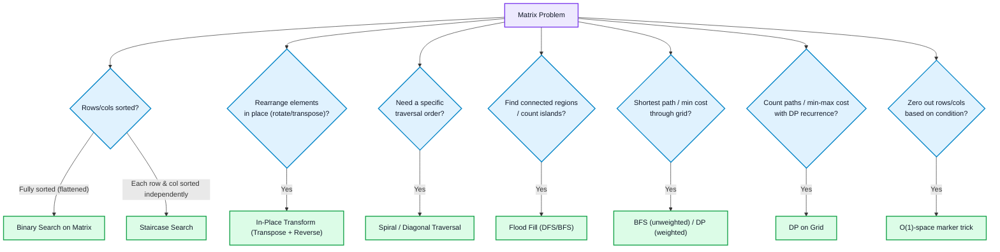
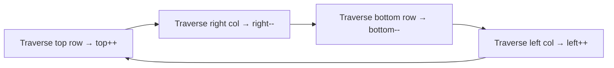
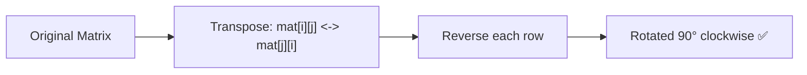
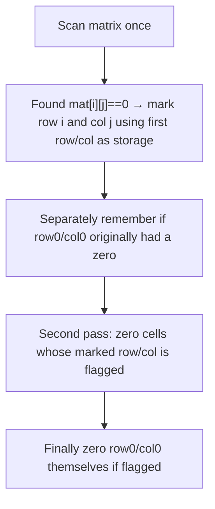
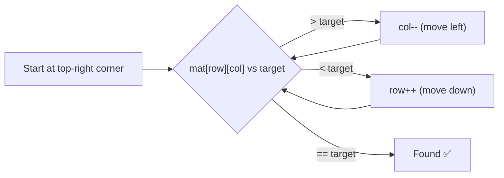
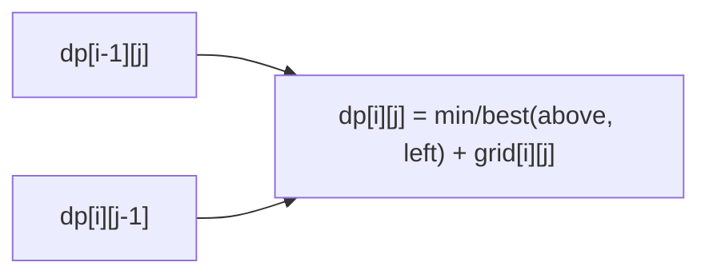

# Matrix

## Core Concept

A matrix (2D array) is a grid of elements accessed via `(row, col)`. Almost every matrix problem is really an **array or graph pattern applied in two dimensions** — the hard part is usually the traversal/indexing logic, not a new algorithmic idea. Most matrix interview problems fall into a small number of recurring patterns.

**C++ representation:** `vector<vector<int>>`, size `m x n` (m rows, n columns). `mat[i][j]` is O(1) access. Row-major storage means iterating row-by-row (`for i, for j`) is cache-friendlier than column-by-column.

---

## 🧭 Matrix Pattern Decision Flow



---

## Pattern 1: Traversal Basics (row-major, column-major, boundary)

> [!info] Difficulty
> Easy

> [!tip] When to apply
> foundational — almost every other pattern builds on iterating a grid correctly.

```cpp
for (int i = 0; i < m; i++)
    for (int j = 0; j < n; j++)
        // process mat[i][j]
```
**4-directional and 8-directional neighbor offsets** (used constantly in flood-fill/BFS/DFS patterns below):

```cpp
int dx4[] = {-1, 1, 0, 0};           int dy4[] = {0, 0, -1, 1};   // up, down, left, right
int dx8[] = {-1,-1,-1,0,0,1,1,1};    int dy8[] = {-1,0,1,-1,1,-1,0,1}; // + diagonals
```

> [!example] Complexity
> O(m·n) to visit every cell once.

> [!warning] Remember
> Always bounds-check (`0 <= x < m && 0 <= y < n`) **before** indexing — the most common matrix bug is an out-of-bounds access on a boundary cell.

## Pattern 2: Spiral Traversal

> [!info] Difficulty
> Medium

> [!tip] When to apply
> need to visit elements in spiral order (outer ring inward), or generate a matrix filled in spiral order.

> [!note] Intuition
> Maintain 4 shrinking boundaries (top, bottom, left, right); traverse each edge of the current ring, then shrink the boundary that was just completed.

```cpp
vector<int> spiralOrder(vector<vector<int>>& mat) {
    int top = 0, bottom = mat.size() - 1, left = 0, right = mat[0].size() - 1;
    vector<int> result;
    while (top <= bottom && left <= right) {
        for (int j = left; j <= right; j++) result.push_back(mat[top][j]);
        top++;
        for (int i = top; i <= bottom; i++) result.push_back(mat[i][right]);
        right--;
        if (top <= bottom) { for (int j = right; j >= left; j--) result.push_back(mat[bottom][j]); bottom--; }
        if (left <= right) { for (int i = bottom; i >= top; i--) result.push_back(mat[i][left]); left++; }
    }
    return result;
}
```



> [!example] Complexity
> O(m·n), Space: O(1) extra (excluding output).

> [!warning] Remember
> The two `if` guards before the bottom-row and left-column passes are essential — without them, a single-row or single-column matrix gets double-counted.

## Pattern 3: Rotate Matrix In-Place (Transpose + Reverse)

> [!info] Difficulty
> Medium

> [!tip] When to apply
> rotate a square matrix 90° without extra space.

> [!note] Intuition
> A 90° clockwise rotation = **transpose** (flip across the main diagonal) **then reverse each row**. Two simple, well-known operations combine into the harder one.

```cpp
void rotate(vector<vector<int>>& mat) {
    int n = mat.size();
    for (int i = 0; i < n; i++)                      // transpose
        for (int j = i + 1; j < n; j++)
            swap(mat[i][j], mat[j][i]);
    for (auto& row : mat) reverse(row.begin(), row.end());   // reverse each row
}
```



> [!example] Complexity
> O(n²), Space: O(1).

> [!warning] Remember
> Transpose loop must start `j` at `i+1` (not 0) — swapping the full range would swap each pair twice, undoing the transpose.

## Pattern 4: Set Matrix Zeroes (O(1) space marker trick)

> [!info] Difficulty
> Medium

> [!tip] When to apply
> zero out entire rows/columns based on existing zeros, without allocating new row/col tracking arrays.

> [!note] Intuition
> Use the matrix's own first row/column as marker space instead of extra arrays.



> [!example] Complexity
> O(m·n), Space: O(1).

> [!warning] Remember
> Track whether row0/col0 originally had a zero **separately**, since you overwrite them as markers during the scan. Full walkthrough: [[Arrays]] Pattern 12.

## Pattern 5: Binary Search on Matrix

> [!info] Difficulty
> Medium

> [!tip] When to apply
> matrix is fully sorted when flattened row-by-row (each row sorted, first element of row > last element of previous row) — treat as a 1D sorted array via index mapping.

```cpp
bool searchMatrix(vector<vector<int>>& mat, int target) {
    int m = mat.size(), n = mat[0].size();
    int low = 0, high = m * n - 1;
    while (low <= high) {
        int mid = low + (high - low) / 2;
        int val = mat[mid / n][mid % n];
        if (val == target) return true;
        val < target ? low = mid + 1 : high = mid - 1;
    }
    return false;
}
```

> [!example] Complexity
> O(log(m·n)), Space: O(1).

> [!warning] Remember
> Row-major index mapping: `row = mid / n, col = mid % n`. Full pattern + variant: [[Binary Search]] Pattern 5.

## Pattern 6: Staircase Search (rows AND columns independently sorted)

> [!info] Difficulty
> Medium

> [!tip] When to apply
> each row sorted left-to-right AND each column sorted top-to-bottom, but the matrix is **not** globally sorted when flattened (so Pattern 5's binary search doesn't apply).

> [!note] Intuition
> Start at the top-right corner. If current > target, move left (eliminate column); if current < target, move down (eliminate row). Each comparison eliminates a full row or column.

```cpp
bool searchMatrixII(vector<vector<int>>& mat, int target) {
    int row = 0, col = mat[0].size() - 1;
    while (row < mat.size() && col >= 0) {
        if (mat[row][col] == target) return true;
        else if (mat[row][col] > target) col--;   // eliminate this column
        else row++;                                 // eliminate this row
    }
    return false;
}
```



> [!example] Complexity
> O(m+n) — not O(log(mn)), since global sort order isn't guaranteed. Space: O(1).

> [!warning] Remember
> Starting from top-**right** (or bottom-left) is essential — it's the only corner where one direction increases and the other decreases, letting each step eliminate a full row or column. Starting top-left or bottom-right doesn't give a valid elimination direction.

## Pattern 7: Flood Fill / Number of Islands (DFS or BFS on grid)

> [!info] Difficulty
> Medium

> [!tip] When to apply
> find/count/label **connected regions** of matching cells — "number of islands," flood fill, connected components in a grid.

> [!note] Intuition
> From each unvisited "land" cell, DFS/BFS to all 4-directionally connected land cells, marking them visited so they aren't recounted.

```cpp
void dfs(vector<vector<char>>& grid, int i, int j) {
    if (i < 0 || j < 0 || i >= grid.size() || j >= grid[0].size() || grid[i][j] != '1') return;
    grid[i][j] = '0';   // mark visited (sink the land)
    dfs(grid, i+1, j); dfs(grid, i-1, j); dfs(grid, i, j+1); dfs(grid, i, j-1);
}
int numIslands(vector<vector<char>>& grid) {
    int count = 0;
    for (int i = 0; i < grid.size(); i++)
        for (int j = 0; j < grid[0].size(); j++)
            if (grid[i][j] == '1') { count++; dfs(grid, i, j); }
    return count;
}
```

> [!example] Complexity
> O(m·n) — each cell visited once. Space: O(m·n) worst-case recursion stack (a grid that's entirely one island).

> [!warning] Remember
> Mutating the grid in place (`'1' -> '0'`) doubles as the visited-tracker — avoids needing a separate `visited` array, but destroys the input; use a separate `visited` grid if the input must be preserved.

## Pattern 8: BFS Shortest Path in Grid

> [!info] Difficulty
> Medium

> [!tip] When to apply
> shortest path / minimum steps through a grid with **unweighted** moves (each step costs 1) — "shortest path in binary matrix," "rotting oranges" (multi-source BFS).

> [!note] Intuition
> BFS naturally explores in order of distance from the source(s), so the first time you reach the target is guaranteed to be via the shortest path — unlike DFS, which doesn't guarantee shortest-first discovery.

```cpp
int shortestPath(vector<vector<int>>& grid) {
    int n = grid.size();
    if (grid[0][0] == 1) return -1;
    queue<pair<int,int>> q;
    q.push({0, 0});
    grid[0][0] = 1;   // reuse grid as visited marker
    int steps = 1;
    int dx[] = {-1,-1,-1,0,0,1,1,1}, dy[] = {-1,0,1,-1,1,-1,0,1};   // 8-directional
    while (!q.empty()) {
        int sz = q.size();
        for (int k = 0; k < sz; k++) {
            auto [x, y] = q.front(); q.pop();
            if (x == n-1 && y == n-1) return steps;
            for (int d = 0; d < 8; d++) {
                int nx = x+dx[d], ny = y+dy[d];
                if (nx>=0 && ny>=0 && nx<n && ny<n && grid[nx][ny]==0) {
                    grid[nx][ny] = 1;
                    q.push({nx, ny});
                }
            }
        }
        steps++;
    }
    return -1;
}
```

> [!example] Complexity
> O(m·n), Space: O(m·n) for the queue.

> [!warning] Remember
> Mark a cell visited **when pushing it into the queue**, not when popping — marking on pop allows the same cell to be enqueued multiple times before being processed, wasting work and potentially causing incorrect distances.

## Pattern 9: DP on Grid (Paths / Min-Max Cost)

> [!info] Difficulty
> Medium

> [!tip] When to apply
> count the number of paths, or find min/max cost path, through a grid with **restricted movement** (typically only right/down) — "unique paths," "minimum path sum."

> [!note] Intuition
> `dp[i][j]` depends only on cells above/left of it, so a simple 2D table filled row-by-row (or column-by-column) solves it — this is [[Dynamic Programming]] applied with 2D state instead of 1D.

```cpp
int minPathSum(vector<vector<int>>& grid) {
    int m = grid.size(), n = grid[0].size();
    vector<vector<int>> dp(m, vector<int>(n));
    for (int i = 0; i < m; i++)
        for (int j = 0; j < n; j++) {
            if (i == 0 && j == 0) dp[i][j] = grid[i][j];
            else if (i == 0) dp[i][j] = dp[i][j-1] + grid[i][j];        // only from left
            else if (j == 0) dp[i][j] = dp[i-1][j] + grid[i][j];        // only from above
            else dp[i][j] = min(dp[i-1][j], dp[i][j-1]) + grid[i][j];   // best of both
        }
    return dp[m-1][n-1];
}
```



> [!example] Complexity
> O(m·n), Space: O(m·n) (can optimize to O(n) with a rolling row, same idea as [[Kadane's Algorithm]]'s space optimization).

> [!warning] Remember
> First row and first column are special base cases (only one direction of entry) — a very common off-by-one source if not handled explicitly.

## Pattern 10: Diagonal Traversal

> [!info] Difficulty
> Medium

> [!tip] When to apply
> need elements grouped/ordered by diagonal — e.g. "diagonal traverse," or problems where `i - j` (top-left to bottom-right diagonals) or `i + j` (anti-diagonals) is a meaningful grouping key.

> [!note] Intuition
> All cells on the same top-left-to-bottom-right diagonal share the same value of `i - j`. All cells on the same anti-diagonal share the same value of `i + j`. Group cells by this key instead of thinking in raw row/col terms.

```cpp
// Group cells by anti-diagonal (i + j constant) — e.g. for zigzag diagonal traversal
map<int, vector<int>> diagonals;
for (int i = 0; i < m; i++)
    for (int j = 0; j < n; j++)
        diagonals[i + j].push_back(mat[i][j]);
```

> [!example] Complexity
> O(m·n), Space: O(m·n) for grouped output.

> [!warning] Remember
> `i - j` constant = "\\" diagonals (top-left to bottom-right). `i + j` constant = "/" anti-diagonals. Picking the right one for the problem is the entire trick.

---

## When to apply — quick reference

- Fully sorted matrix (flattened) → **Binary search on matrix**
- Rows AND columns independently sorted, not globally → **Staircase search (top-right start)**
- Rotate square matrix in-place → **Transpose + reverse rows**
- Visit in spiral order → **Shrinking 4-boundary traversal**
- Zero rows/cols based on condition, O(1) space → **First-row/col marker trick**
- Count/label connected regions → **Flood fill (DFS/BFS)**
- Shortest path, unweighted moves → **BFS (never DFS for shortest path)**
- Count paths / min-max cost, restricted movement → **DP on grid**
- Group cells by diagonal → **`i-j` or `i+j` as grouping key**

## Common mistakes

- Missing/incorrect bounds checks before indexing — the single most common matrix bug, especially on boundary rows/columns.
- Using DFS when the problem needs **shortest** path — DFS finds *a* path, not the shortest one; BFS guarantees shortest-first for unweighted grids.
- Marking visited on **pop** instead of **push** in BFS — allows duplicate enqueues, wasting work and risking incorrect distances.
- Spiral traversal: forgetting the extra `if` guards before the last two edges — double-counts cells on single-row/single-column matrices.
- Rotate in-place: transposing the full `j` range (0 to n) instead of `i+1` to n — undoes itself by swapping each pair twice.
- DP on grid: forgetting to special-case the first row/column (they only have one valid entry direction).
- Confusing `i-j` and `i+j` diagonal groupings — verify with a small example before committing to one.

## Related Concepts

- [[Arrays]] — Pattern 12 (Set Matrix Zeroes) shares this note's marker trick in full array-specific detail.
- [[Binary Search]] — Pattern 5 (2D Matrix) is Pattern 5 here in more depth.
- [[Dynamic Programming]] — grid DP is 2D-state DP; the underlying recurrence-building process is identical to 1D DP.
- [[Recursion & Backtracking]] — Word Search is grid backtracking (mark → recurse → unmark), a close cousin of flood fill.
