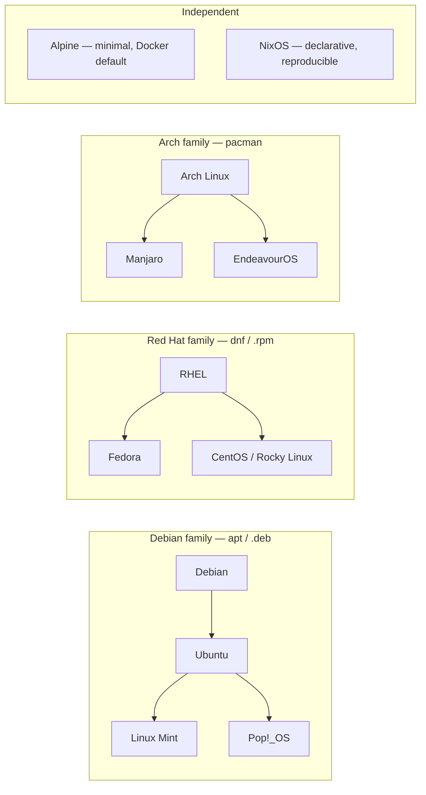
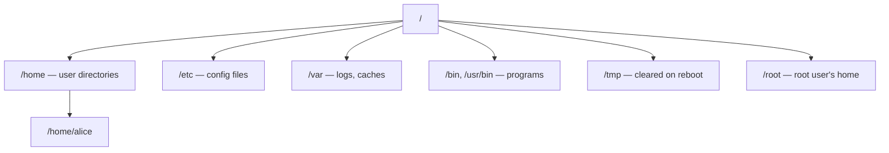

# Linux

## What is it?

**Linux** is a **kernel** — the core software that talks directly to your computer's hardware (CPU, RAM, disks, network) and manages how programs share those resources. Linux itself is not something you install directly; it's the engine underneath a **distribution**.

A **distribution ("distro")** is a complete, installable OS built around the Linux kernel, bundling:
- A **shell** (command interpreter, e.g. `bash`) so humans can type commands
- **GNU utilities** (`ls`, `cp`, `grep`, ...) — the basic toolkit for files and text
- A **package manager** to install/update/remove software
- Optionally, a graphical desktop environment

This is why you "install Ubuntu," not "install Linux" — Ubuntu is a distro that happens to use the Linux kernel.

## Why does it exist?

Before Linux, Unix-like systems were expensive and closed-source. In 1991 Linus Torvalds released a free, open-source kernel; combined with the GNU project's free tools, it became possible to run a full, free, Unix-like OS. Because the source is open, anyone can inspect, modify, and redistribute it — which is why Linux now runs most of the world's servers, cloud infrastructure, Android phones, and CI/CD pipelines.

**Why it matters to you:** almost all backend/DevOps work — servers, Docker containers, cloud VMs, CI pipelines — happens on Linux. Comfort with the shell is close to mandatory.

## Distributions



| Family | Package manager | Known for | Examples |
|---|---|---|---|
| Debian-based | `apt` | Stability, beginner-friendly | Ubuntu, Debian, Mint |
| Red Hat-based | `dnf`/`yum` | Enterprise, long support | Fedora, RHEL, Rocky |
| Arch-based | `pacman` | Rolling release, latest packages | Arch, Manjaro |
| Independent | varies | Specialized philosophies | Alpine (tiny, Docker), NixOS |

**Picking one:** learning/desktop → Ubuntu/Mint. Servers/production → Debian/RHEL/Rocky. Docker base image → Alpine.

## Filesystem

Unlike Windows (`C:\`, `D:\`), Linux has **one tree** rooted at `/`. Every disk or drive is *mounted* as a folder inside that tree instead of getting its own letter.



- `/home/<user>` — your personal files
- `/etc` — system-wide config (plain text, human-editable)
- `/var` — data that changes at runtime: logs (`/var/log`), caches
- `/bin`, `/usr/bin` — where executables live
- `/tmp` — scratch space, may be wiped on reboot
- `/root` — the **root** (admin) user's home — not the same as `/`

## The Shell

The **shell** reads what you type and runs it. `bash` is the most common default; `zsh` is a popular alternative. Opening a "terminal" opens a window running a shell.

- Almost every command supports `--help`, and has a manual page: `man command`
- Paths are **absolute** (start with `/`, e.g. `/home/alice/notes`) or **relative** (e.g. `../notes`)

## Command Reference

### Navigation
```bash
pwd          # print working directory
ls -la       # list ALL files (incl. hidden), long format
cd path      # change directory
cd ..        # up one level
cd ~         # go home
cd -         # go to previous directory
```
Files starting with `.` (e.g. `.bashrc`) are hidden by convention — `ls -a` reveals them.

### File & Directory Operations
```bash
touch f           # create empty file, or update its timestamp
mkdir d           # create a directory
mkdir -p a/b/c    # create nested dirs, no error if they exist
cp a b            # copy file a to b
cp -r dirA dirB   # copy a directory recursively
mv a b            # move OR rename
rm f              # delete a file — permanent, no recycle bin
rm -rf d          # delete a directory and everything inside — permanent
```

### Locating Things
```bash
which cmd     # full path of the executable that would run for "cmd"
whereis cmd   # binary, source, and man page locations for "cmd"
type cmd      # is "cmd" a binary, a shell builtin, or an alias?
find . -name "*.log"   # search by filename, walking the filesystem live
locate "*.log"          # search a prebuilt index — much faster, can be stale
diff a.txt b.txt        # show line-by-line differences between two files
```
`find` is always accurate but slower (it walks disk in real time); `locate` is fast but reads from an index that's updated periodically (`sudo updatedb` refreshes it).

### Viewing & Editing Files
```bash
cat f          # dump whole file to screen
less f         # scrollable viewer for long files (q to quit)
head -n 20 f   # first 20 lines
tail -n 20 f   # last 20 lines
tail -f f      # follow a file live as lines are appended (great for logs)
nano f         # simple beginner-friendly editor
vim f          # powerful, steeper learning curve
```

### Searching
```bash
grep "text" f            # search for "text" inside file f
grep -r "text" .         # search recursively through a directory
grep -i "text" f         # case-insensitive
grep -rn "text" .        # recursive + show line numbers
find . -type d            # find only directories
find . -mtime -1          # files modified in the last 1 day
```
`grep` searches file **contents**; `find` searches file **names/metadata** — a common beginner mix-up.

### Text Processing
The classic Unix approach: small tools, each doing one thing, chained together with pipes.

```bash
cut -d',' -f1 file.csv     # print the 1st column of a comma-separated file
sort file.txt               # sort lines alphabetically
sort -n file.txt             # sort lines numerically
sort -r file.txt             # sort in reverse
uniq file.txt                # remove adjacent duplicate lines (sort first!)
uniq -c file.txt             # also count how many times each line repeats
wc -l file.txt                # count lines
wc -w file.txt                # count words

sed 's/foo/bar/' f            # replace the FIRST "foo" per line with "bar"
sed 's/foo/bar/g' f           # replace ALL occurrences ("g" = global)
sed -i 's/foo/bar/g' f        # edit the file in place instead of printing

awk '{print $1}' f            # print the 1st whitespace-separated field of each line
awk -F',' '{print $2}' f      # use comma as the field separator, print 2nd field
awk '{sum += $1} END {print sum}' f   # sum a column
```
`sed` is for find/replace on a stream of text; `awk` is for working with columns/fields. A very common combo: `cat access.log | grep "ERROR" | awk '{print $1}' | sort | uniq -c`.

### Redirection & Pipes
```bash
ls > out.txt          # send stdout to a file, OVERWRITING it
ls >> out.txt         # send stdout to a file, APPENDING to it
sort < unsorted.txt   # feed a file in as a command's input

cmd 2> errors.txt      # redirect only stderr (error output) to a file
cmd > out.txt 2>&1     # redirect stdout to a file, AND send stderr to the same place
cmd &> both.txt        # shorthand: redirect both stdout and stderr

find . -name "*.tmp" | xargs rm     # pipe a list of filenames into rm as arguments
echo "hello" | xargs -I{} echo "{} world"   # {} substitutes the piped value
```
Every process has two separate output streams: **stdout** (normal output, stream `1`) and **stderr** (errors, stream `2`). `grep error app.log > results.txt` only redirects stdout — error messages from `grep` itself would still print to your terminal unless you also redirect stream `2`.
`xargs` exists because pipes (`|`) pass data as *input*, but many commands (like `rm`) expect filenames as *arguments*, not input — `xargs` bridges that gap.

### Permissions & Ownership
Every file has an **owner**, a **group**, and permission bits for **owner/group/others**, each with read (`r`), write (`w`), execute (`x`).

```bash
ls -l              # shows permissions, e.g. -rwxr-xr-x
chmod 755 f        # set permissions via octal notation
chmod u+x f        # symbolic: add execute for the owner (u)
chown user f       # change owner
chown user:group f # change owner AND group
```
Octal: each digit = `r(4) + w(2) + x(1)`, in order **owner, group, others**.
- `755` → owner `rwx` (7), group `r-x` (5), others `r-x` (5) — typical for a script
- `644` → owner `rw-`, group `r--`, others `r--` — typical for a data file
- `600` → owner `rw-` only, nobody else — typical for SSH private keys

**Special permission bits** (a 4th, leading octal digit):
- **setuid** (`chmod 4755 f`) — the program runs with the *file owner's* privileges, not the user running it (e.g. `passwd` runs as root briefly so any user can change their own password)
- **setgid** (`chmod 2755 d`) — on a directory, new files created inside inherit the *directory's group* instead of the creator's group
- **sticky bit** (`chmod 1777 d`) — on a shared directory (e.g. `/tmp`), users can only delete/rename their *own* files, even though everyone can write there

### Disks & Mounting
```bash
lsblk             # list block devices (disks/partitions) as a tree
df -h              # disk space usage per mounted filesystem
sudo fdisk -l      # detailed partition info per disk (needs root)
sudo mount /dev/sdb1 /mnt/data   # attach a partition to a folder in the tree
sudo umount /mnt/data             # detach it safely
```
A drive isn't usable until it's **mounted** — attached to some folder in the single `/` tree. Unlike Windows drive letters, you choose the mount point yourself.

### Process Management
```bash
ps aux         # snapshot of all running processes
top            # live, auto-refreshing process monitor (q to quit)
htop           # nicer interactive version of top
kill PID       # ask a process to terminate gracefully (SIGTERM)
kill -9 PID    # force-kill immediately (SIGKILL) — last resort
command &      # run in background, get prompt back immediately
nohup command & # run in background, survives closing the terminal
jobs           # list background jobs in this shell session
fg / bg        # bring a job to foreground / resume in background
```

### Package Management
```bash
# Debian / Ubuntu
sudo apt update            # refresh the list of available packages
sudo apt install x         # install package x
sudo apt remove x          # remove package x
sudo apt upgrade           # upgrade all installed packages

# Fedora / RHEL
sudo dnf install x
sudo dnf remove x

# Arch
sudo pacman -S x           # install
sudo pacman -R x           # remove
sudo pacman -Syu           # sync and upgrade everything
```
Always `update`/`sync` before installing on Debian systems — the local package list goes stale.

### Archiving & Compression
```bash
tar -czvf out.tar.gz dir/   # Create, gZip, Verbose, File — compress a folder
tar -xzvf out.tar.gz        # eXtract a .tar.gz archive
zip -r out.zip dir/         # zip a folder
unzip out.zip                # extract a .zip
```

### Networking
```bash
ping host                 # test connectivity/latency
curl url                   # fetch a URL's content, test APIs from the terminal
curl -I url                 # fetch only response headers
wget url                    # download a file from a URL
ssh user@host              # open a secure remote shell
scp file user@host:/path   # securely copy a file to/from a remote machine
ip addr                     # show network interfaces and their IP addresses
ss -tulpn                   # show listening ports and the process using each
```
`ip addr` and `ss` are the modern replacements for the older `ifconfig` and `netstat` (still seen in tutorials, but deprecated on most current distros).

### System Info & Admin
```bash
sudo cmd       # run one command with administrator privileges
df -h          # disk space usage, human-readable
du -sh dir     # total size of a folder, human-readable
free -h        # RAM usage
history        # your past commands in this shell
man cmd        # manual page for a command
uname -a       # kernel and system info
whoami         # current logged-in user
```

### Users & Groups
```bash
sudo useradd -m alice        # create user alice with a home directory
sudo passwd alice            # set/change alice's password
sudo usermod -aG group alice # add alice to an additional group
sudo userdel -r alice        # delete user and their home directory
groups alice                 # list groups alice belongs to
```

### Services (systemd)
Most modern distros manage background services (web servers, databases, etc.) with **systemd**.
```bash
sudo systemctl start nginx     # start a service now
sudo systemctl stop nginx      # stop it
sudo systemctl restart nginx   # restart it
sudo systemctl enable nginx    # start automatically on boot
sudo systemctl status nginx    # check if it's running, recent logs
journalctl -u nginx -f         # follow that service's logs live
```

### Scheduling Jobs (cron)
**cron** runs commands automatically on a recurring schedule.
```bash
crontab -e     # open your personal crontab in an editor
crontab -l     # list your current scheduled jobs
```
A crontab line has 5 time fields, then the command:
```
# minute hour day-of-month month day-of-week   command
  0       3    *             *     *            /home/alice/backup.sh
# ↑ runs backup.sh at 3:00 AM every day
  */15    *    *             *     *            /home/alice/check.sh
# ↑ runs check.sh every 15 minutes
```

### Basic Shell Scripting
A shell script is just a text file of commands, run top to bottom.
```bash
#!/bin/bash
# ^ "shebang" — tells the OS which interpreter runs this file

name="World"                    # no spaces around =
echo "Hello, $name"              # $ reads a variable's value

if [ -f "$name.txt" ]; then      # -f checks "does this file exist"
  echo "found it"
else
  echo "missing"
fi

for f in *.log; do               # loop over every .log file
  echo "processing $f"
done
```
Make it runnable with `chmod +x script.sh`, then run with `./script.sh`.

### Shell Customization
```bash
alias ll='ls -la'          # define a shortcut command for this session
alias gs='git status'
```
Aliases typed at the prompt only last for the current session. To make them (and environment variables) permanent, add them to your shell's startup file:
- `~/.bashrc` — runs for every new `bash` shell (most common place for aliases/exports)
- `~/.zshrc` — the `zsh` equivalent
- After editing, reload with `source ~/.bashrc` instead of restarting the terminal

```bash
export PATH="$HOME/scripts:$PATH"   # persist a PATH addition by putting this line in .bashrc
export EDITOR=vim                    # set your default editor system-wide
PS1='\u@\h:\w\$ '                    # customize the prompt: user@host:path$
```

## Key Concepts

- **Piping (`|`)** — feeds one command's output into another's input, chaining small tools into a pipeline. Example: `ps aux | grep firefox` lists all processes, then filters for lines mentioning "firefox."
- **Redirection** — `>` overwrites a file with output, `>>` appends, `<` feeds a file in as input, `2>`/`&>` redirect error output. See **Redirection & Pipes** above.
- **Environment variables** — named values the shell/programs can read, e.g. `$PATH` (directories searched for commands). Set with `export VAR=value`; read with `echo $VAR`.
- **`sudo` vs `root`** — `root` is the all-powerful admin account. Instead of logging in as root (risky), you stay logged in as yourself and prefix individual commands with `sudo` ("superuser do").
- **Symlinks** — `ln -s target link` creates a pointer file to another file/folder, like a shortcut. Deleting the symlink doesn't delete the original.

## When to use Linux

- Servers, cloud VMs, containers — the vast majority of production infrastructure
- Dev environments that need to match production closely
- Embedded/IoT systems (lightweight, configurable)
- Anywhere scripting and automation matter more than a polished GUI

## When not to / tradeoffs

- Mainstream gaming and some proprietary creative software (certain Adobe/CAD tools) still have gaps vs. Windows/macOS
- Brand-new laptop hardware driver support can lag
- Distro fragmentation — advice for one distro doesn't always transfer to another

## Common mistakes

- **`rm -rf /` or `rm -rf *` in the wrong directory** — no confirmation, no recycle bin, permanent. Always check `pwd` before a recursive delete.
- **`chmod 777` as a lazy permission fix** — grants everyone full read/write/execute; a real security hole, not just a quirk to bypass.
- **Unquoted variables in scripts** — `rm $file` breaks if `$file` contains a space; `rm "$file"` is safe.
- **Confusing `grep` and `find`** — contents vs. filenames.
- **Editing config files without a backup** — a broken `/etc` file can stop a service, or the system, from starting. `cp file file.bak` first.
- **Forgetting `sort` before `uniq`** — `uniq` only removes *adjacent* duplicate lines, so unsorted input silently leaves duplicates in.
- **Redirecting stdout and assuming errors are captured too** — `cmd > out.txt` misses stderr entirely; use `cmd > out.txt 2>&1` to capture both.

## Edge cases / Important details

- Linux is **case-sensitive**: `File.txt` and `file.txt` are different files.
- Hidden files are a *convention*, not security — `ls -a` reveals them instantly.
- A **hard link** points to the same underlying data as the original (data isn't freed until all hard links are gone); a **symlink** just points to a path and breaks if the target moves.
- `kill -9` skips a process's cleanup logic (e.g. it can't save unsaved data) — prefer plain `kill` first, escalate only if needed.
- `locate`'s index can be stale right after creating a new file — run `sudo updatedb` to refresh it, or use `find` for guaranteed-current results.

## Related Concepts
- [[Git and GitHub]] — Git commands run in this same shell environment
- [[Package Managers and Build Tools]] — deeper dive on installing software
- [[System Design MOC]] — Linux as server/cloud infrastructure
