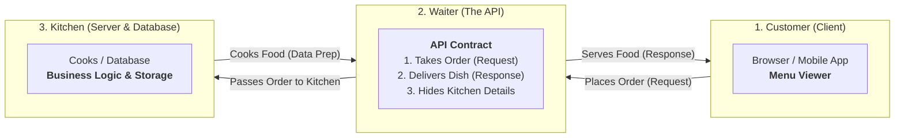
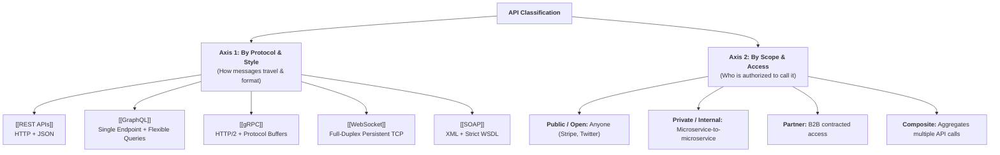

# API — Architecture, Protocols & Master Guide

An **API (Application Programming Interface)** is a formalized software contract that enables two independent systems to exchange data and execute logic without either system needing to understand the underlying implementation, database schema, or memory layout of the other.

---

## 🖼️ System Architecture Diagram

![[api-architecture-diagram.svg|960]]

---

## 🍽️ The Core Mental Model (The Restaurant Analogy)

To understand why APIs exist and how they work, consider a restaurant:



> [!NOTE]
> **Why this matters:** The customer never walks into the kitchen to chop onions (direct database access). As long as the menu (API documentation) remains unchanged, the chef can reorganize the kitchen, upgrade appliances, or change recipes internally without confusing the customer.

---

## 🧭 The Two Independent Dimensions of APIs

Every API in the software industry is classified across two **independent axes**:



---

## ⚖️ Comprehensive Protocol Comparison Matrix

| Protocol | Transport | Serialization | Communication Style | Performance | Best Used For | Dedicated Note |
| :--- | :--- | :--- | :--- | :--- | :--- | :--- |
| **REST** | HTTP/1.1 or HTTP/2 | JSON, XML, Text | Request / Response (Stateless) | ⭐⭐⭐ | Standard CRUD web services, public APIs | [[REST APIs]] |
| **GraphQL** | HTTP (POST) | JSON | Request / Response (Client-shaped) | ⭐⭐⭐ | Complex frontend dashboards, mobile apps | [[GraphQL]] |
| **gRPC** | HTTP/2 | Protobuf (Binary) | Unary & Bi-directional Streaming | ⭐⭐⭐⭐⭐ | Internal high-throughput microservices | [[gRPC]] |
| **WebSocket** | TCP (Upgraded HTTP) | Text / Binary frames | Persistent Full-Duplex Bi-directional | ⭐⭐⭐⭐ | Real-time chat, multiplayer games, live tickers | [[WebSocket]] |
| **SOAP** | HTTP, SMTP, TCP | XML (Strict Envelope) | Request / Response | ⭐⭐ | Legacy banking, insurance, enterprise transactions | [[SOAP]] |

---

## 🎯 How to Choose the Right API Style

```mermaid
flowchart TD
    Start["What is your primary requirement?"] --> Q1{"Who is the consumer?"}
    
    Q1 -->|Browser / Mobile App / Public| Q2{"Data structure requirements?"}
    Q1 -->|Internal Microservices| Q3{"Low latency & high throughput needed?"}
    Q1 -->|Real-time 2-way continuous push| WS_Pick["👉 Choose <b>WebSocket</b>"]

    Q2 -->|Standard CRUD / Universal Caching| REST_Pick["👉 Choose <b>REST APIs</b>"]
    Q2 -->|Deeply nested relationships / Overfetching problem| GQL_Pick["👉 Choose <b>GraphQL</b>"]

    Q3 -->|Yes (Speed & typed contracts matter)| GRPC_Pick["👉 Choose <b>gRPC</b>"]
    Q3 -->|Legacy enterprise / Formal WSDL contract required| SOAP_Pick["👉 Choose <b>SOAP</b>"]
```

---

## 🔗 Deep-Dive Vault Notes
- [[REST APIs]] — Resources, HTTP verbs, status codes, and idempotency (Featuring ![[nodejs.svg|16]] Express & ![[fastapi-rest.svg|16]] FastAPI implementations)
- ![[graphql-logo.png|16]] [[GraphQL]] — Schema definition language, resolvers, and avoiding N+1 queries
- ![[grpc-logo.svg|16]] [[gRPC]] — Protocol Buffers, `.proto` compilation, and HTTP/2 streaming
- ![[websocket.svg|16]] [[WebSocket]] — Handshake upgrade, duplex messaging, and connection management
- [[SOAP]] — XML Envelopes, WSDL contracts, and enterprise WS-Security
