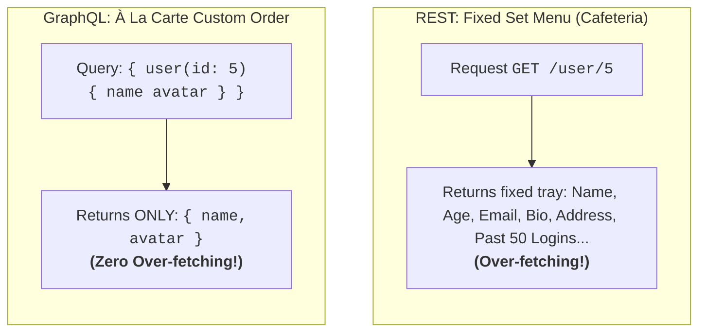
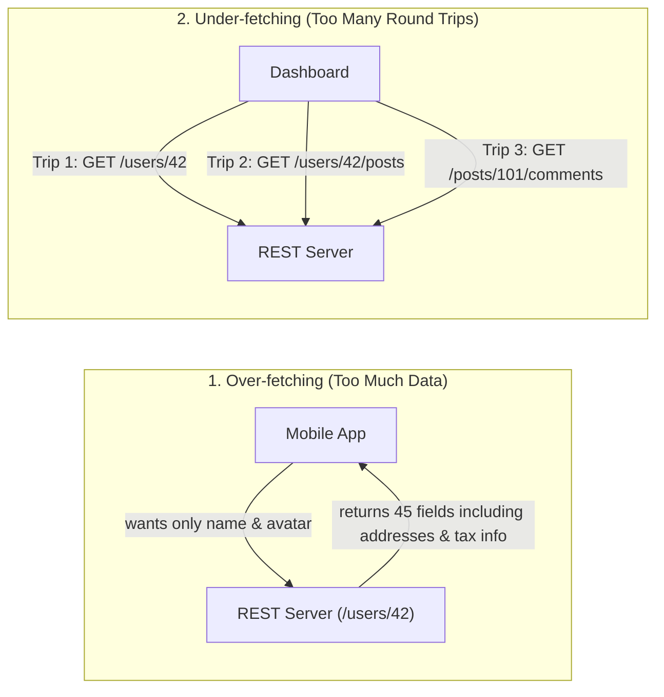
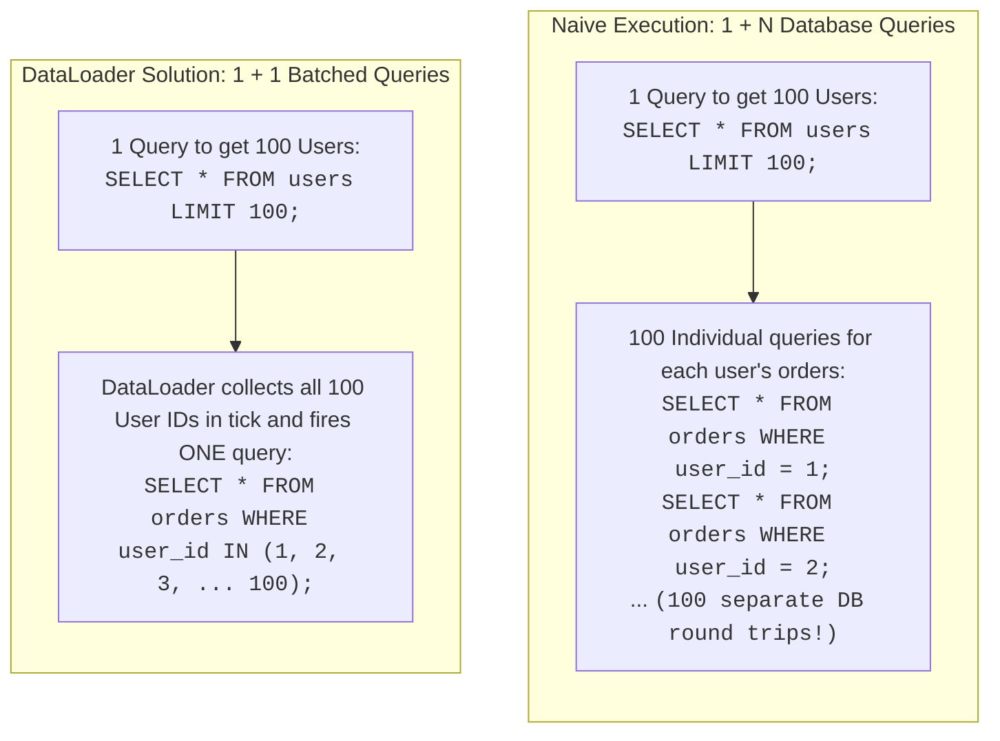

# ![[graphql-logo.png|40]] GraphQL — Architecture, Schema Design & Performance

**GraphQL** is an open-source data query and manipulation language for APIs, along with a runtime engine for executing queries against backend data sources. Created by Facebook in 2012 and open-sourced in 2015, GraphQL allows the **client** to specify the exact structure and fields of the data required, rather than the server dictating fixed response shapes.

---

## 🖼️ GraphQL Query Engine Architecture

![[graphql-architecture-diagram.svg|944]]

---

## 🍽️ The Core Mental Model (Cafeteria vs. À La Carte)



---

## ⚔️ REST vs. GraphQL: The Two Classic Fetching Problems



---

## ⚡ The N+1 Query Problem & DataLoader Solution

The **#1 most critical performance pitfall** in GraphQL backend architecture is the **N+1 Problem**:



> [!IMPORTANT]
> **What DataLoader Does:**
> 1. **Batching**: Coalesces all individual ID requests during one event-loop tick into a single `WHERE IN (...)` batch query.
> 2. **Caching**: Caches per-request object lookups to avoid redundant database reads within the same query.

### DataLoader Implementation Code Example

Here is how a DataLoader solves the N+1 problem in standard JavaScript/TypeScript backend code:

```javascript
const DataLoader = require('dataloader');

// 1. Define batch loading function
// Input: array of keys [1, 2, 3, ... 100]
// Output: Promise resolving to array of results [ordersOfUser1, ordersOfUser2, ... ordersOfUser100]
const batchGetOrdersByUserIds = async (userIds) => {
  // Query DB once for all matching orders
  const orders = await db.query('SELECT * FROM orders WHERE user_id IN (?)', [userIds]);
  
  // Map and group results to preserve correct ordering relative to inputs
  return userIds.map(id => orders.filter(order => order.user_id === id));
};

// 2. Instantiate DataLoader (typically per HTTP request context)
const orderLoader = new DataLoader(batchGetOrdersByUserIds);

// 3. Define GraphQL Resolver utilizing the loader
const resolvers = {
  User: {
    orders: (user, args, context) => {
      // Instead of calling the database directly inside this field resolver, 
      // we load through orderLoader. This schedules all user IDs 
      // queried in this turn to be batched and executed at once.
      return orderLoader.load(user.id);
    }
  }
};
```

---

## 📊 Comprehensive Comparison: GraphQL vs. REST

| Feature | REST API | GraphQL |
| :--- | :--- | :--- |
| **Endpoints** | Multiple URLs (`/users`, `/posts`, `/orders`) | Single URL (usually `POST /graphql`) |
| **Data Fetching** | Fixed server-defined payloads | Flexible client-defined query payloads |
| **Network Roundtrips** | Often multiple requests (under-fetching) | Single request for nested graphs |
| **Caching** | Native HTTP caching (Browser, CDN, 304 Not Modified) | Client-side memory caching (Apollo / Relay normalized cache) |
| **Error Handling** | HTTP Status codes (`404`, `401`, `500`) | Typically returns `200 OK` with an `errors: [...]` JSON payload |
| **Versioning** | URI versioning (`/api/v1`, `/api/v2`) | Field-level deprecation (`@deprecated` tag in schema) |
| **Binary / File Upload** | Standard multipart HTTP POST | Non-standard (requires multipart spec extensions) |

---

## 🔗 Related Vault Concepts
- [[API]] — Overall API architectural styles comparison
- [[REST APIs]] — The traditional resource-based alternative
- [[WebSocket]] — Used as the transport layer for real-time GraphQL Subscriptions
- [[JSON]] — The output format for GraphQL responses
