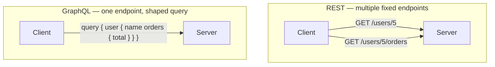
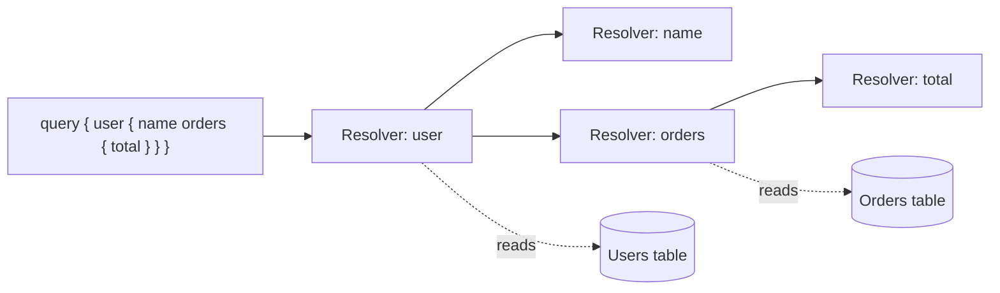

# GraphQL

## What is it?

**GraphQL** is a query language for APIs, plus a runtime for executing those queries against your data. Created by Facebook in 2012 and open-sourced in 2015, it lets the **client** describe exactly what data it wants — in what shape, with which fields — in a single request, instead of the server dictating fixed response shapes through separate endpoints.

## Why does it exist?

[[REST APIs|REST]] organizes data around fixed endpoints (`/users/5`, `/users/5/orders`), each returning a fixed shape of data. This creates two recurring problems as apps grow:

- **Over-fetching**: `/users/5` might return 20 fields, but your mobile screen only needs the name and avatar. You've downloaded 18 fields you'll never use.
- **Under-fetching**: showing a user's name *and* their 3 most recent orders might require two separate REST requests (`/users/5`, then `/users/5/orders`), because no single endpoint returns both.

This gets worse with multiple client types — a mobile app, a web dashboard, and a smartwatch app each want a different slice of the same data, but a REST API typically has to either serve everyone the same bloated response or create a custom endpoint per client.

GraphQL solves this by moving the decision of "what data comes back" from the server (fixed endpoints) to the client (a query describing exactly what's needed).

## REST vs GraphQL, visually



REST needs two round trips to assemble the same view GraphQL gets in one — and REST's `/users/5` response includes every field, whether the client wanted them or not.

## How does it work?

### One endpoint, many queries

Unlike REST's many URLs, a GraphQL API typically exposes a **single endpoint** (e.g. `POST /graphql`). What varies between requests isn't the URL — it's the **query** sent in the request body.

### Schema and types

Every GraphQL API is backed by a **schema** — a strongly typed description of all the data and operations available, written in GraphQL's Schema Definition Language (SDL):

```graphql
type User {
  id: ID!
  name: String!
  email: String!
  orders: [Order!]!
}

type Order {
  id: ID!
  total: Float!
}

type Query {
  user(id: ID!): User
}
```

`!` means "non-nullable" (this field is guaranteed to have a value). `[Order!]!` means "a non-null list of non-null Orders."

### Queries: reading data

The client sends a query shaped like the data it wants back:

```graphql
{
  user(id: "5") {
    name
    orders {
      id
      total
    }
  }
}
```

Response — notice the shape mirrors the query exactly:

```json
{
  "data": {
    "user": {
      "name": "Asha",
      "orders": [
        { "id": "101", "total": 42.5 },
        { "id": "102", "total": 17.0 }
      ]
    }
  }
}
```

If the client had only asked for `name`, the response would contain only `name` — no `email`, no `orders`. This directly solves over-fetching.

### Mutations: writing data

Reads use `query`; writes (create/update/delete) use `mutation`:

```graphql
mutation {
  createOrder(userId: "5", total: 29.99) {
    id
    total
  }
}
```

### Resolvers

On the server, each field in the schema is backed by a **resolver** — a function that knows how to fetch that specific piece of data (from a database, another API, a cache, etc.). When a query comes in, GraphQL calls the resolver for each requested field, potentially several levels deep, and assembles the results into the response shape:



## Example: comparing to REST

To show a user's name and their order totals, REST might need:
```
GET /users/5        → { id, name, email, address, ... (everything) }
GET /users/5/orders → [ { id, total, items, shipping, ... (everything) } ]
```
Two requests, each returning more fields than needed.

GraphQL needs one request, returning exactly what's asked:
```graphql
{
  user(id: "5") {
    name
    orders { total }
  }
}
```

## When to use

- Apps with complex, deeply nested data relationships (social feeds, dashboards pulling from many related entities)
- Multiple client types (web, mobile, smartwatch) that each need different slices of the same underlying data
- Rapidly evolving frontends, where adding a field to a query doesn't require any backend endpoint changes
- Aggregating data from multiple internal services behind one unified API

## When not to use

- Simple CRUD APIs with a handful of resources — REST's simplicity and built-in HTTP caching are often less overhead
- Public APIs where you want to leverage HTTP-level caching (CDNs, browser cache) — GraphQL's single `POST` endpoint doesn't cache the way REST `GET` URLs do
- Teams unfamiliar with GraphQL's schema/resolver model, on a tight timeline — the learning curve and server setup cost is real
- File uploads and simple binary transfers — REST/HTTP handles these more naturally

## Common mistakes

- **The N+1 query problem**: a naive resolver for `user.orders` that queries the database separately for each user in a list results in 1 query for the users + N queries for each user's orders. Solved with batching tools like **DataLoader**, which collect and batch resolver calls together.
- **Assuming GraphQL is always faster than REST**: a single deeply nested query can actually place more load on the server than several simple REST calls, since the server must resolve every requested field.
- **No query depth/complexity limits**: without limits, a client (malicious or careless) can send a deeply nested, expensive query and overload the server — servers typically need query depth/complexity analysis to guard against this.
- **Forgetting GraphQL errors return HTTP 200**: unlike REST's 4xx/5xx status codes, GraphQL typically returns `200 OK` even when a query partially fails — errors appear in an `"errors"` array in the response body alongside any partial `"data"`. Client code must check the `errors` field, not just the HTTP status.

## Edge cases / Important details

- A single GraphQL response can contain **both** `data` (partial success) and `errors` (what failed) at once — a query can succeed for some fields and fail for others in the same response.
- Because there's typically one endpoint, standard HTTP-level caching (which relies on distinct URLs) doesn't work out of the box — GraphQL clients (like Apollo Client, Relay) implement their own client-side caching instead.
- Subscriptions (a third operation type alongside query/mutation) allow real-time updates over [[WebSocket]], letting clients "subscribe" to changes.

## Related concepts
- [[API]] — the general concept; see the overview note for how GraphQL compares to REST, SOAP, gRPC, and WebSocket
- [[REST APIs]] — the architecture style GraphQL is most commonly contrasted with
- [[JSON]] — GraphQL responses are typically JSON
- [[WebSocket]] — often used to transport GraphQL subscriptions for real-time data

## Open Questions / To Explore Later
- Apollo Client / Relay and client-side caching strategies
- Query complexity analysis and rate limiting
- Federation — splitting a GraphQL schema across multiple backend services
