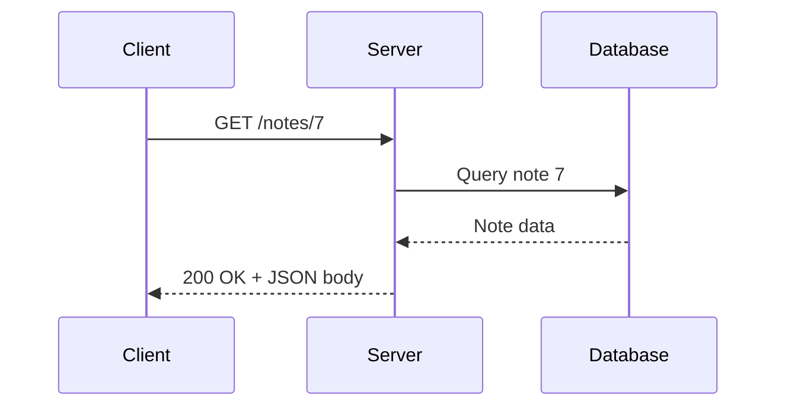

# REST APIs

A **REST API** (Representational State Transfer) is an architectural style for designing web APIs, defined by Roy Fielding in 2000. It's a set of design constraints — not a protocol or library — that most modern web [[API|APIs]] follow.

## Core Idea

An [[API]] is a contract that lets two pieces of software communicate. In a REST API specifically, that communication happens over [[HTTP]], and everything is organized around **resources** (nouns) manipulated via **HTTP methods** (verbs).

## The 4 Key Constraints

1. **Client-Server separation** — frontend and backend evolve independently, connected only by the interface.
2. **Statelessness** — every request carries all context the server needs; the server holds no session memory between requests. This is what makes REST APIs horizontally scalable (any server instance can handle any request).
3. **Cacheability** — responses indicate whether/how long they can be cached.
4. **Uniform Interface** — resources are identified by URLs, manipulated through representations (usually [[JSON]]), and accessed via standard HTTP methods.

## Request Flow

Every REST call follows the same request → response shape, regardless of which method is used:



Because each request is **stateless**, the server doesn't remember this exchange afterward — the next request from this client (or any client) must carry everything it needs again.

## HTTP Methods (the verbs)

| Method | Purpose | Example |
|---|---|---|
| `GET` | Read a resource | `GET /users/42` |
| `POST` | Create a resource | `POST /users` |
| `PUT` | Replace a resource entirely | `PUT /users/42` |
| `PATCH` | Partially update a resource | `PATCH /users/42` |
| `DELETE` | Remove a resource | `DELETE /users/42` |

## Example: Notes App API

```
GET    /notes          list all notes
GET    /notes/7        get note #7
POST   /notes          create a new note
PATCH  /notes/7        update note #7
DELETE /notes/7        delete note #7
```

Request:
```
POST /notes
Content-Type: application/json

{ "title": "Groceries", "content": "Milk, eggs" }
```

Response:
```
HTTP/1.1 201 Created
Content-Type: application/json

{ "id": 8, "title": "Groceries", "content": "Milk, eggs" }
```

## HTTP Status Codes

- 2xx Success: 200 OK, 201 Created, 204 No Content
- 3xx Redirection
- 4xx Client Error: 400 Bad Request, 401 Unauthorized, 404 Not Found
- 5xx Server Error: 500 Internal Server Error

## Key Takeaways

- REST equals design principles centered on resources and HTTP methods, not a strict protocol.
- Statelessness is the key property enabling scalability.
- [[JSON]] is the dominant data format for REST responses today.
- Not every API calling itself RESTful follows all constraints strictly.

## Related Concepts
- [[API]] — the general concept this specializes, including how REST compares to GraphQL, SOAP, gRPC, and WebSocket
- [[HTTP]] — the transport protocol REST is built on
- [[JSON]] — typical data format for REST payloads
- [[Client-Server Architecture]]

## Open Questions / To Explore Later
- Authentication patterns for REST APIs (API keys, OAuth, JWT)
- HATEOAS (the lesser-followed REST constraint)
