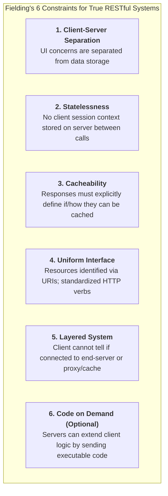
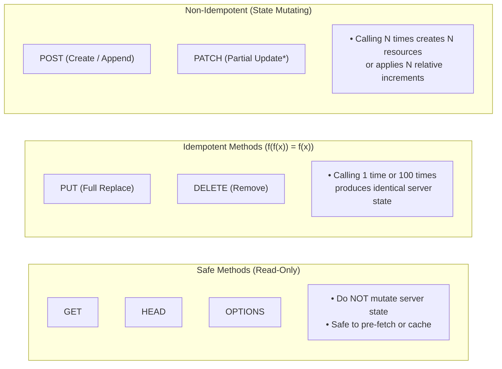
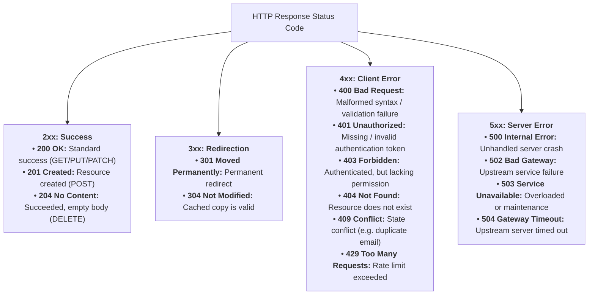
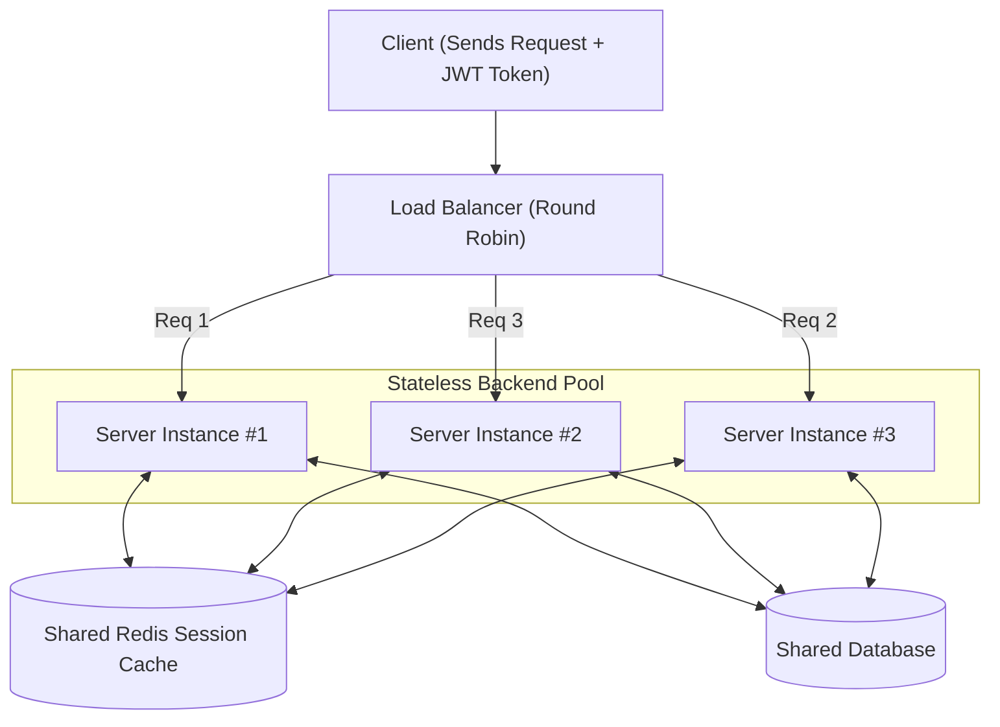

# REST APIs — Comprehensive Architecture & Design Guide

A **REST API** (Representational State Transfer) is an architectural style designed by Roy Fielding in 2000 for distributed hypermedia systems. It is not a rigid library or protocol, but rather a set of **design principles** that map operations on resources to standard [[HTTP]] methods.

---

## 🖼️ RESTful Request & Response Lifecycle Diagram

![[rest-architecture-diagram.svg|960]]

---

## 🏛️ The 6 Architectural Constraints of REST



---

## 🔄 HTTP Verbs: Safety vs. Idempotency



### Complete HTTP Methods Matrix

| Method | CRUD Equivalent | Safe? | Idempotent? | Body in Request? | Response Cachable? | Example URI |
| :--- | :--- | :---: | :---: | :---: | :---: | :--- |
| `GET` | Read | ✅ Yes | ✅ Yes | ❌ No | ✅ Yes | `GET /articles/101` |
| `POST` | Create | ❌ No | ❌ No | ✅ Yes | ⚠️ Rarely | `POST /articles` |
| `PUT` | Replace / Upsert | ❌ No | ✅ Yes | ✅ Yes | ❌ No | `PUT /articles/101` |
| `PATCH` | Partial Update | ❌ No | ⚠️ Contextual | ✅ Yes | ❌ No | `PATCH /articles/101` |
| `DELETE` | Delete | ❌ No | ✅ Yes | ❌ Optional | ❌ No | `DELETE /articles/101` |
| `HEAD` | Read Headers | ✅ Yes | ✅ Yes | ❌ No | ✅ Yes | `HEAD /articles/101` |
| `OPTIONS`| Query Capabilities| ✅ Yes | ✅ Yes | ❌ No | ❌ No | `OPTIONS /articles` |

> [!IMPORTANT]
> **PUT vs. PATCH Difference:**
> - `PUT /users/42` replaces the **entire user object**. Any fields you omit are wiped or reset to defaults.
> - `PATCH /users/42` updates **only the fields provided** in the payload (e.g. `{ "email": "new@site.com" }`), leaving other fields untouched.

---

## 🚦 HTTP Status Codes Cheat Sheet



---

## ⚖️ Statelessness & Horizontal Scaling



---

## 📐 REST URI Design Rules & Best Practices

| Best Practice Rule | ✅ Good URI Example | ❌ Bad / Anti-Pattern Example | Why? |
| :--- | :--- | :--- | :--- |
| **Use Nouns, Not Verbs** | `GET /orders` | `GET /getOrders` | HTTP verbs (`GET`/`POST`) already define the action |
| **Plural Naming** | `GET /users/5` | `GET /user/5` | Consistency across collection vs. singleton routes |
| **Represent Hierarchy** | `GET /authors/4/books` | `GET /getBooksByAuthor?id=4` | Sub-resources naturally show parent-child ownership |
| **Filter via Query Params** | `GET /products?category=shoes&sort=price_asc` | `GET /products/shoes/sortPrice` | Keep base resource clean; use query strings for filters |
| **Use Kebab-Case** | `GET /order-history` | `GET /order_history` or `/orderHistory` | Web URIs are case-insensitive and standardized on dashes |

---

## 🚀 REST Implementation Examples

To make REST concrete, here is how you build a standard `GET /users/:id` endpoint in two of the most popular modern ecosystems.

### ![[nodejs.svg|24]] Node.js (Express)
```javascript
const express = require('express');
const app = express();
const PORT = 3000;

// Mock database
const users = {
  42: { id: 42, name: "Alice", email: "alice@example.com" }
};

// REST Endpoint: GET resource by ID
app.get('/users/:id', (req, res) => {
  const userId = req.params.id;
  const user = users[userId];
  
  if (user) {
    res.status(200).json(user); // 200 OK with JSON payload
  } else {
    res.status(404).json({ error: "User not found" }); // 404 Not Found
  }
});

app.listen(PORT, () => console.log(`REST Server running on port ${PORT}`));
```

### ![[fastapi-rest.svg|24]] Python (FastAPI)
```python
from fastapi import FastAPI, HTTPException, status
from pydantic import BaseModel

app = FastAPI()

# Resource Schema
class User(BaseModel):
    id: int
    name: str
    email: str

# Mock database
users = {
    42: User(id=42, name="Alice", email="alice@example.com")
}

# REST Endpoint: GET resource by ID
@app.get("/users/{user_id}", response_model=User, status_code=status.HTTP_200_OK)
def get_user(user_id: int):
    user = users.get(user_id)
    if not user:
        raise HTTPException(
            status_code=status.HTTP_404_NOT_FOUND, 
            detail="User not found"
        )
    return user
```

---

## 🔗 Related Vault Concepts
- [[API]] — The overarching classification guide (REST vs GraphQL vs gRPC vs WebSocket)
- [[GraphQL]] — How GraphQL solves REST over-fetching and under-fetching
- [[gRPC]] — The binary high-performance RPC alternative for microservices
- [[WebSocket]] — For real-time bi-directional messaging where REST polling is inefficient
