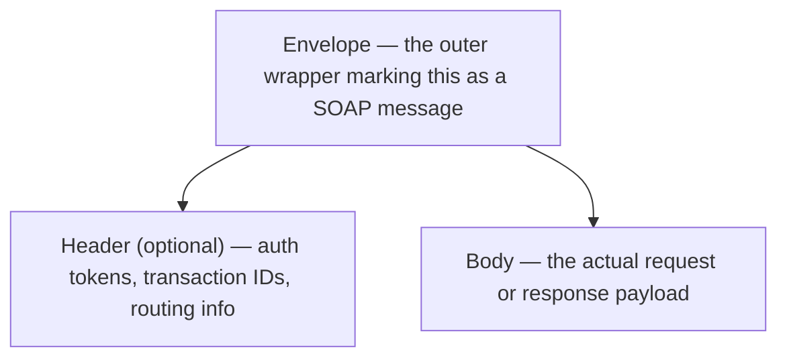
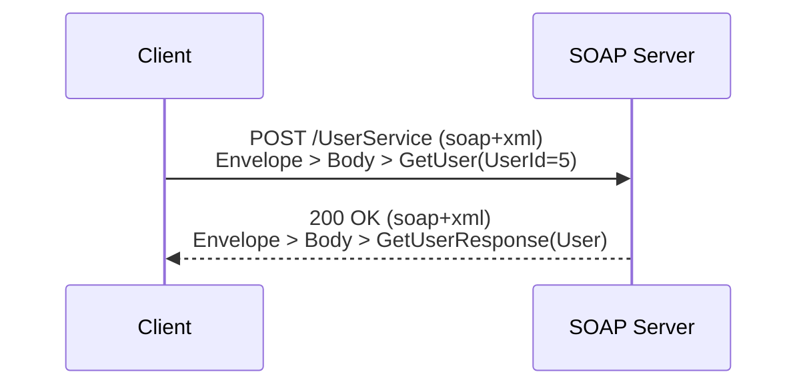

# SOAP

## What is it?

**SOAP** (Simple Object Access Protocol) is a strict, XML-based messaging protocol for exchanging structured information between systems. Unlike [[REST APIs|REST]] (a style built loosely on HTTP), SOAP is a formal **protocol** with a rigid message format and a machine-readable contract describing exactly what operations exist and what data types they accept and return.

## Why does it exist?

SOAP predates REST, developed by Microsoft in the late 1990s for enterprise systems that needed:

- **A strict, verifiable contract** — the client and server must agree, in advance, on every operation and data type, checkable by tooling rather than left to documentation.
- **Built-in standards for security and reliability** — enterprise needs like message-level encryption, guaranteed delivery, and formal transactions, standardized as extensions (the "WS-*" family: WS-Security, WS-ReliableMessaging, WS-AtomicTransaction).
- **Transport independence** — SOAP messages can travel over HTTP, SMTP (email), or other transports, not just HTTP like REST.

These guarantees matter most where correctness and auditability are non-negotiable — banking, insurance, healthcare, and government systems — which is why SOAP is still common in those industries today, even though it's rare in new consumer-facing web APIs.

## How does it work?

### The SOAP envelope

Every SOAP message is XML, wrapped in a strict structure called an **envelope**:



```xml
<soap:Envelope xmlns:soap="http://www.w3.org/2003/05/soap-envelope">
  <soap:Header>
    <!-- optional: auth tokens, transaction IDs, routing info -->
  </soap:Header>
  <soap:Body>
    <GetUserRequest xmlns="http://example.com/users">
      <UserId>5</UserId>
    </GetUserRequest>
  </soap:Body>
</soap:Envelope>
```

- **Envelope** — the root wrapper, marking the message as SOAP.
- **Header** (optional) — metadata: authentication, transaction context, routing — separate from the actual request data.
- **Body** — the actual request or response payload.

### WSDL: the formal contract

A **WSDL** (Web Services Description Language) file is an XML document that precisely defines a SOAP service: every operation available, the exact structure of inputs and outputs, and the data types involved. Client tooling can read a WSDL and auto-generate working client code in almost any language — a key reason SOAP was popular in large enterprises with many internal teams and languages.

### Example exchange



Request (over HTTP, though SOAP doesn't require HTTP):
```xml
POST /UserService HTTP/1.1
Content-Type: application/soap+xml

<soap:Envelope xmlns:soap="http://www.w3.org/2003/05/soap-envelope">
  <soap:Body>
    <GetUser xmlns="http://example.com/users">
      <UserId>5</UserId>
    </GetUser>
  </soap:Body>
</soap:Envelope>
```

Response:
```xml
<soap:Envelope xmlns:soap="http://www.w3.org/2003/05/soap-envelope">
  <soap:Body>
    <GetUserResponse xmlns="http://example.com/users">
      <User>
        <Id>5</Id>
        <Name>Asha</Name>
      </User>
    </GetUserResponse>
  </soap:Body>
</soap:Envelope>
```

Compare this to the equivalent REST call, which is far shorter: `GET /users/5` returning `{ "id": 5, "name": "Asha" }`. The verbosity is the trade-off for SOAP's strict typing and formal contract.

## When to use

- Enterprise systems requiring formally verified contracts (WSDL) between many internal teams or languages
- Applications needing built-in, standardized transaction support (e.g. multi-step operations that must all succeed or all roll back)
- Systems needing message-level security (not just transport-level, like HTTPS) — the message itself is encrypted/signed, useful when it passes through intermediaries
- Legacy enterprise integration — banking, insurance, healthcare (HL7-based systems), government systems, many of which standardized on SOAP decades ago and haven't migrated

## When not to use

- Public web/mobile APIs — the XML verbosity and rigid contract slow down development compared to REST/JSON for typical CRUD needs
- Anywhere a lightweight, human-readable format is preferred — JSON is far easier to read and debug than XML envelopes
- New projects without an existing enterprise requirement for SOAP's specific guarantees — REST or GraphQL is almost always the simpler modern default

## Common mistakes

- **Assuming SOAP is obsolete/dead**: it's rare in new public APIs, but very much alive in banking, insurance, and government backends — don't be surprised to encounter it in enterprise integration work.
- **Confusing SOAP with "using HTTP + XML"**: sending XML over HTTP without the Envelope structure and WSDL contract isn't SOAP — SOAP specifically requires the formal envelope and (usually) a WSDL definition.
- **Underestimating the tooling requirement**: working with SOAP in most languages requires SOAP-specific libraries to parse the WSDL and generate client stubs — you rarely hand-write SOAP XML directly in practice.

## Related concepts
- [[API]] — the general concept; see the overview note for how SOAP compares to REST, GraphQL, gRPC, and WebSocket
- [[REST APIs]] — the lighter-weight style that replaced SOAP for most new web APIs
- [[JSON]] — SOAP uses XML instead, one of its key differences from modern REST/GraphQL APIs

## Open Questions / To Explore Later
- WS-Security in depth (message-level encryption and signing)
- WSDL structure and client-stub code generation in a specific language
