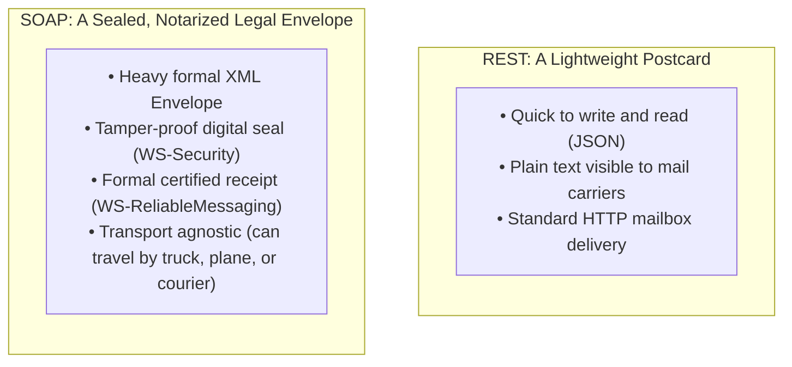
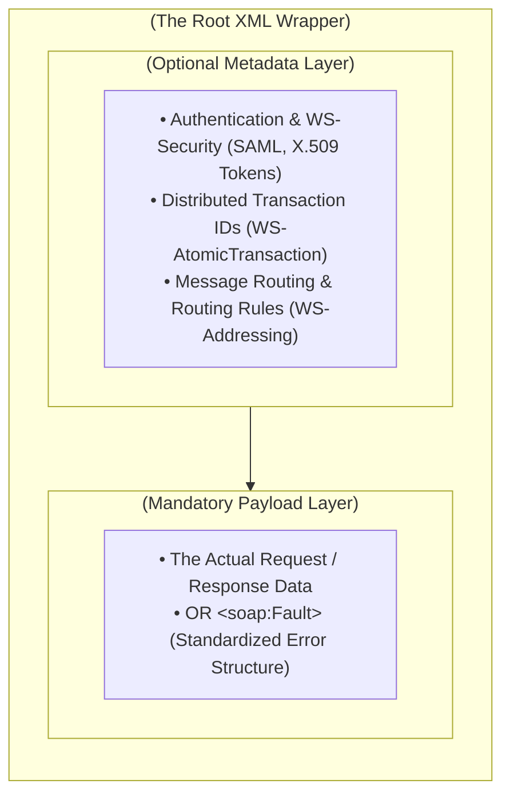
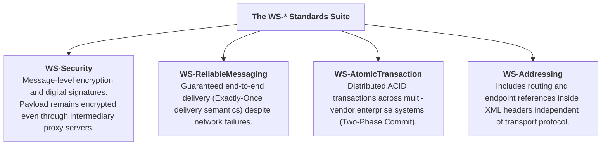

# SOAP — Architecture, WSDL Contracts & Enterprise Messaging

**SOAP** (Simple Object Access Protocol) is a standardized, XML-based messaging protocol specification for exchanging structured and typed information in the implementation of web services. Originally created by Microsoft in 1998, SOAP is a **formal protocol** governed by the World Wide Web Consortium (W3C), characterized by strict contract definitions, transport independence, and built-in enterprise standards.

---

## 🖼️ SOAP XML Envelope & WSDL Architecture

![[soap-envelope-diagram.svg|960]]

---

## ✉️ The Core Mental Model (Notarized Postal Mail vs. Postcard)



---

## 📦 The Anatomy of a SOAP Message

Every SOAP payload is strictly enclosed within an XML **Envelope**:



---

## 📜 Concrete SOAP Examples: Envelope & WSDL

To demystify the abstract XML structure of SOAP, see these actual definitions:

### 1. Simple SOAP Request Payload Example
```xml
<?xml version="1.0" encoding="utf-8"?>
<soap:Envelope xmlns:soap="http://schemas.xmlsoap.org/soap/envelope/"
               xmlns:m="http://www.example.org/stock">
  <soap:Header>
    <!-- Metadata Layer: Authentication Token -->
    <m:AuthHeader>
      <m:ApiKey>12345-ABCDE</m:ApiKey>
    </m:AuthHeader>
  </soap:Header>
  <soap:Body>
    <!-- Main Payload: RPC method call with arguments -->
    <m:GetStockPrice>
      <m:StockName>GOOG</m:StockName>
    </m:GetStockPrice>
  </soap:Body>
</soap:Envelope>
```

### 2. Standard WSDL (Web Services Description Language) Structure
A WSDL document acts as the strict, machine-readable contract describing all data structures, operations, and network bindings for the web service:

```xml
<definitions name="StockService"
             targetNamespace="http://example.com/stock"
             xmlns="http://schemas.xmlsoap.org/wsdl/">
             
  <!-- 1. Types: Abstract data types and schema definitions (XML schemas) -->
  <types>
    <!-- Declares GetStockPrice and GetStockPriceResponse structures -->
  </types>

  <!-- 2. Messages: Abstract definition of data being transmitted -->
  <message name="GetStockPriceInput">
    <part name="body" element="tns:GetStockPrice"/>
  </message>
  <message name="GetStockPriceOutput">
    <part name="body" element="tns:GetStockPriceResponse"/>
  </message>

  <!-- 3. PortType: Set of abstract operations (similar to an interface) -->
  <portType name="StockPort">
    <operation name="GetStockPrice">
      <input message="tns:GetStockPriceInput"/>
      <output message="tns:GetStockPriceOutput"/>
    </operation>
  </portType>

  <!-- 4. Binding: Message format and protocol choices for a port type (e.g. SOAP over HTTP) -->
  <binding name="StockSoapBinding" type="tns:StockPort">
    <soap:binding style="document" transport="http://schemas.xmlsoap.org/soap/http"/>
  </binding>

  <!-- 5. Service: Concrete URL endpoint location for the binding -->
  <service name="StockService">
    <port name="StockPort" binding="tns:StockSoapBinding">
      <soap:address location="http://example.com/stock/api"/>
    </port>
  </service>
</definitions>
```

---

## 🛡️ The Enterprise WS-* Standard Extensions



---

## ⚖️ Comprehensive Comparison: SOAP vs. REST

| Feature | SOAP | REST |
| :--- | :--- | :--- |
| **Nature** | Strict, standardized **Protocol** (W3C) | Flexible **Architectural Style** (Roy Fielding) |
| **Data Format** | XML only (Strict schema) | JSON, XML, Plain Text, HTML, YAML |
| **Transport Layer** | HTTP, HTTPS, SMTP (Email), JMS, TCP | HTTP / HTTPS exclusively |
| **Contract** | Mandatory formal WSDL document | Optional OpenAPI / Swagger |
| **Security** | Transport (HTTPS) + Message-level (WS-Security) | Transport-level (HTTPS / TLS) + OAuth / JWT |
| **Statefulness** | Can be stateful or stateless | Strictly stateless |
| **Bandwidth / Overhead**| High (Large XML envelopes and tags) | Low (Compact JSON strings) |
| **Error Handling** | Standardized `<soap:Fault>` structure | HTTP Status Codes (`400`, `404`, `500`) |
| **Industry Adoption** | Banking, insurance, legacy enterprise, defense | Web, mobile, SaaS, modern cloud backends |

---

## 🔗 Related Vault Concepts
- [[API]] — The comprehensive taxonomy of all API architectures
- [[REST APIs]] — The modern lightweight alternative that replaced SOAP in mainstream web apps
- [[gRPC]] — The modern binary RPC alternative for high-performance enterprise systems
