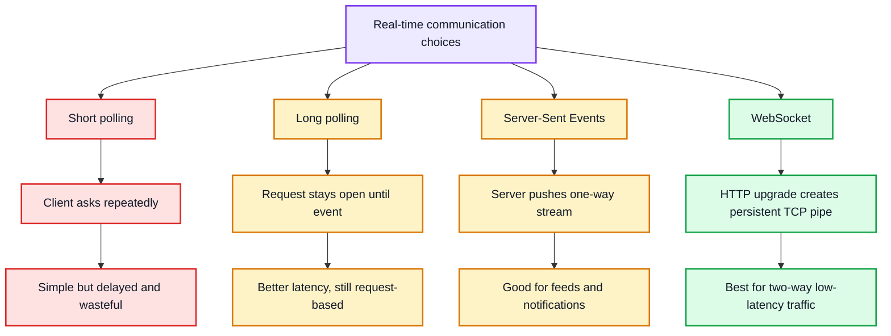
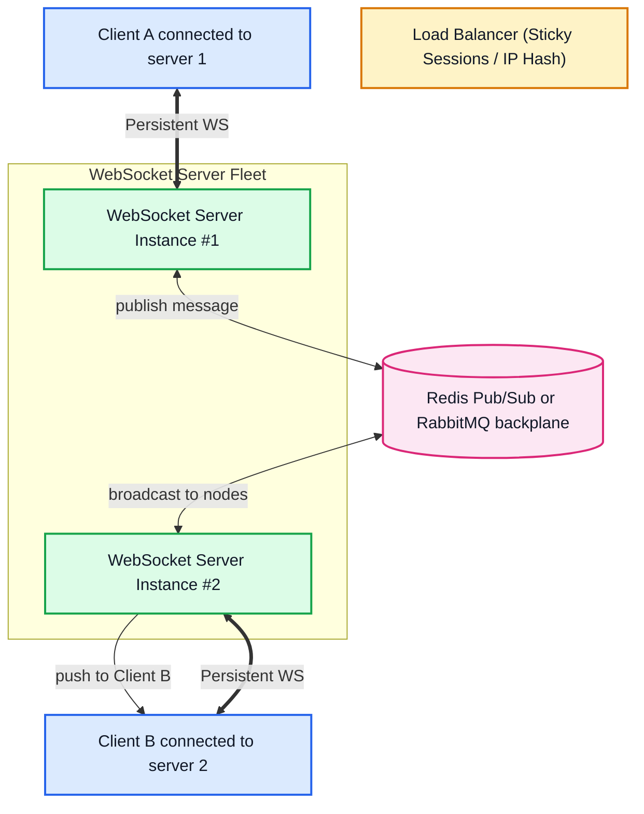

# ![[websocket.svg|40]] WebSocket — Full-Duplex Real-Time Networking

**WebSocket** is a standardized computer communications protocol that provides **full-duplex, bidirectional communication channels** over a single, persistent TCP connection. Standardized by the IETF as RFC 6455 in 2011, WebSocket enables the server to push real-time events to the client instantly without the client needing to poll.

---

## 🖼️ WebSocket Full-Duplex Connection Diagram

![[websocket-lifecycle-diagram.svg|960]]

---

## ⚡ The Real-Time Dilemma: 4 Approaches Compared



---

## 🚀 Practical WebSocket Implementation Example

To illustrate the full-duplex communication cycle, here is how a connection is established and used:

### 1. The Client-Side Browser Connection
```javascript
// 1. Establish persistent connection to WebSocket Server
const socket = new WebSocket('ws://localhost:8080');

// 2. Event: Connection opened (Handshake completed successfully)
socket.onopen = (event) => {
  console.log('Connected! Handshake complete.');
  // Client can send message packets containing any text/JSON or binary data
  socket.send(JSON.stringify({ type: 'greet', text: 'Hello Server!' }));
};

// 3. Event: Server pushed a message to the client (Real-time Push)
socket.onmessage = (event) => {
  const data = JSON.parse(event.data);
  console.log('Message from server:', data);
};

// 4. Event: Connection closed
socket.onclose = () => {
  console.log('Connection closed by remote peer.');
};
```

### 2. The Server-Side Handler (Node.js - `ws` library)
```javascript
const WebSocket = require('ws');

// Instantiate a persistent TCP server port
const wss = new WebSocket.Server({ port: 8080 });

wss.on('connection', (ws) => {
  console.log('New client joined!');

  // Listen for message packets from this specific client connection
  ws.on('message', (rawPayload) => {
    const payload = JSON.parse(rawPayload);
    console.log(`Received: ${payload.text}`);

    // Instantly push data back over the SAME socket line
    ws.send(JSON.stringify({ 
      sender: 'server', 
      text: `Echo: "${payload.text}"` 
    }));
  });

  // Welcome push immediately on connection
  ws.send(JSON.stringify({ sender: 'server', text: 'Connected to Real-Time Core!' }));
});
```

---

## 🌐 Scaling WebSockets: The Horizontal Architecture

Because WebSockets are **stateful** (a connection is tied to a specific physical server memory), scaling across multiple instances requires a **Pub/Sub message broker**:



---

## 📊 Comparison: WebSocket vs. SSE vs. Long Polling

| Feature | WebSocket | Server-Sent Events (SSE) | Long Polling |
| :--- | :--- | :--- | :--- |
| **Communication** | Bi-directional (Full-Duplex) | Uni-directional (Server → Client) | Simulated (Request/Response) |
| **Transport** | TCP (Upgraded from HTTP) | HTTP/1.1 or HTTP/2 | Standard HTTP |
| **Data Format** | Text (JSON/UTF-8) & Binary (Buffers) | UTF-8 Text only | Text / JSON |
| **Auto-Reconnect** | Manual implementation | Built into browser `EventSource` | Manual implementation |
| **Firewall / Proxy Friendly** | Sometimes blocked by corporate proxies | 100% standard HTTP (Never blocked) | 100% standard HTTP |
| **Best For** | Gaming, live chat, shared whiteboard | Live score tickers, notification feeds | Legacy fallback systems |

---

## 🔗 Related Vault Concepts
- [[API]] — Master API architecture comparison
- [[REST APIs]] — The stateless alternative for standard CRUD
- [[GraphQL]] — Uses WebSocket for GraphQL Subscriptions
- [[System Design MOC]] — Scaling real-time distributed chat systems
