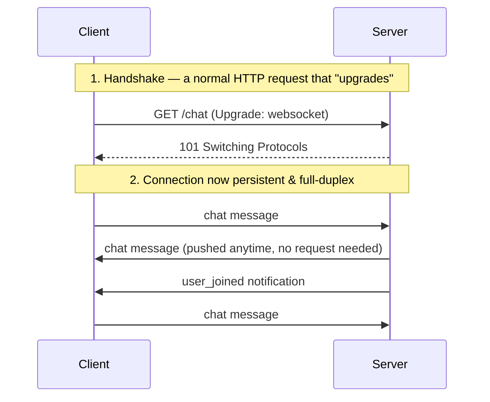

# WebSocket

## What is it?

**WebSocket** is a protocol that keeps a single, **persistent, two-way (full-duplex)** connection open between a client and a server. This is fundamentally different from [[REST APIs|REST]], [[GraphQL]], [[SOAP]], and typical [[gRPC]] unary calls, all of which follow a **request → response, connection closes** pattern. With WebSocket, once the connection is open, either side can send a message to the other **at any time**, without the client having to ask first.

## Why does it exist?

Some applications need the server to push updates to the client the moment something happens — a new chat message, a live stock price change, another player's move in a game. With a request-response model like REST, the client has no way to know *when* new data is available; it would have to keep asking:

- **Polling**: the client sends a REST request every few seconds asking "anything new?" — wasteful (most requests return "no"), and updates are delayed by the polling interval.
- **Long polling**: the client sends a request, and the server holds it open until there's something to say — better, but still re-opens a new request after every response, with overhead per cycle.

WebSocket solves this properly: open **one** connection, and let the server push data the instant it's available, with no repeated request overhead.

## Request-response vs WebSocket, visually



## How does it work?

### The handshake

A WebSocket connection starts as a normal HTTP request, containing a special `Upgrade` header:

```
GET /chat HTTP/1.1
Host: example.com
Upgrade: websocket
Connection: Upgrade
```

If the server supports it, it responds confirming the upgrade, and from that point on, **the same underlying TCP connection is reused for WebSocket framing instead of HTTP** — no more HTTP requests are needed on that connection. The URL scheme changes to `ws://` (or `wss://` for the encrypted version, the WebSocket equivalent of `https://`).

### After the handshake: free-form, two-way messaging

Once connected, both client and server can send messages independently, at any time:

```
Client → Server: { "type": "chat_message", "text": "hi" }
Server → Client: { "type": "chat_message", "user": "Ravi", "text": "hey!" }
Server → Client: { "type": "user_joined", "user": "Priya" }
```

There's no concept of "request" and "response" anymore — just a stream of messages in either direction, whenever either side has something to send.

### Example: browser client

```javascript
const socket = new WebSocket("wss://example.com/chat");

socket.onopen = () => {
  socket.send(JSON.stringify({ type: "chat_message", text: "hi" }));
};

socket.onmessage = (event) => {
  const data = JSON.parse(event.data);
  console.log("Received:", data);
};

socket.onclose = () => {
  console.log("Connection closed");
};
```

## When to use

- Live chat and messaging apps
- Multiplayer games needing near-instant state sync between players
- Real-time dashboards — live stock tickers, sports scores, monitoring metrics
- Collaborative editing (Google Docs-style — seeing other users' cursors and edits instantly)
- Live notifications that must arrive the moment they happen, not seconds later

## When not to use

- Data that changes infrequently — a REST endpoint the client checks occasionally (or even a simple periodic poll) is simpler and avoids holding an open connection unnecessarily
- One-way server-to-client updates only (no client-to-server messages needed) — **Server-Sent Events (SSE)**, a simpler one-directional protocol built on plain HTTP, is often a better fit and easier to scale
- Systems where horizontal scaling simplicity matters more than real-time delivery — REST's statelessness means any server can handle any request; WebSocket connections are stateful and tied to a specific server instance, complicating load balancing

## Common mistakes

- **Using WebSocket where simple polling or SSE would do**: holding an open connection per client has real server resource cost (memory, file descriptors) — don't reach for WebSocket by default; use it when true two-way, low-latency communication is actually needed.
- **Not handling reconnection**: network drops happen — production WebSocket clients need reconnect logic (often with exponential backoff) to recover gracefully, which isn't automatic.
- **Forgetting WebSocket is stateful**: unlike REST's stateless requests (any server instance can handle any request), a WebSocket connection lives on one specific server. Scaling WebSocket servers horizontally requires extra infrastructure (sticky sessions, or a shared pub/sub layer like Redis to broadcast messages across server instances).
- **Skipping authentication on the initial handshake**: since there's no per-message "request" to attach fresh credentials to the way REST attaches headers, WebSocket apps typically authenticate once during the handshake (e.g. a token in the connection URL or an initial message) and must handle what happens if that session should later be revoked.

## Edge cases / Important details

- **WebSocket vs Server-Sent Events (SSE)**: SSE is one-way only (server → client), built on plain HTTP (no special upgrade/protocol), and automatically reconnects in the browser. Use SSE when you only need server-to-client push; use WebSocket when the client also needs to send messages back on the same connection.
- A WebSocket connection can remain open for hours or days — unlike REST requests, which complete in milliseconds to seconds.

## Related concepts
- [[API]] — the general concept; see the overview note for how WebSocket compares to REST, GraphQL, SOAP, and gRPC
- [[REST APIs]] — the request-response style WebSocket deliberately departs from
- [[GraphQL]] — GraphQL **subscriptions** (real-time updates) are commonly transported over WebSocket
- [[JSON]] — the typical message format sent over a WebSocket connection, though it's not required (binary frames are also supported)

## Open Questions / To Explore Later
- Server-Sent Events (SSE) in more depth, as the simpler one-way alternative
- Scaling WebSocket servers (sticky sessions, Redis pub/sub for broadcasting across instances)
- Socket.IO and other libraries that add reconnection/fallback on top of raw WebSocket
