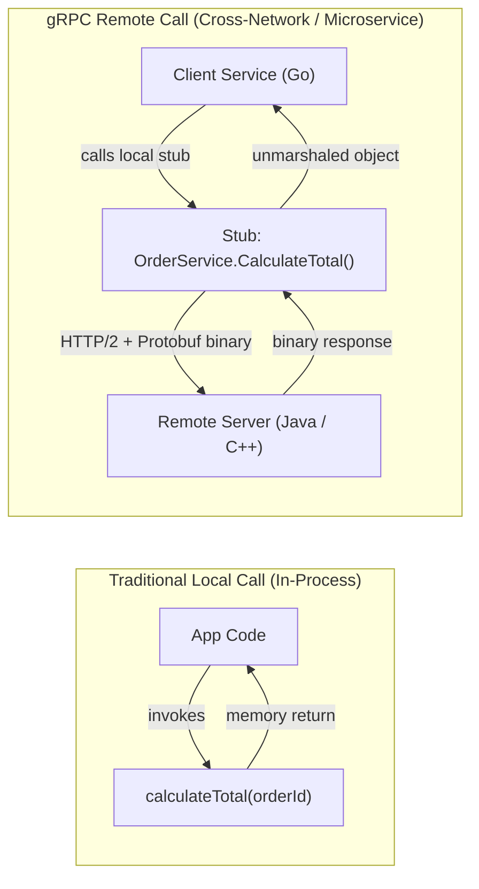
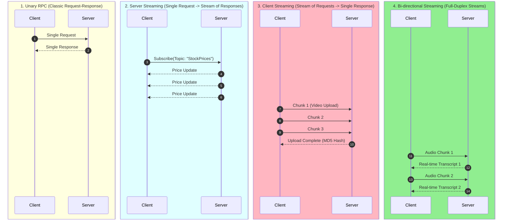

# ![[grpc-logo.svg|40]] gRPC — High-Performance RPC & Microservices Architecture

**gRPC** (gRPC Remote Procedure Call) is an open-source, high-performance universal RPC framework developed by Google. In gRPC, a client application can directly call a method on a server application running on a completely different machine as if it were a local function call in memory.

---

## 🖼️ gRPC Binary RPC Architecture

![[grpc-architecture-diagram.svg|960]]

---

## 🧠 The Core Mental Model (Local vs. Remote Function Calls)



---

## ⚙️ The Protobuf Compilation Workflow

```mermaid
flowchart TD
    Proto[".proto Contract File<br/>(service & message definitions)"]
    
    Compiler["<b>protoc</b> (Protocol Buffer Compiler)"]
    
    Proto --> Compiler
    
    Compiler -->|--go_out| GoStub["Go Client Stub & Interface"]
    Compiler -->|--python_out| PyStub["Python Client Stub"]
    Compiler -->|--java_out| JavaServer["Java Backend Server Base"]
    Compiler -->|--cpp_out| CppEngine["C++ Low-Latency Engine"]

    GoStub <==|"Binary Wire Protocol (HTTP/2)"| JavaServer
    PyStub <==|"Binary Wire Protocol (HTTP/2)"| CppEngine
```

---

## 🚀 Concrete gRPC Example: Contract & Stub Usage

To understand why gRPC is so powerful, see how service contracts are designed and compiled.

### 1. The Strict Interface Contract (`users.proto`)
```protobuf
syntax = "proto3";

package users;

// Define the service contract
service UserService {
  // Remote Procedure: receives a request and returns a response
  rpc GetUser (UserRequest) returns (UserResponse);
}

// Request payload structure (numbered positions denote binary serialization indices)
message UserRequest {
  int32 user_id = 1;
}

// Response payload structure
message UserResponse {
  int32 id = 1;
  string name = 2;
  string email = 3;
}
```

### 2. Utilizing Compiled Client Stubs (Go Client Code)
Once `protoc` is run on the `.proto` file, a local client stub is compiled, enabling static type safety and local-like function calls:

```go
package main

import (
	"context"
	"log"
	"google.golang.org/grpc"
	pb "myproject/generated/users" // Generated packages
)

func main() {
	// 1. Establish high-performance, persistent HTTP/2 connection
	conn, err := grpc.Dial("localhost:50051", grpc.WithInsecure())
	if err != nil {
		log.Fatalf("failed to connect: %v", err)
	}
	defer conn.Close()

	// 2. Instantiate the generated Client Stub
	client := pb.NewUserServiceClient(conn)

	// 3. Call the remote server directly, exactly like a local function!
	req := &pb.UserRequest{UserId: 42}
	res, err := client.GetUser(context.Background(), req)
	if err != nil {
		log.Fatalf("could not fetch user: %v", err)
	}

	// 4. Access fields with type-safe generated getters
	log.Printf("Successfully retrieved User: %s (%s)", res.GetName(), res.GetEmail())
}
```

---

## 🌊 The 4 gRPC Communication Modes



---

## 📊 gRPC vs. REST: Quick Comparison

| Feature | gRPC | REST (HTTP/1.1 + JSON) |
| :--- | :--- | :--- |
| **Protocol / Transport** | HTTP/2 (Binary framing) | HTTP/1.1 or HTTP/2 (Text-based) |
| **Payload Format** | Protocol Buffers (Binary) | JSON (Human-readable text) |
| **Contract** | Strict `.proto` schema (Enforced at compile-time)| OpenAPI / Swagger (Optional, loose) |
| **Streaming** | Native 4-way streaming | Server-Sent Events or WebSockets needed |
| **Performance / CPU** | 7x to 10x faster serialization | Higher CPU parsing & serialization cost |
| **Browser Compatibility** | Requires `grpc-web` proxy | Supported natively by all browsers |
| **Primary Use Case** | Internal microservices, IoT, mobile backends | Public web APIs, external third parties |

---

## 🔗 Related Vault Concepts
- [[API]] — Master overview and API selection guide
- [[REST APIs]] — The public-facing alternative to gRPC
- [[WebSocket]] — For browser-native bi-directional communication
- [[System Design MOC]] — Microservices architecture and high-throughput networking
