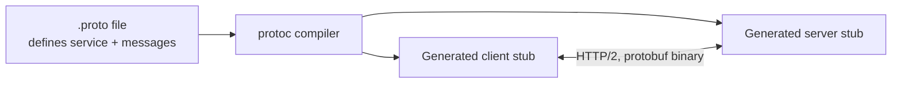
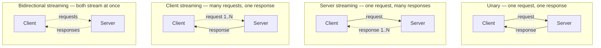

# gRPC

## What is it?

**gRPC** (gRPC Remote Procedure Call) is a high-performance framework, created by Google, for calling functions on a remote server as if they were local function calls. Instead of thinking in terms of URLs and HTTP verbs like [[REST APIs|REST]], you define a **service** with named methods, and calling a remote method looks almost identical to calling a regular function in your code.

## Why does it exist?

As companies split large applications into many small **microservices**, those services need to call each other constantly, often thousands of times per second, purely internally (never touched by a browser or end user directly). For this specific use case, REST/JSON has real overhead:

- JSON is text-based and larger than a binary format for the same data.
- REST's variety of URLs/methods doesn't map cleanly onto a formal, typed contract between services.
- HTTP/1.1 (which REST traditionally runs on) opens a new connection per request more often, adding latency at scale.

gRPC was built specifically to make internal, service-to-service calls as fast and strongly-typed as possible, trading away REST's human-readability and universal browser support (which internal services don't need anyway).

## How does it work?

### From .proto file to working code



### Protocol Buffers (protobuf)

Instead of JSON, gRPC uses **Protocol Buffers**, a compact binary serialization format. You define your service and message types in a `.proto` file:

```protobuf
syntax = "proto3";

message User {
  string id = 1;
  string name = 2;
}

message GetUserRequest {
  string id = 1;
}

service UserService {
  rpc GetUser(GetUserRequest) returns (User);
}
```

A compiler (`protoc`) reads this file and **generates client and server code** in your target language (Go, Python, Java, C++, etc.) — you get a strongly typed `getUser(request)` function to call, with no manual URL-building or JSON-parsing.

### HTTP/2 transport

gRPC runs over **HTTP/2**, which supports:
- **Multiplexing** — many requests and responses share a single connection simultaneously, instead of REST's typical one-request-per-connection pattern.
- **Streaming** — data can flow continuously in either direction without waiting for a full request/response cycle to complete.

### Four call types



| Type | Description | Example use |
|---|---|---|
| Unary | One request, one response (like a typical REST call) | `GetUser(id)` → one `User` |
| Server streaming | One request, a stream of responses | Client asks for logs; server streams them as they arrive |
| Client streaming | A stream of requests, one final response | Client uploads a stream of sensor readings; server returns one summary |
| Bidirectional streaming | Both sides stream simultaneously | Real-time chat or live collaborative editing between services |

## Example

Client code (Python-style pseudocode, after protobuf code generation):
```python
channel = grpc.insecure_channel('user-service:50051')
stub = UserServiceStub(channel)

response = stub.GetUser(GetUserRequest(id="5"))
print(response.name)
```

Notice there's no URL, no manual JSON parsing, no HTTP verb choice — `GetUser(...)` is called like a normal function, and the framework handles serialization, the network call, and deserialization behind the scenes.

## When to use

- Internal, service-to-service communication in a microservices architecture, where every caller is another backend service (not a browser)
- Performance-critical paths where the smaller binary payload and HTTP/2 multiplexing meaningfully reduce latency at high request volume
- Systems where a strongly typed contract (the `.proto` file) between services is valuable — changes are caught at compile time, not at runtime
- Streaming use cases — continuous data flows in either or both directions

## When not to use

- Public-facing APIs consumed directly by web browsers — browsers can't natively speak gRPC's HTTP/2 framing; you'd need a translation proxy (**grpc-web**), adding complexity
- APIs where human-readability matters for debugging (support engineers reading raw request/response bodies) — protobuf's binary format isn't readable without tooling, unlike JSON
- Simple APIs with low request volume, where REST's simplicity and wide tooling support outweigh gRPC's performance benefits
- Teams without protobuf/codegen tooling already in place — there's real setup investment

## Common mistakes

- **Calling gRPC directly from a browser**: browsers can't use raw HTTP/2 trailers the way gRPC needs; you need **grpc-web**, a proxy layer, to bridge browser JS to a gRPC backend.
- **Treating protobuf files as an afterthought**: the `.proto` file is the actual contract between services — changes to it (especially removing/renumbering fields) can silently break other services still using the old generated code.
- **Assuming gRPC is always faster in practice**: for small payloads or low-traffic APIs, the difference vs REST/JSON is often negligible, while gRPC's tooling and debugging overhead is real and immediate.
- **Skipping field number discipline in `.proto` files**: protobuf identifies fields by their assigned number, not name — reusing a number for a different field after removing an old one can corrupt data for anyone on an older generated client.

## Related concepts
- [[API]] — the general concept; see the overview note for how gRPC compares to REST, GraphQL, SOAP, and WebSocket
- [[REST APIs]] — the more common choice for public-facing APIs; gRPC targets internal service-to-service calls instead
- [[JSON]] — what gRPC deliberately avoids in favor of the more compact protobuf binary format

## Open Questions / To Explore Later
- grpc-web and browser integration in more depth
- Protobuf schema evolution rules (safe vs breaking changes)
- gRPC vs message queues (Kafka, RabbitMQ) for async service communication
