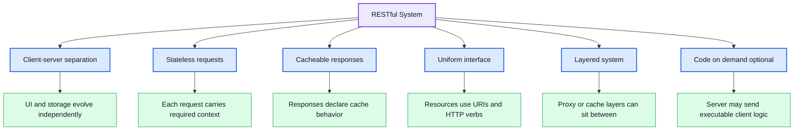
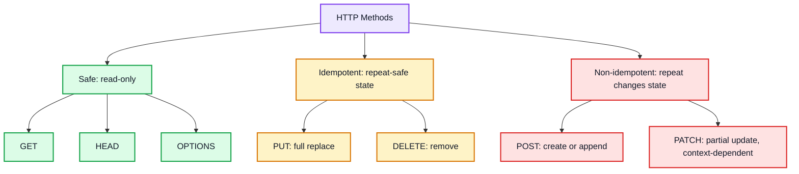
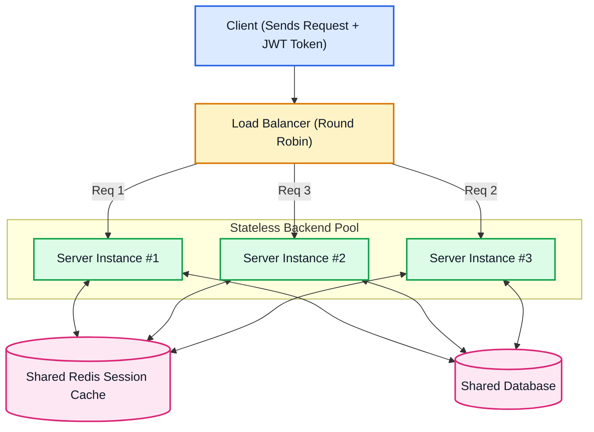

# REST APIs — Comprehensive Architecture & Design Guide

A **REST API** (Representational State Transfer) is an architectural style designed by Roy Fielding in 2000 for distributed hypermedia systems. It is not a rigid library or protocol, but rather a set of **design principles** that map operations on resources to standard [[HTTP]] methods. These principles are sometimes debated at the edges, but they remain the industry-standard best practices for building servers that stay scalable and maintainable as they grow.

---

## 🖼️ RESTful Request & Response Lifecycle Diagram

![[rest-architecture-diagram.svg|960]]

---

## 🏛️ The 6 Architectural Constraints of REST



### Client-Server Separation — the foundational rule

This is the constraint everything else builds on: **the client (a browser, a mobile app, a smart-TV app, an IoT device) and the server must be completely independent of each other.** The server doesn't know or care what kind of client is calling it — a phone app and a web browser can hit the exact same endpoint. This independence is what lets a team redesign the entire frontend without touching the backend, or swap out the database without any client noticing, as long as the API contract (URIs, request/response shapes) stays the same.

---

## 🔄 HTTP Verbs: Safety vs. Idempotency



### Complete HTTP Methods Matrix

| Method | CRUD Equivalent | Safe? | Idempotent? | Body in Request? | Response Cachable? | Example URI |
| :--- | :--- | :---: | :---: | :---: | :---: | :--- |
| `GET` | Read | ✅ Yes | ✅ Yes | ❌ No | ✅ Yes | `GET /articles/101` |
| `POST` | Create | ❌ No | ❌ No | ✅ Yes | ⚠️ Rarely | `POST /articles` |
| `PUT` | Replace / Upsert | ❌ No | ✅ Yes | ✅ Yes | ❌ No | `PUT /articles/101` |
| `PATCH` | Partial Update | ❌ No | ⚠️ Contextual | ✅ Yes | ❌ No | `PATCH /articles/101` |
| `DELETE` | Delete | ❌ No | ✅ Yes | ❌ Optional | ❌ No | `DELETE /articles/101` |
| `HEAD` | Read Headers | ✅ Yes | ✅ Yes | ❌ No | ✅ Yes | `HEAD /articles/101` |
| `OPTIONS`| Query Capabilities| ✅ Yes | ✅ Yes | ❌ No | ❌ No | `OPTIONS /articles` |

> [!IMPORTANT]
> **PUT vs. PATCH Difference:**
> - `PUT /users/42` replaces the **entire user object**. Any fields you omit are wiped or reset to defaults.
> - `PATCH /users/42` updates **only the fields provided** in the payload (e.g. `{ "email": "new@site.com" }`), leaving other fields untouched.

### ⚠️ Common anti-pattern: using `POST` for everything

A frequent beginner mistake is routing **every** action — creating, updating, deleting — through `POST`, e.g. `POST /deleteUser` or `POST /updateEmail`. This technically "works" (the server can inspect the body and figure out what to do), but it defeats the entire purpose of having distinct HTTP verbs:

- It breaks the **uniform interface** constraint — a client (or any tooling built around REST conventions, like API gateways or generic HTTP caches) can no longer infer intent from the method alone.
- It throws away **safety and idempotency guarantees** — infrastructure that knows `DELETE` is idempotent can safely retry a failed request; it can't make that assumption about `POST /deleteUser`, since `POST` is never guaranteed safe to retry.
- It makes the API harder to reason about for anyone consuming it — `DELETE /users/42` is self-explanatory; `POST /deleteUser` requires reading documentation or code to understand.

**Using the specific method for its specific purpose is what makes an API "RESTful"** rather than just "an HTTP API that happens to use JSON."

---

## 🚦 HTTP Status Codes Cheat Sheet

```mermaid
flowchart TD
    Code["HTTP Response Status Code"]

    Code --> S2["2xx Success"]
    S2 --> OK["200 OK"]
    S2 --> Created["201 Created"]
    S2 --> NoContent["204 No Content"]

    Code --> S3["3xx Redirection"]
    S3 --> Moved["301 Moved Permanently"]
    S3 --> NotModified["304 Not Modified"]

    Code --> S4["4xx Client Error"]
    S4 --> Bad["400 Bad Request"]
    S4 --> Auth["401 Unauthorized"]
    S4 --> Forbidden["403 Forbidden"]
    S4 --> Missing["404 Not Found"]
    S4 --> Limit["429 Too Many Requests"]

    Code --> S5["5xx Server Error"]
    S5 --> Crash["500 Internal Error"]
    S5 --> Gateway["502 Bad Gateway"]
    S5 --> Unavailable["503 Service Unavailable"]
    S5 --> Timeout["504 Gateway Timeout"]

    classDef root fill:#EDE9FE,stroke:#7C3AED,color:#111827,stroke-width:2px
    classDef success fill:#DCFCE7,stroke:#16A34A,color:#111827,stroke-width:2px
    classDef redirect fill:#DBEAFE,stroke:#2563EB,color:#111827,stroke-width:2px
    classDef client fill:#FEF3C7,stroke:#D97706,color:#111827,stroke-width:2px
    classDef server fill:#FEE2E2,stroke:#DC2626,color:#111827,stroke-width:2px
    class Code root
    class S2,OK,Created,NoContent success
    class S3,Moved,NotModified redirect
    class S4,Bad,Auth,Forbidden,Missing,Limit client
    class S5,Crash,Gateway,Unavailable,Timeout server
```



---

## ⚖️ Statelessness & Horizontal Scaling



---

## 🖥️ Data Format Choice: HTML (Server-Side Rendering) vs JSON

A REST server has to decide **what shape of data to hand back**, and this decision is independent of the HTTP verbs/status codes above — it's about the response *body*.

| Approach | What it means | Trade-off |
|---|---|---|
| **HTML (server-side rendering)** | The server renders a complete HTML page (using a template engine) and sends that finished markup directly to the browser. | **Faster for the browser to display** — it just paints the HTML it received, with little further processing needed. But the response is tied to *how it looks*, which makes it awkward for a non-browser client (a mobile app, a third-party integration) to consume — they'd have to parse HTML to extract the actual data. |
| **JSON (raw data)** | The server sends only the underlying data as JSON, with no presentation baked in. | **Cross-platform by design** — a web frontend, a mobile app, and a desktop app can all consume the exact same endpoint and render the data however suits their own UI. This is why JSON became the default for modern APIs consumed by multiple kinds of clients (e.g. a React frontend, see [[React MOC]]). The trade-off is the client now has to do its own rendering work. |

**In Express, this maps directly to two different response methods:**
```js
res.json(user);          // send raw data — client (e.g. React) renders it
res.render('profile', { user });  // render a template server-side and send finished HTML
```
`res.render()` requires a configured template/view engine (e.g. EJS, Pug) — it's the Express-level entry point into full server-side rendering. `res.json()` (or the more general `res.send()` from [[09 - Introduction to Express.js]], which auto-detects and JSON-encodes objects) is the entry point into building a data-only API for a separate frontend to consume.

**Practical takeaway:** choose JSON by default for any API that might have more than one kind of client (this is most real-world APIs today); reach for server-rendered HTML when you're building a traditional server-rendered website with no separate frontend app consuming the same data.

---

## 📐 REST URI Design Rules & Best Practices

| Best Practice Rule | ✅ Good URI Example | ❌ Bad / Anti-Pattern Example | Why? |
| :--- | :--- | :--- | :--- |
| **Use Nouns, Not Verbs** | `GET /orders` | `GET /getOrders` | HTTP verbs (`GET`/`POST`) already define the action |
| **Plural Naming** | `GET /users/5` | `GET /user/5` | Consistency across collection vs. singleton routes |
| **Represent Hierarchy** | `GET /authors/4/books` | `GET /getBooksByAuthor?id=4` | Sub-resources naturally show parent-child ownership |
| **Filter via Query Params** | `GET /products?category=shoes&sort=price_asc` | `GET /products/shoes/sortPrice` | Keep base resource clean; use query strings for filters |
| **Use Kebab-Case** | `GET /order-history` | `GET /order_history` or `/orderHistory` | Web URIs are case-insensitive and standardized on dashes |

---

## 🚀 REST Implementation Examples

To make REST concrete, here is how you build a standard `GET /users/:id` endpoint in two of the most popular modern ecosystems.

### ![[nodejs.svg|24]] Node.js (Express)

```javascript
const express = require('express');
const app = express();
const PORT = 3000;

// Mock database
const users = {
  42: { id: 42, name: "Alice", email: "alice@example.com" }
};

// REST Endpoint: GET resource by ID — data-only response for a separate frontend (e.g. React)
app.get('/users/:id', (req, res) => {
  const userId = req.params.id;
  const user = users[userId];

  if (user) {
    res.status(200).json(user); // 200 OK with JSON payload
  } else {
    res.status(404).json({ error: "User not found" }); // 404 Not Found
  }
});

// Same resource, but server-rendered HTML instead (requires a configured view engine)
app.get('/users/:id/profile-page', (req, res) => {
  const user = users[req.params.id];
  if (!user) return res.status(404).send("User not found");
  res.render('profile', { user }); // renders e.g. views/profile.ejs with `user` in scope
});

app.listen(PORT, () => console.log(`REST Server running on port ${PORT}`));
```

### ![[fastapi-rest.svg|24]] Python (FastAPI)

```python
from fastapi import FastAPI, HTTPException, status
from pydantic import BaseModel

app = FastAPI()

# Resource Schema

class User(BaseModel):
    id: int
    name: str
    email: str

# Mock database

users = {
    42: User(id=42, name="Alice", email="alice@example.com")
}

# REST Endpoint: GET resource by ID

@app.get("/users/{user_id}", response_model=User, status_code=status.HTTP_200_OK)
def get_user(user_id: int):
    user = users.get(user_id)
    if not user:
        raise HTTPException(
            status_code=status.HTTP_404_NOT_FOUND,
            detail="User not found"
        )
    return user
```

---

## 🔗 Related Vault Concepts

- [[API]] — The overarching classification guide (REST vs GraphQL vs gRPC vs WebSocket)
- [[GraphQL]] — How GraphQL solves REST over-fetching and under-fetching
- [[gRPC]] — The binary high-performance RPC alternative for microservices
- [[WebSocket]] — For real-time bi-directional messaging where REST polling is inefficient
- [[09 - Introduction to Express.js]] — `res.send()`/`res.json()` mechanics referenced above
- [[08 - HTTP Methods & Method-Based Routing in Node.js]] — reading `req.method` manually, before a framework enforces REST conventions for you
