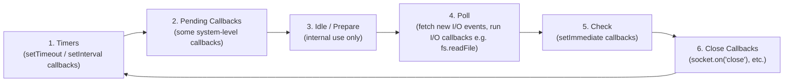
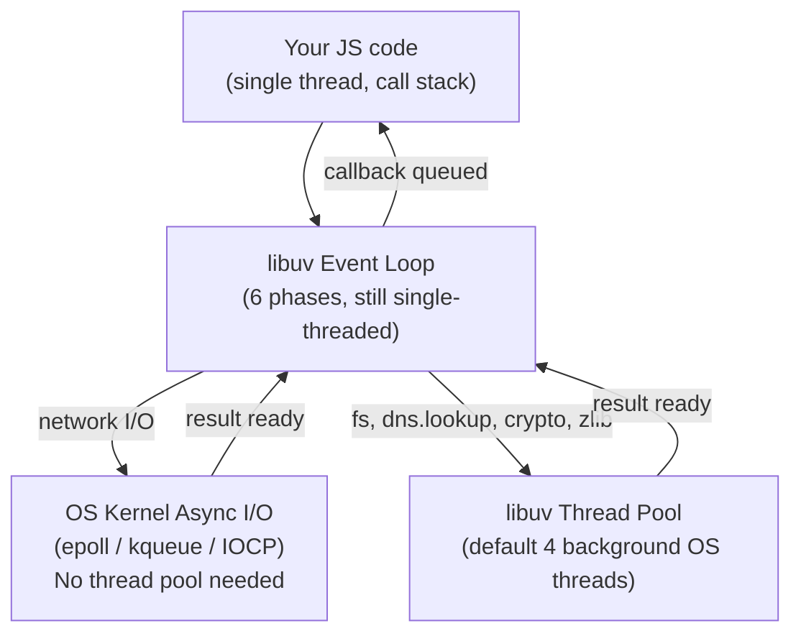

# 05 - Node.js Event Loop Phases & libuv Thread Pool

> **Prerequisite:** this note assumes you already know the *general* JS execution model — call stack, microtask queue, macrotask queue. If not, read [[Event Loop]] first (covers the browser/general-JS version of this). This note only covers what's **different or additional in Node specifically**: libuv's actual phase-by-phase event loop and the thread pool.

## Why does Node need an event loop at all?

Traditional server models (like old-school Apache) spin up a **new OS thread per incoming request**. That works, but threads are expensive (memory, context-switching overhead), so a server handling 10,000 concurrent connections needs 10,000 threads — this doesn't scale well.

Node's approach: run your JS on a **single thread**, and whenever an operation would normally block (reading a file, querying a database, waiting for a network response), hand it off to the underlying system (**libuv**) instead of waiting for it. Your single JS thread stays free to keep handling other requests. When the slow operation finishes, libuv schedules your callback to run. This is why Node is good at I/O-heavy backend work (APIs, file serving) despite being single-threaded — it's not *doing* less work, it's not *wastefully waiting* while work happens elsewhere.

## The libuv event loop: 6 phases

The general JS "microtask vs macrotask" model is a simplification. Under the hood, Node's event loop (powered by **libuv**, the same C library mentioned in [[01 - Introduction to Node.js & JavaScript Engines]]) actually cycles through distinct **phases**, each with its own callback queue:



| Phase | What runs here |
|---|---|
| **Timers** | Callbacks scheduled by `setTimeout()` and `setInterval()` — but only once their delay has actually elapsed. |
| **Pending callbacks** | Certain system-level callbacks deferred from the previous loop cycle (rare in everyday app code). |
| **Idle, prepare** | Used internally by Node itself; not something you interact with directly. |
| **Poll** | The big one — retrieves new I/O events (e.g. a completed `fs.readFile`, an incoming network connection) and runs their callbacks. Node will *wait* here if there's nothing else to do and no timers pending. |
| **Check** | Runs `setImmediate()` callbacks — designed to run "right after the poll phase finishes," which is why `setImmediate` is often used inside I/O callbacks. |
| **Close callbacks** | Cleanup callbacks, e.g. `socket.on('close', ...)`. |

**Between every single callback** (not just between phases), Node drains the **microtask queue** (Promise callbacks) and **`process.nextTick` queue** — see priority order below.

## `process.nextTick` — higher priority than everything

Node adds a queue that doesn't exist in browsers: **`process.nextTick()`**. Its callbacks run **before** the Promise microtask queue, and before the event loop proceeds to its next phase — making it the single highest-priority callback mechanism in Node.

**Priority order in Node, highest to lowest:**
1. `process.nextTick()` queue — drained completely first
2. Microtask queue (`Promise.then`, `async/await` continuations) — drained completely next
3. Whatever the current event loop phase queue holds (timers, I/O callbacks, `setImmediate`, etc.)

```js
console.log('1: sync');

setTimeout(() => console.log('2: setTimeout'), 0);

Promise.resolve().then(() => console.log('3: promise'));

process.nextTick(() => console.log('4: nextTick'));

console.log('5: sync');

// Output: 1, 5, 4, 3, 2
// nextTick beats the Promise microtask, and both beat the timer.
```

**Common mistake:** overusing `process.nextTick()` recursively (scheduling another `nextTick` from within a `nextTick` callback) can starve the event loop entirely — I/O callbacks (poll phase) never get a chance to run because Node keeps draining the `nextTick` queue first. Same starvation risk applies to recursive microtasks in general (see [[Event Loop]]).

## `setImmediate` vs `setTimeout(fn, 0)` — the classic interview question

Both *seem* to mean "run this as soon as possible," but they belong to different phases:

```js
// At the TOP LEVEL of a script, the order is NOT guaranteed —
// it depends on process startup timing (how long it took to reach this line).
setTimeout(() => console.log('timeout'), 0);
setImmediate(() => console.log('immediate'));
// Could print either order.

// INSIDE an I/O callback, the order IS guaranteed:
const fs = require('fs');
fs.readFile(__filename, () => {
  setTimeout(() => console.log('timeout'), 0);
  setImmediate(() => console.log('immediate'));
  // Always prints: immediate, then timeout.
  // Why: we're currently in the POLL phase (running an I/O callback).
  // The very next phase is CHECK (setImmediate's phase) — it comes
  // before the loop wraps back around to TIMERS.
});
```

## The libuv Thread Pool

Some operations have **no native async support at the OS level** — the underlying system call is inherently blocking (e.g. most filesystem operations on many platforms, DNS lookups via `dns.lookup`, some `crypto` functions, `zlib` compression). Since Node can't make the OS itself non-blocking for these, **libuv offloads them to a pool of background OS threads** so the main JS thread isn't stuck waiting.



**Key distinction — what actually uses the thread pool:**

| Uses the thread pool | Does NOT use the thread pool (handled by OS-native async I/O instead) |
|---|---|
| Most `fs` module operations (`fs.readFile`, `fs.writeFile`, etc.) | Network operations — TCP/HTTP sockets, `http`/`https` requests |
| `dns.lookup()` | `dns.resolve()` and its variants (these use c-ares, not the thread pool) |
| Some `crypto` functions: `pbkdf2`, `scrypt`, `randomBytes`, `randomFill` | — |
| `zlib` compression functions | — |

**Why this distinction matters:** most operating systems provide genuinely non-blocking, event-driven APIs for *networking* (epoll on Linux, kqueue on macOS, IOCP on Windows) — so libuv uses those directly with no threads needed. Filesystem APIs on many OSes don't have an equivalent non-blocking primitive, so libuv fakes non-blocking behavior for them using its thread pool instead.

### Thread pool size

```bash
# Default is 4 threads. Must be set BEFORE the Node process starts (it's read once at startup).
UV_THREADPOOL_SIZE=8 node server.js
```
- Default: **4** threads.
- Practical max: **128** (libuv's hard-coded ceiling).
- **Common mistake:** assuming more threads always means more speed, or that it should match CPU core count. Thread pool tasks are often I/O-bound (waiting on disk), not CPU-bound — a thread waiting on disk I/O isn't consuming much CPU, so having more threads than cores can still help throughput for I/O-heavy workloads. For genuinely CPU-bound thread pool work (like `crypto.pbkdf2`), increasing beyond your actual CPU core count gives diminishing or no returns, since those threads *are* competing for real CPU time.
- This setting has nothing to do with how many requests your HTTP server can accept — that's governed by the OS-level async networking path (no thread pool involved), not this pool.

## Common mistakes

- Thinking "Node is single-threaded" means *everything* in Node runs on one thread — the JS call stack is single-threaded, but libuv can and does use multiple OS threads under the hood for the thread pool.
- Doing CPU-heavy synchronous work directly in JS (e.g. a huge synchronous loop, `JSON.parse` on a massive string, sync crypto) — this blocks the *actual* single JS thread, and no thread pool helps here, because that work never leaves the main thread. This is the real danger case for Node servers: one slow synchronous computation freezes every other request being handled.
- Confusing "the event loop has 6 phases" with "there are 6 kinds of macrotasks" — they're the same idea from two angles; each phase processes one category of callback.

## Related concepts
[[Event Loop]] — general call stack / microtask / macrotask model (read first if new to this topic)
[[01 - Introduction to Node.js & JavaScript Engines]] — what libuv is and why Node embeds it
[[04 - File Handling in Node.js (fs module)]] — `fs` is the most common thread-pool consumer you'll actually write
[[06 - Building an HTTP Server with the http Module]] — network I/O in practice, which bypasses the thread pool entirely
