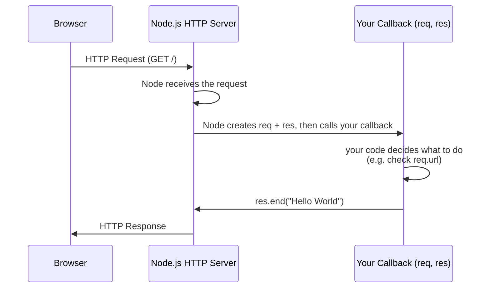

# 06 - Building an HTTP Server with the http Module

*(Following Piyush Garg's Node.js playlist.)*

## What is an HTTP server, conceptually?

Before touching code, hold this simple mental model: an HTTP server is just a program that sits and waits, and every time it receives a request, it processes it and sends something back.

```
Browser
   │
   │  GET /
   ↓
HTTP Server
   │
   │  "Hello World"
   ↓
Browser
```

**A "server" doesn't need to be a special physical machine.** During local development, your own laptop plays both roles at once — it runs the browser making the request *and* the Node.js process acting as the server answering it:

```
Your Laptop
├── Browser          (the client)
└── Node.js Process  (the server)
```

## `localhost` and ports — where the request actually goes

Two terms you'll see constantly, and both are simpler than they sound:

- **`localhost`** means *"this computer"* — it's a hostname that always resolves back to the machine you're currently on (technically the loopback address `127.0.0.1`), rather than pointing out to some server on the internet.
- **A port** is a number that identifies *which specific service* on that computer should receive the connection. One computer can run many network services simultaneously — a Node app, a database, another dev server — so ports disambiguate which one a given request is meant for.

```
localhost:8000   →  port 8000 on this computer
localhost:3000   →  port 3000 on this computer  (a different service)
localhost:5432   →  port 5432 on this computer  (e.g. PostgreSQL's default port)
```

So when you write:
```js
server.listen(8000);
```
you're telling Node: *"start listening for incoming connections specifically on port 8000."* And when your browser opens `http://localhost:8000`, it's saying: *"on this computer, talk to whatever is listening on port 8000"* — which is your Node server.

## What is the `http` module?

**`http`** is one of Node's **core modules** (see [[03 - npm, package.json & Node Modules]]) — it lets you create a web server directly, with no framework, by handling raw HTTP requests and responses yourself.

```js
const http = require('http');
```

Express (which you'll get to later) is itself built **on top of** this exact module — everything Express does (routing, middleware, `req`/`res` helpers) is ultimately implemented using `http` underneath. Learning this first is what makes Express make sense later, instead of feeling like magic.

## Why does it exist?

A web server's job, at the lowest level, is: accept incoming TCP connections, parse the raw HTTP text (request line, headers, body) arriving over that connection, and let your code decide what to send back. Doing this by hand with raw TCP sockets would mean re-implementing the entire HTTP protocol parser yourself. The `http` module does that parsing for you and hands you clean `req` (request) and `res` (response) objects — your job is just to decide, per request, what data to send back.

## `http.createServer(requestListener)`

```js
const server = http.createServer((req, res) => {
  // this function runs once for EVERY incoming request
});
```

### What is a callback, really? (the "you give it, Node calls it" mental model)

The function you pass in — `(req, res) => { ... }` — is a **callback**. The key idea to really absorb: **you don't call this function. Node calls it, whenever a request shows up.**

```js
// You:
http.createServer(myFunction);

// What Node does internally, conceptually:
whenRequestArrives(() => {
    myFunction(req, res);
});
```

Visualized as a flow:

```
YOU
 │
 │  hand Node a function
 ↓
NODE
 │
 │  waits quietly, doing nothing yet
 ↓
an HTTP request arrives
 │
 ↓
NODE calls the function YOU gave it
 │
 ↓
your callback executes, using fresh req/res for this request
```

This is why it's literally called a "call-back" — Node calls your code *back* later, when the relevant event (a request) actually happens, rather than you calling it yourself right away.

### Why does `createServer` take a callback at all?

Because a server, once started, **keeps running indefinitely** and will receive an unknown number of requests over its lifetime — you can't just "run some code once" the way you would in a script. You need a function that gets **invoked automatically, once per request, with a fresh `req`/`res` pair each time**. That's exactly what a callback is for.

Under the hood, `http.createServer(requestListener)` is shorthand for:
```js
const server = new http.Server();
server.on('request', requestListener);
```
This is Node's standard **event-driven pattern** (the same `EventEmitter` pattern used throughout Node): the server object emits a `'request'` event every time a new HTTP request arrives, and `requestListener` is just the function registered to run whenever that event fires. `createServer` simply does this event registration for you in one step, since "handle a request" is the one thing every HTTP server needs to do.

## `server.listen(port, callback)`

```js
server.listen(8000, () => console.log('server started'));
```
This binds the server to the port number discussed above and starts accepting incoming connections on it. The callback fires once the server has successfully started listening — useful for confirming startup (logging, readiness checks). **One server, one port** — a single `http.Server` instance listens on exactly one port at a time.

## Key `req` (request) properties — what you actually need

| Property / Method | What it gives you |
|---|---|
| `req.url` | The path (+ query string) requested, **relative to the server root** — e.g. `/about` or `/search?q=node`. Not the full URL (no domain/protocol). Visiting `http://localhost:8000/` gives `"/"`; visiting `.../about` gives `"/about"`. |
| `req.method` | The HTTP verb used: `'GET'`, `'POST'`, `'PUT'`, `'DELETE'`, etc. A normal browser page visit is a `GET`. |
| `req.headers` | An object of all request headers, with lowercase keys (e.g. `req.headers['content-type']`). |
| `req.on('data', chunk => ...)` | Fires repeatedly as the request **body** arrives, in `Buffer` chunks (bodies arrive as a stream, not a ready-made property — this is why frameworks like Express need body-parsing middleware to give you a convenient `req.body`). |
| `req.on('end', () => ...)` | Fires once the entire body has been received — where you'd assemble the collected chunks into the final body. |

## Key `res` (response) properties/methods

| Method | What it does |
|---|---|
| `res.writeHead(statusCode, headersObj)` | Sets the status code (e.g. `200`, `404`) and response headers **before** sending the body. Must be called before `res.write`/`res.end` if you need custom headers. |
| `res.setHeader(name, value)` | Sets a single response header. |
| `res.write(chunk)` | Sends part of the response body — can be called multiple times for streaming output. |
| `res.end([data])` | **Finalizes and sends** the response, optionally with one last chunk of data. `res.end("Hello World")` means: finish the response and send `"Hello World"` back to the client. |

**Common mistake:** forgetting to call `res.end()` — without it, the response is never sent, and the client (browser/Postman) hangs indefinitely waiting, because as far as it knows the server hasn't finished replying.

## The complete request/response flow

This is the single most important mental model for everything above:



In words: browser sends a request → Node receives it → Node builds fresh `req`/`res` objects for this exact request → Node invokes **your** callback with them → your code runs and calls `res.end(...)` → Node sends that back as the HTTP response → the browser receives it.

## Your first server

```javascript
const http = require("http");

const server = http.createServer((req, res) => {
    res.end("Hello World");
});

server.listen(8000, () => {
    console.log("Server started");
});
```

Breaking down each line:
- `require("http")` → get Node's HTTP module.
- `http.createServer(...)` → create an HTTP server object.
- `(req, res) => {}` → the callback Node will invoke for every incoming request.
- `res.end("Hello World")` → send the response.
- `server.listen(8000)` → start listening on port 8000.

## A more realistic version: logging + async response

```javascript
const http = require("http");
const fs = require("fs");

const server = http.createServer((req, res) => {
    const log = `${Date.now()}:New Req Recieved\n`;
    fs.appendFile('log.txt', log, (err, data) => {
        res.end("Hello From Server Again");
    });
});

server.listen(8000, () => console.log("server started"));
```

Walkthrough:
- Every incoming request triggers the `requestListener` callback.
- `Date.now()` timestamps the request, building a one-line log entry.
- `fs.appendFile(...)` (see [[04 - File Handling in Node.js (fs module)]]) writes that line to `log.txt` **without erasing previous entries** (unlike `writeFile`, which would overwrite the file each time).
- `res.end(...)` is called **inside** the `fs.appendFile` callback — correctly waiting for the (non-blocking, async) file write to finish before responding.
- **Improvement to note:** the `err` parameter in the `fs.appendFile` callback is never checked. In production code, you'd want:
  ```js
  fs.appendFile('log.txt', log, (err) => {
    if (err) {
      res.writeHead(500);
      return res.end("Something went wrong");
    }
    res.end("Hello From Server Again");
  });
  ```

## Basic manual routing with `req.url`

Once you can read `req.url`, you can send different responses for different paths:

```javascript
const http = require("http");

const server = http.createServer((req, res) => {
    if (req.url === "/") {
        res.end("Home Page");
    } else if (req.url === "/about") {
        res.end("About Page");
    } else {
        res.end("404 Not Found");
    }
});

server.listen(8000);
```

```
GET /            →  Home Page
GET /about       →  About Page
GET /something   →  404 Not Found
```

This is **manual routing** — you, not a framework, decide what happens for each path.

## Upgraded version: routing with `switch`

The same idea scales a little more cleanly with `switch`, and this version also demonstrates combining it with the logging pattern from earlier:

```javascript
const http = require("http");
const fs = require("fs");

const server = http.createServer((req, res) => {
    const log = `${Date.now()}:New Req Recieved: ${req.url}\n`;

    fs.appendFile('log.txt', log, (err) => {
        if (err) {
            res.writeHead(500, { 'Content-Type': 'text/plain' });
            return res.end("Server error while logging request");
        }

        res.writeHead(200, { 'Content-Type': 'text/plain' });

        switch (req.url) {
            case '/':
                res.end("Welcome to the Home Page");
                break;

            case '/about':
                res.end("This is the About Page");
                break;

            case '/contact':
                res.end("This is the Contact Page");
                break;

            default:
                res.writeHead(404, { 'Content-Type': 'text/plain' });
                res.end("404 - Page Not Found");
        }
    });
});

server.listen(8000, () => console.log("server started"));
```

**What changed and why:**
- `req.url` is compared against known paths to decide the response — this **is routing**, in its most manual form.
- A `default` case handles any unrecognized path with a proper `404`, instead of silently returning the home page response for everything (a common beginner bug — always handle the "not found" case explicitly).
- `res.writeHead(200, {...})` is set once, before the `switch`, since every matched case shares the same success status — only the `default` case overrides it to `404`.

**Why this doesn't scale (and why Express exists):**
- Real apps have dozens/hundreds of routes — an ever-growing `switch`/`if-else` chain becomes unmanageable.
- `req.url` includes query strings (`/about?ref=email` won't match the `'/about'` case exactly) — production routing needs proper URL parsing (see [[07 - URL Structure & Parsing in Node.js]]) to separate the path from the query.
- There's no clean way to handle dynamic path segments (`/users/123`) with a plain `switch`.
- Real routing also needs to check the HTTP method, not just the path (see [[08 - HTTP Methods & Method-Based Routing in Node.js]]) — `/signup` might need to behave differently for `GET` vs `POST`.
- This exact pain point — matching methods + paths + dynamic segments cleanly — is precisely what a routing framework like Express solves. Understanding *why* you'd want it is easier having built this by hand first.

## The full mental model, all together

```
                 YOUR COMPUTER
┌─────────────────────────────────────┐
│                                      │
│   Browser                           │
│      │                              │
│      │ HTTP Request                 │
│      ↓                              │
│   localhost:8000                    │
│      │                              │
│      ↓                              │
│   Node.js                           │
│      │                              │
│      ↓                              │
│   HTTP Server                       │
│      │                              │
│      ↓                              │
│   callback(req, res)                │
│      │                              │
│      ↓                              │
│   Your code                         │
│      │                              │
│      ↓                              │
│   res.end(...)                      │
│      │                              │
│      ↓                              │
│   Browser receives response         │
│                                      │
└─────────────────────────────────────┘
```

**Self-check:** if asked *"what happens when I visit `localhost:8000/about`?"*, you should be able to say — browser sends an HTTP request → it resolves to port 8000 on this machine → Node's server receives it → Node invokes your callback with fresh `req`/`res` → your code checks `req.url === "/about"` → decides what to send → calls `res.end(...)` → the browser receives that as its response. If that whole chain is second nature, this foundation is solid.

## Common mistakes

- Forgetting `res.end()` — client hangs forever.
- Comparing `req.url` directly against a path when a query string might be present (`/about?x=1 !== /about`).
- Doing heavy synchronous work inside the request handler — since Node is single-threaded for JS execution (see [[05 - Node.js Event Loop Phases & libuv Thread Pool]]), this blocks **every other concurrent request** the server is trying to handle.
- Not setting a `Content-Type` header — clients may guess the wrong type for your response body.

## Related concepts
[[04 - File Handling in Node.js (fs module)]]
[[05 - Node.js Event Loop Phases & libuv Thread Pool]] — why blocking work in a request handler is dangerous
[[03 - npm, package.json & Node Modules]] — `http` as a core module
[[07 - URL Structure & Parsing in Node.js]]
[[08 - HTTP Methods & Method-Based Routing in Node.js]]
