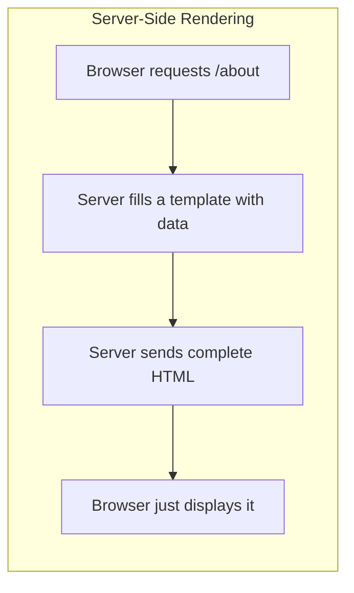
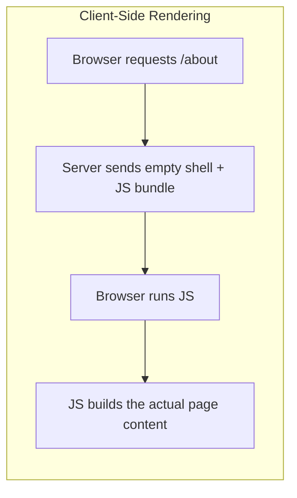

# 16 - Server-Side Rendering (SSR) & EJS

*(Following Piyush Garg's Node.js playlist.)*

## What is Server-Side Rendering (SSR)?

**SSR** means the server builds the **complete HTML page** for a request and sends that finished markup to the browser — the browser just has to display it, with little extra work. This is the opposite approach to **Client-Side Rendering (CSR)**, where the server sends a mostly-empty HTML shell plus JavaScript, and the browser itself builds the actual page content by running that JS (this is how React apps typically work — see [[React MOC]]).





### Why does SSR matter / when is it the better choice?

- **Faster first paint** — the browser has real content to show immediately, without waiting for JS to download, parse, and execute first.
- **Better for search engines and simple crawlers** — an SSR page's HTML already contains the actual content when it arrives; a CSR page may show an empty shell to anything that doesn't run JavaScript.
- **Simpler for content-heavy, less interactive sites** — blogs, documentation, traditional multi-page sites — where there isn't much dynamic client-side behavior to justify shipping a full JS framework.

This directly connects to the **HTML vs JSON** decision already covered in [[REST APIs]]: SSR is the "send HTML" branch of that decision, and `res.render()` (mentioned there and in [[09 - Introduction to Express.js]]) is Express's entry point into it.

## What is EJS?

**EJS** ("Embedded JavaScript templates") is a **template engine** — a library that lets you write plain HTML files with small snippets of JavaScript embedded directly inside them, which get evaluated and filled in with real data on the server before the final HTML is sent to the browser.

## Why does a template engine exist?

Without one, generating HTML dynamically in Node would mean manually concatenating strings — extremely messy and error-prone for anything beyond a trivial page:
```js
// Without a template engine — painful and hard to read
res.send(`<html><body><h1>Hello ${name}</h1><ul>${items.map(i => `<li>${i}</li>`).join('')}</ul></body></html>`);
```
EJS lets you write that same output as an actual `.ejs` **file** that looks almost entirely like normal HTML, with small, clearly-marked JS snippets embedded exactly where dynamic content is needed — far more readable and maintainable.

## Setting up EJS in Express

```bash
npm install ejs
```
```js
const express = require('express');
const app = express();

app.set('view engine', 'ejs'); // tell Express to use EJS as the template engine
// Express automatically looks for templates in a folder named `views/` by default
```

```js
app.get('/about', (req, res) => {
    res.render('about', { name: 'Aryan', skills: ['Node', 'Express', 'React'] });
    // looks for views/about.ejs, fills it with the given data object, sends the resulting HTML
});
```

## EJS syntax

| Tag | What it does |
|---|---|
| `<% ... %>` | **Scriptlet** — runs JS logic (loops, conditionals) but outputs nothing itself. |
| `<%= ... %>` | Outputs a value, **HTML-escaped** — safe default for untrusted/user-provided data (prevents XSS by converting `<`, `>`, `&`, etc. into safe entities). |
| `<%- ... %>` | Outputs a value **without escaping** — use only for HTML you trust (e.g. rendering another partial template), never for raw user input. |
| `<%# ... %>` | A comment — ignored entirely, not rendered into the output. |
| `<%- include('partial') %>` | Inserts another `.ejs` file's rendered output at this point — for reusable pieces like a header/footer. |

### Example: `views/about.ejs`

```html
<!DOCTYPE html>
<html>
<body>
    <h1>Hello, <%= name %>!</h1>

    <ul>
        <% skills.forEach(skill => { %>
            <li><%= skill %></li>
        <% }) %>
    </ul>
</body>
</html>
```
Given `res.render('about', { name: 'Aryan', skills: ['Node', 'Express', 'React'] })`, this produces a complete HTML page with `Aryan` and each skill filled in — all computed server-side, before anything reaches the browser.

## Common mistakes

- **Forgetting `app.set('view engine', 'ejs')`** — `res.render()` won't know how to interpret `.ejs` files without it.
- **Using `<%- %>` (unescaped) for user-submitted data** — this is a direct **XSS (Cross-Site Scripting) vulnerability**: if a user's input contains `<script>...</script>` and it's inserted unescaped, that script actually runs in every visitor's browser. Always default to `<%= %>` for anything that came from user input; reserve `<%- %>` for trusted content like your own partials.
- **Putting `.ejs` files outside the default `views/` folder** without telling Express where to look (`app.set('views', './myTemplatesFolder')`) — `res.render()` will fail to find the template.
- Confusing EJS (server-side templating, output is plain HTML sent once) with a frontend framework like React (client-side, interactive, re-renders in the browser without a full page reload) — they solve different problems and are often not used together in the same project.

## Related concepts
[[09 - Introduction to Express.js]] — where `res.render()` was first introduced
[[REST APIs]] — the HTML (SSR) vs JSON decision this note expands on
[[React MOC]] — the client-side-rendering alternative (React itself can also do SSR via frameworks like Next.js, a different topic from EJS)
