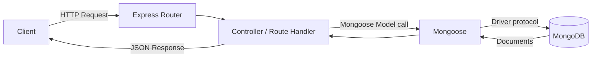

# MongoDB

## What is it?

MongoDB is a **NoSQL, document-oriented database**. Instead of storing data in rigid tables of rows and columns (like MySQL or PostgreSQL), it stores data as **documents** — JSON-like objects — grouped into **collections**.

```
SQL World                    MongoDB World
─────────                    ─────────────
Database         ──────────►  Database
Table             ──────────►  Collection
Row                ──────────►  Document
Column             ──────────►  Field
```

A document looks like this:

```json
{
  "_id": "651f3a1b9e1a4c2b8f9d3e21",
  "name": "Aryan",
  "email": "aryan@example.com",
  "skills": ["React", "Node", "MongoDB"],
  "address": { "city": "Nagpur", "pin": "440001" }
}
```

Nested objects and arrays live directly inside one document — no JOIN is needed to read a user's address or skills. Under the hood, documents are stored as **BSON** (Binary JSON) — a binary encoding of JSON that adds extra types JSON doesn't have natively (dates, binary data, etc).

`_id` is a special field every document gets automatically (type `ObjectId`) unless you supply your own — it acts as the primary key.

## Why does it exist? What problem does it solve?

Relational databases force every row in a table to share the exact same columns, and enforce relationships by splitting data across multiple linked tables (requiring JOINs to reassemble it). This is powerful for strict, tabular data — but painful when:

- Your data doesn't naturally fit fixed columns (e.g. user profiles where different users have different optional fields)
- Your data is naturally nested/hierarchical (comments on a post, items in an order)
- You want to move fast without designing a rigid schema upfront, or your schema will evolve often

MongoDB solves this by letting each document have its own shape, and by keeping related data physically together in one document instead of splitting it across tables — trading some of SQL's strict structure for flexibility and speed of development, especially for JS/JSON-shaped data (which pairs naturally with Node.js/Express).

## Key concepts

| Term | Meaning |
|---|---|
| **Document** | A single record, stored as BSON. Equivalent to a row in SQL. |
| **Collection** | A group of documents. Equivalent to a table. Schema-less by default — two documents in the same collection can have different fields. |
| **Database** | A container for collections. One MongoDB server can host many databases. |
| **`_id` / ObjectId** | Auto-generated unique identifier for each document (not a plain string — it's an `ObjectId` type). |
| **BSON** | Binary JSON — MongoDB's storage format. |
| **mongosh** | MongoDB's official shell — a JavaScript-like CLI for running commands directly against a database. |
| **Index** | A data structure that speeds up queries on specific fields, avoiding a full collection scan. |

## How does it work? (Core syntax via `mongosh`)

This is MongoDB's "raw" query language. Everything below runs in `mongosh` or via the native drivers; Mongoose (see below) is a layer built on top of this same language.

### Selecting a database
```js
use myDatabase        // creates the DB on first insert if it doesn't exist
show dbs
show collections
```

### Create (Insert)
```js
db.users.insertOne({ name: "Aryan", age: 21 })

db.users.insertMany([
  { name: "Aryan", age: 21 },
  { name: "Riya", age: 23 }
])
```

### Read (Find)
```js
db.users.find()                                 // all documents
db.users.find({ age: 21 })                       // filter
db.users.findOne({ name: "Aryan" })              // first match only

// Comparison operators
db.users.find({ age: { $gt: 20 } })              // greater than
db.users.find({ age: { $gte: 20, $lte: 30 } })   // range
db.users.find({ age: { $in: [21, 23] } })

// Logical operators
db.users.find({ $or: [{ age: 21 }, { name: "Riya" }] })

// Projection — choose which fields to return
db.users.find({}, { name: 1, _id: 0 })           // only name, hide _id
```

### Update
```js
db.users.updateOne(
  { name: "Aryan" },
  { $set: { age: 22 } }
)

db.users.updateMany(
  { age: { $lt: 25 } },
  { $inc: { age: 1 } }     // increment field
)
```
⚠️ Without `$set`, `updateOne({filter}, { age: 22 })` **replaces the entire document** with `{ age: 22 }`, deleting every other field. This is the most common beginner mistake.

### Delete
```js
db.users.deleteOne({ name: "Aryan" })
db.users.deleteMany({ age: { $lt: 18 } })
```

### Common query operators
| Operator | Meaning |
|---|---|
| `$eq`, `$ne` | equal / not equal |
| `$gt`, `$gte`, `$lt`, `$lte` | greater/less than (or equal) |
| `$in`, `$nin` | value in / not in array |
| `$and`, `$or`, `$not` | logical combinators |
| `$exists` | field exists or not |
| `$regex` | pattern match (like SQL `LIKE`) |
| `$set` | set a field's value (update) |
| `$inc` | increment a numeric field |
| `$push` | add an item to an array field |
| `$unset` | remove a field |

### Indexes
```js
db.users.createIndex({ email: 1 })   // 1 = ascending, -1 = descending
```
Without an index, MongoDB scans every document to find a match (a "collection scan") — slow as data grows. Index fields you query or sort on frequently, e.g. `email` for login lookups.

### Aggregation pipeline (analytics-style queries)
Think of this as SQL's `GROUP BY` + `JOIN`, expressed as a pipeline of stages where each stage's output feeds the next — similar to piping commands in Linux.
```js
db.orders.aggregate([
  { $match: { status: "delivered" } },                          // filter
  { $group: { _id: "$userId", total: { $sum: "$amount" } } },   // group + sum
  { $sort: { total: -1 } }                                      // sort
])
```

## Using MongoDB with Node.js/Express (Mongoose)

There are two ways to talk to MongoDB from Node:
1. **Native MongoDB Node.js driver** — queries nearly identical to the `mongosh` syntax above, written in async JS.
2. **Mongoose** (an ODM — Object Document Mapper) — adds schemas, validation, and a cleaner model-based API on top of the driver. **This is the standard choice in real Express projects**, so it's the one worth mastering.

### Why Mongoose, if MongoDB is schema-less?
Schema-less is flexible but dangerous — nothing stops a typo like `{ nam: "Aryan" }` from silently being inserted into your `users` collection. Mongoose lets you define the *expected* shape of a document in code, validates data before it reaches the DB, and gives convenient methods (`.save()`, `.find()`) tied to JS classes instead of raw collection calls.

### 1. Install & connect
```bash
npm install mongoose
```
```js
const mongoose = require('mongoose');

mongoose.connect('mongodb://127.0.0.1:27017/myDatabase')
  .then(() => console.log('MongoDB connected'))
  .catch((err) => console.log('Connection error', err));
```
For MongoDB Atlas (cloud-hosted):
```
mongodb+srv://<user>:<password>@cluster0.xxxxx.mongodb.net/myDatabase
```

### 2. Define a Schema and Model
A **Schema** defines the shape and validation rules of a document. A **Model** is a compiled class built from the schema, used to actually query the database.

```js
const { Schema, model } = require('mongoose');

const userSchema = new Schema({
  name: { type: String, required: true },
  email: { type: String, required: true, unique: true },
  age: { type: Number, min: 0 },
  createdAt: { type: Date, default: Date.now }
});

const User = model('User', userSchema);  // collection name auto-pluralized → "users"
module.exports = User;
```

### 3. CRUD with Mongoose inside Express routes
```js
const express = require('express');
const router = express.Router();
const User = require('./models/User');

// CREATE
router.post('/users', async (req, res) => {
  try {
    const user = await User.create(req.body);   // req.body = { name, email, age }
    res.status(201).json(user);
  } catch (err) {
    res.status(400).json({ error: err.message });
  }
});

// READ all
router.get('/users', async (req, res) => {
  const users = await User.find();
  res.json(users);
});

// READ one
router.get('/users/:id', async (req, res) => {
  const user = await User.findById(req.params.id);
  if (!user) return res.status(404).json({ error: 'Not found' });
  res.json(user);
});

// UPDATE
router.put('/users/:id', async (req, res) => {
  const user = await User.findByIdAndUpdate(req.params.id, req.body, { new: true });
  res.json(user);
});

// DELETE
router.delete('/users/:id', async (req, res) => {
  await User.findByIdAndDelete(req.params.id);
  res.status(204).send();
});

module.exports = router;
```
`{ new: true }` in `findByIdAndUpdate` makes it return the *updated* document instead of the original pre-update one — easy to forget.

### Request flow



## When to use
- Data shape varies between records (not every document needs identical fields)
- Data is naturally nested/hierarchical (comments on posts, items in an order)
- You need to move fast without locking in a rigid schema
- High write throughput and horizontal scaling needs

## When NOT to use
- You need strict multi-table relationships with heavy transactional consistency (e.g. banking across accounts) — relational DBs' ACID guarantees across tables are more mature here
- Your data is inherently tabular and relationships/JOINs are the core of the app (heavy reporting)
- You constantly need complex multi-document transactions (MongoDB supports them, but it's not its strength)

## Common mistakes
- Forgetting `await` on Mongoose queries — you get a Promise object instead of the actual data.
- Using raw `update()` without `$set` — replaces the whole document instead of patching one field.
- Not handling `findById` returning `null` for a non-existent ID — crashes if you access `.name` on `null` without checking.
- Storing passwords in plain text — always hash before saving (e.g. bcrypt in a pre-save hook).
- Comparing `_id` as a plain string without conversion — it's an `ObjectId` type, not a string.
- Not indexing fields used in frequent lookups (e.g. `email` for login) — causes slow queries as data grows.

## Edge cases
- Two documents in the same collection can have completely different fields — Mongoose schemas only enforce structure for writes that go through the Model; documents inserted directly via `mongosh` bypass that validation entirely.
- `unique: true` in a schema needs an index to actually enforce uniqueness. Mongoose creates it automatically, but adding it to an existing large collection can fail if duplicates already exist.

## Advantages
- Flexible schema — fast iteration, no migrations for every field change
- Natural fit for JSON/JS data — nested documents avoid JOINs
- Horizontal scaling (sharding) built in for large datasets
- Powerful aggregation pipeline for analytics-style queries

## Disadvantages / Tradeoffs
- Weaker multi-document transactional guarantees compared to mature relational DBs
- No enforced schema at the database level (enforcement is only as strong as your application/ODM layer)
- Data duplication across documents (denormalization) is common — trades storage/consistency effort for read speed

## Related concepts
- [[Express]] — routes call into Mongoose models
- [[REST APIs]] — CRUD routes above form a REST API
