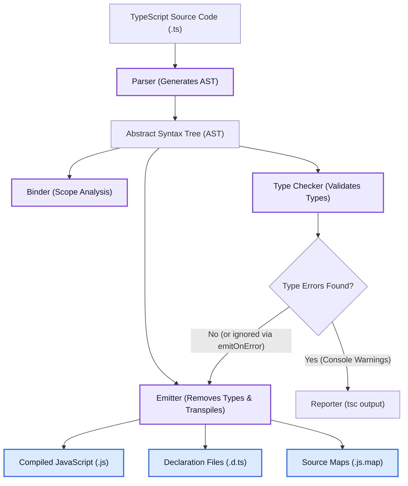

# Introduction and Compiler Config

TypeScript is an open-source, strongly-typed superset of JavaScript developed by Microsoft. It adds **static typing** on top of JavaScript's dynamic runtime behavior, providing static analysis, advanced tooling, and earlier error detection during development.

---

## 🖼️ The TypeScript Compilation Pipeline

Unlike traditional compiled languages (like C++ or Rust), the TypeScript compiler (`tsc`) does not produce machine code or binaries. Instead, it compiles TypeScript code (`.ts`) down to clean, standards-compliant JavaScript (`.js`).



### Key Concept: Type Erasure
TypeScript is completely erased at compile-time. The browser and the Node.js runtime only execute the generated JavaScript and are entirely unaware of TypeScript.
- **No Runtime Performance Overhead:** Since types are removed during code generation, TypeScript applications do not run slower than pure JavaScript.
- **Static vs. Runtime:** TypeScript performs **Static Type Checking** (checking types before execution). If a value changes its structure at runtime (e.g., due to an API payload), TypeScript's compiler cannot prevent errors unless runtime validations are added.

---

## ⚙️ The `tsconfig.json` Configuration Master Guide

The `tsconfig.json` file resides in the root directory of a TypeScript project and specifies the compiler options required to compile the project.

### Example `tsconfig.json` (Strict Production Setup)
```json
{
  "compilerOptions": {
    "target": "ES2022",                          /* Specify ECMAScript target version */
    "module": "NodeNext",                        /* Specify module code generation */
    "lib": ["ES2022", "DOM", "DOM.Iterable"],    /* Specify library files to be included */
    "strict": true,                              /* Enable all strict type-checking options */
    "noImplicitAny": true,                       /* Raise error on expressions and declarations with an implied 'any' type */
    "strictNullChecks": true,                    /* Enable strict null checks */
    "strictFunctionTypes": true,                 /* Enable strict checking of function types */
    "noUnusedLocals": true,                      /* Report errors on unused variables */
    "noUnusedParameters": true,                  /* Report errors on unused parameters */
    "noImplicitReturns": true,                   /* Report error when not all code paths in function return a value */
    "esModuleInterop": true,                     /* Enables emit interoperability between CommonJS and ES Modules */
    "skipLibCheck": true,                        /* Skip type checking of declaration files (.d.ts) */
    "forceConsistentCasingInFileNames": true,    /* Disallow inconsistently-cased references to the same file */
    "outDir": "./dist",                          /* Redirect output structure to the directory */
    "rootDir": "./src"                           /* Specify the root directory of input files */
  },
  "include": ["src/**/*"],
  "exclude": ["node_modules", "dist"]
}
```

---

## Comprehensive Compiler Options Breakdown

| Section | Option | Recommended | Description |
| :--- | :--- | :---: | :--- |
| **Project** | `target` | `ES2022` / `ESNext` | Determines what level of JavaScript features the output will use (e.g., converting ES6 classes/arrows back into ES5 if set to `ES5`). |
| **Project** | `module` | `NodeNext` / `ESNext`| Specifies the module system for output code: CommonJS (`require`), ESM (`import`), or modern runtimes. |
| **Project** | `lib` | `["DOM", "ESNext"]` | Informs the type-checker about APIs available in the environment (e.g., `window`, `document`, or specific modern array methods). |
| **Strictness**| `strict` | `true` | The "umbrella" flag. Enables all strict-mode rules. Enabling this is mandatory for clean codebases. |
| **Strictness**| `noImplicitAny` | `true` | Blocks instances where TypeScript cannot infer a type and defaults to `any` implicitly. Forces explicit typing. |
| **Strictness**| `strictNullChecks` | `true` | Prevents operating on objects that might be `null` or `undefined` unless they are explicitly checked first. |
| **Strictness**| `strictBindCallApply` | `true` | Enforces that arguments passed to `.bind`, `.call`, and `.apply` match the function signature's expected types. |
| **Analysis** | `noUnusedLocals` | `true` | Reports errors when a declared variable is never read or used in the code. |
| **Analysis** | `noImplicitReturns` | `true` | Guarantees that every possible logical branch of a function returns a value if the function declares a return type. |
| **Interop** | `esModuleInterop` | `true` | Solves compatibility issues when importing CommonJS files inside ES modules (e.g., handles `import React from 'react'` elegantly). |

---

## 🔗 Related Concepts

- [[Primitive and Special Types]] — Understanding the typing system checked by the compiler
- [[TS Integration and Build Tooling]] — Interfacing TypeScript with modern Bundlers (Vite/Webpack)
- [[TS Interview Questions and Tricky Types]] — Structural vs Nominal Typing, compiler performance debugging
