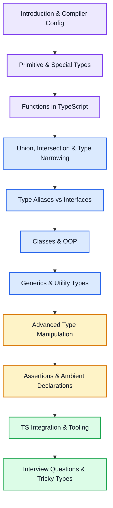

# TypeScript MOC (Map of Content)

Complete placement-ready TypeScript revision roadmap — static typing $\to$ advanced type manipulation $\to$ generic utility design $\to$ compilation pipeline $\to$ core interview drill sheet.

---

## 🧭 TypeScript Learning Flow

---

## 1. Getting Started & Compiler Mechanics

- [[Introduction and Compiler Config]] — Core architecture, `tsc` compilation flow, transpilation, abstract syntax trees (ASTs), type-erasing, and complete `tsconfig.json` compiler options.

## 2. Type Foundations

- [[Primitive and Special Types]] — Primitives (`string`, `number`, `boolean`, `symbol`), special types (`any`, `unknown`, `never`, `void`), Array and Tuple typing, and `readonly` and optional fields.
- [[Functions in TypeScript]] — Parameter and return value annotations, optional/default arguments, call/construct signatures, function overloading, and typing `this` dynamically.

## 3. Structural Composition & Guarding

- [[Union Intersection and Type Narrowing]] — Union (`|`) and Intersection (`&`) types, Literal types, Type Guards (`typeof`, `instanceof`, `in`), user-defined type predicates (`is`), and Discriminated Unions.
- [[Type Aliases and Interfaces]] — Object type annotations, differences between types and interfaces, declaration merging/re-opening interfaces, index signatures, and selecting the correct abstraction.

## 4. Object-Oriented TS & Classes

- [[Classes and OOP in TypeScript]] — Access modifiers (`public`, `private`, `protected`), `readonly` parameters, constructor shorthands (parameter properties), abstract classes, interface enforcement, and polymorphic behavior.

## 5. Generics & Polymorphism

- [[Generics and Utility Types]] — Generic parameterization of functions, classes, and types; constraints using `extends`; default types; and a complete master-class on built-in Utility Types (`Partial`, `Pick`, `Omit`, `Record`, etc.).

## 6. Advanced Type Systems (The Type-Level Programming Layer)

- [[Advanced Type Manipulation]] — Type-level programming using `keyof`, `typeof` query, indexed access types (`T[K]`), conditional types (`T extends U ? X : Y`), mapped types, and template literal types.

## 7. Escape Hatches & Interoperability

- [[Type Assertions and Ambient Declarations]] — `as` assertions, `as const` (literal assertions), non-null assertions (`!`), definite assignment assertions, DefinitelyTyped (`@types`), and writing custom `.d.ts` declaration files.

## 8. Integration, Modules & Ecosystem

- [[TS Integration and Build Tooling]] — Module resolution mechanisms, `import type` statement, namespace vs. module, project references, bundling with Vite/Next.js/esbuild, and styling/linting with `typescript-eslint`.

## 9. Interview Drill & Deep Mechanics

- [[TS Interview Questions and Tricky Types]] — Structural vs. Nominal type systems, Covariance and Contravariance ($\text{variance}$ rules), custom utility type challenges, and debugging compiler performance.

---

## 🔗 Related Areas

- [[JavaScript MOC]] — The underlying engine, closures, runtime, and Event Loop.
- [[00 - React MOC|React MOC]] — Creating type-safe React applications (typing component props, hooks, and context).
- [[API|API MOC]] — Designing type-safe client-server contracts (REST, GraphQL, WebSocket, gRPC).
- [[Git and GitHub|Git & GitHub MOC]] — Version control workflows.
