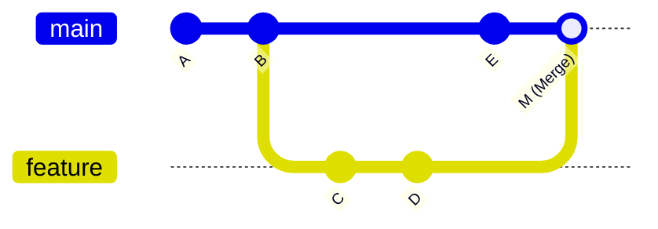
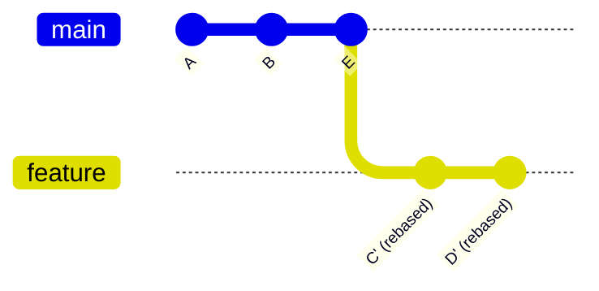

# 04 - Git Rebase

## What is rebase?
**Rebase** replays your branch's commits on top of another branch's tip, producing a **linear history** instead of a merge commit.

## Merge vs Rebase
Starting point: branch diverged from `main` at commit B. Feature branch has C, D; `main` moved on to E.

### 1. Git Merge (Preserves History & Creates Merge Commit)


### 2. Git Rebase (Replays Commits Linearly)


| | Merge | Rebase |
|---|---|---|
| History | Preserves branch structure | Linear, cleaner |
| Extra commit | Yes (merge commit) | No |
| Safe on shared branches | Yes | No — rewrites commit hashes |

## Commands
```bash
git switch feature
git rebase main                           # replay feature's commits on main

# keep a feature branch in sync with updated main
git fetch origin
git rebase origin/main

# after rebasing a branch you've already pushed
git push --force-with-lease origin feature

# if it goes wrong
git rebase --abort
```

## The Golden Rule
**Never rebase commits that have already been pushed to a shared branch.** Rebase rewrites commit history — the rebased commits (C', D') get *new hashes*, even though the content is the same. Anyone who already pulled the old commits will now have history that conflicts with yours, requiring a painful manual reconciliation.

**Safe to rebase:** local branches only you work on, before opening a PR.
**Not safe to rebase:** any branch other people have already pulled from.

## `--force-with-lease` vs `--force`
After rebasing a branch you've already pushed, you need to force-push to update the remote (since the history diverged). `--force-with-lease` refuses to overwrite the remote if someone else has pushed new commits since you last fetched — a safety check plain `--force` doesn't have. Prefer `--force-with-lease` by default.

## When to Use It
- Cleaning up your branch's commit history before opening a pull request.
- Syncing a feature branch with an updated `main` without an extra merge commit.
- On branches nobody else has pulled from.

## Common mistakes
- Rebasing a shared/public branch — rewrites history other people depend on, causing confusing conflicts for everyone who already pulled.
- Using plain `--force` instead of `--force-with-lease` — can silently overwrite a teammate's work you didn't know about.
- Rebasing when you're not confident resolving conflicts — rebase can require resolving the *same* conflict multiple times (once per replayed commit), unlike a single merge conflict resolution.

## Related Concepts
- [[Git & GitHub MOC]] — overview and full topic index
- [[Merge Conflicts]] — rebase can also produce these, resolved the same way
- [[Git Stash]]
