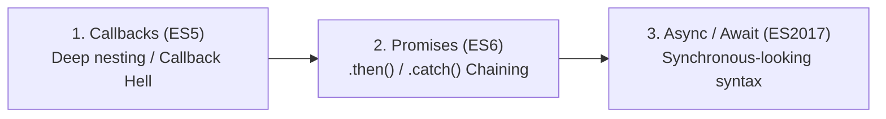

# Asynchronous JavaScript

JavaScript is single-threaded — it can only execute one task at a time. Asynchronous patterns enable programs to start long-running tasks (network requests, database lookups, timers) without blocking execution while waiting for results. See [[Event Loop]] for runtime mechanics.

---

## 🖼️ Promise Lifecycle & Async / Await Execution

![[js-async-promises.svg|960]]

---

## Evolution of Async JavaScript



---

## Promises: States & Chaining

A **Promise** has 3 distinct states:
1. **Pending** — Initial state, neither fulfilled nor rejected.
2. **Fulfilled** — Operation completed successfully (`resolve(value)` was called).
3. **Rejected** — Operation failed (`reject(error)` was called).

```javascript
const myPromise = new Promise((resolve, reject) => {
  setTimeout(() => {
    const success = true;
    success ? resolve("Success data") : reject(new Error("Operation failed"));
  }, 1000);
});

myPromise
  .then(data => console.log("Received:", data))
  .catch(err => console.error("Caught:", err.message))
  .finally(() => console.log("Cleanup complete"));
```

---

## Promise Combinators Comparison

| Method | Resolution Trigger | Rejection Trigger | Best Used For |
| :--- | :--- | :--- | :--- |
| `Promise.all([...])` | Resolves when **ALL** promises fulfill | Rejects immediately if **ANY** promise fails (Fail-Fast) | Dependent parallel API calls |
| `Promise.allSettled([...])` | Resolves when **ALL** promises finish (Fulfilled or Rejected) | **Never rejects**; returns array of `{status, value/reason}` | Batch processing where partial failure is fine |
| `Promise.race([...])` | Settles as soon as the **FIRST** promise settles | Rejects if the first promise rejects | Timeout wrappers for slow API requests |
| `Promise.any([...])` | Resolves as soon as the **FIRST** promise fulfills | Rejects only if **ALL** promises reject (`AggregateError`) | Redundant CDN or mirror fetching |

---

## Sequential vs. Parallel Async Calls

```javascript
// ❌ SLOW: Sequential execution (~2000ms total)
const user = await fetchUser();       // waits 1000ms
const settings = await fetchSettings(); // waits another 1000ms

// ✅ FAST: Parallel execution (~1000ms total)
const [user, settings] = await Promise.all([
  fetchUser(),
  fetchSettings()
]);
```

---

## 🔗 Related Concepts
- [[Event Loop]] — Microtask queues and execution priority
- [[Functions in JavaScript]] — Higher-order callback functions
- [[Error Handling and Memory]] — Error catching with `try...catch` and async functions
- [[JS Interview Questions and Tricky Outputs]] — Async output prediction questions
