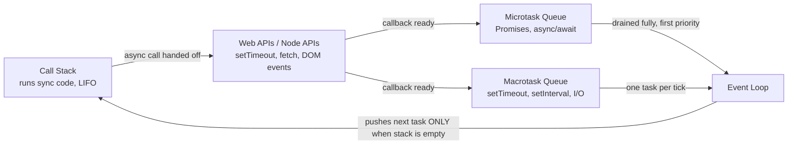

# Event Loop, Call Stack & Task Queues

JavaScript runs on a **single thread** with **one Call Stack** — yet it handles timers, network requests, and UI events without freezing. The **event loop** is the mechanism that makes this possible.

## The Pieces

- **Call Stack** — where synchronous code executes, top to bottom, LIFO (last in, first out). Every function call pushes a frame; returning pops it.
- **Web APIs (browser) / libuv (Node)** — where the *actual waiting* happens for `setTimeout`, `fetch`, DOM events, file I/O. These run **outside** the call stack, so they don't block it.
- **Microtask Queue** — holds callbacks from `Promise.then/.catch/.finally`, `queueMicrotask`, and `async/await` continuations.
- **Macrotask (Callback) Queue** — holds callbacks from `setTimeout`, `setInterval`, DOM events, I/O.
- **Event Loop** — a loop that constantly checks: *"Is the Call Stack empty? If yes, pull in the next task — always drain microtasks first."*



## The Event Loop Algorithm (simplified)

1. Run all synchronous code (Call Stack executes top to bottom).
2. When the stack is empty: **drain the entire microtask queue** (run every pending microtask, even ones added during this draining).
3. Take **ONE** task from the macrotask queue and run it.
4. Drain the microtask queue again.
5. Repeat from step 3 (render/paint may happen here in browsers).

**Rule of thumb:** microtasks always run before the next macrotask — even a `setTimeout(fn, 0)` waits behind every pending Promise callback.

## Worked Example (a classic placement question)

```javascript
console.log("1");
setTimeout(() => console.log("2"), 0);
Promise.resolve().then(() => console.log("3"));
console.log("4");

// Output: 1, 4, 3, 2
```

**Trace:**
1. `console.log("1")` → sync, runs immediately → prints `1`
2. `setTimeout(...)` → handed off to Web API, its callback goes to the **macrotask** queue once the 0ms timer expires
3. `Promise.resolve().then(...)` → callback goes to the **microtask** queue
4. `console.log("4")` → sync, runs immediately → prints `4`
5. Call stack is now empty → event loop drains microtasks → prints `3`
6. Microtask queue empty → event loop takes one macrotask → prints `2`

## Microtask vs Macrotask — Priority Table

| Queue | Contains | Priority |
|---|---|---|
| Microtask queue | `Promise.then/.catch/.finally`, `queueMicrotask`, `async/await` continuations | Runs first — **fully drained** after each macrotask |
| Macrotask (callback) queue | `setTimeout`, `setInterval`, DOM events, I/O | Runs **one at a time**, only after microtasks are empty |

## Why This Matters in Practice

- A `Promise.resolve().then()` will **always** fire before a `setTimeout(fn, 0)`, regardless of the order they were written — a frequent gotcha in "predict the output" questions.
- Long chains of `.then()` or `await` can starve macrotasks (like rendering) if they keep scheduling more microtasks — a real performance pitfall, not just a trivia fact.
- Understanding this is essential for reasoning about race conditions in async code.

## Key Takeaways

- JS is single-threaded; async operations are delegated to Web APIs/Node APIs, not the JS thread itself.
- The event loop only moves work onto the Call Stack when the stack is empty.
- Microtasks (Promises) always fully drain before the next macrotask (setTimeout/setInterval) runs.
- Practice tracing `console.log` + `setTimeout` + `Promise` output order — it's one of the most-asked JS interview formats.

## Related Concepts
- [[Asynchronous JavaScript]] — Promises and async/await, the source of microtasks
- [[Functions in JavaScript]] — callbacks queued by the event loop
- [[JS Interview Questions and Tricky Outputs]] — more output-prediction practice
