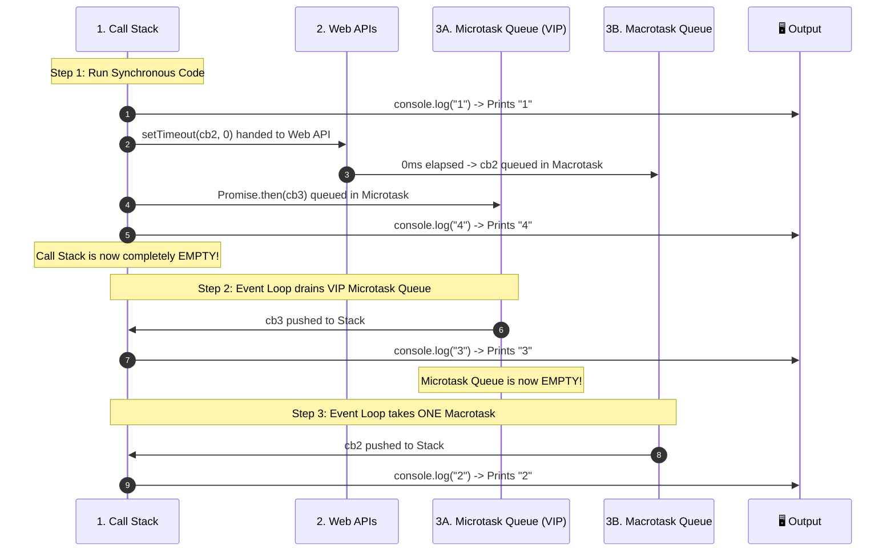

# Event Loop, Call Stack & Task Queues

JavaScript is a **single-threaded** language with **one Call Stack** — meaning it can execute only one line of code at a time. Yet, it handles long-running timers, network requests, and user clicks without freezing the browser UI. The **Event Loop** is the coordinator that makes this asynchronous concurrency possible.

---

## 🖼️ Visual Architecture: Follow the Numbered Steps (1 → 2 → 3 → 4)

![[js-event-loop-architecture.svg|960]]

---

## 🧩 The 4 Main Components Explained Simply

| Component | Role | How It Works |
| :--- | :--- | :--- |
| **1. Call Stack (LIFO)** | Code Execution | Where your JavaScript code runs line by line (Last-In, First-Out). Synchronous functions are pushed onto the stack and popped off when they return. |
| **2. Web APIs / libuv** | Background Waiting | Where async tasks (*waiting for 3s timer*, *downloading an HTTP response*, *listening for clicks*) wait **outside** the main JavaScript thread so they don't freeze the page. |
| **3A. Microtask Queue (VIP 🥇)** | High Priority Queue | Holds callbacks from `Promise.then()`, `Promise.catch()`, `async/await` continuations, and `queueMicrotask`. |
| **3B. Macrotask Queue** | Standard Priority Queue | Holds callbacks from `setTimeout()`, `setInterval()`, DOM events, and I/O. |
| **4. The Event Loop 🔄** | The Gatekeeper | A continuous loop that watches: *"Is the Call Stack empty? If yes, drain the entire Microtask queue first, then take ONE task from the Macrotask queue."* |

---

## 🚦 The 3 Golden Rules of Event Loop Execution

1. **Synchronous code always runs first**: No callback from any queue can enter the Call Stack until the stack is **100% empty**.
2. **Microtasks have VIP Priority (Full Drain)**: When the stack empties, the Event Loop executes **ALL pending Microtasks** (even if microtasks schedule more microtasks) before touching the Macrotask queue.
3. **One Macrotask per tick**: The Event Loop takes only **ONE** task from the Macrotask queue, pushes it to the Call Stack, and then immediately checks and drains the Microtask queue again.

---

## 🧪 Step-by-Step Traced Example (Classic Placement Interview Question)

```javascript
console.log("1");

setTimeout(() => {
  console.log("2");
}, 0);

Promise.resolve().then(() => {
  console.log("3");
});

console.log("4");

// 🎯 Final Output Order: 1, 4, 3, 2
```

### Detailed Trace:



---

## ⚖️ Microtasks vs. Macrotasks Cheat Sheet

| Feature | Microtasks (Promises) | Macrotasks (Timers / I/O) |
| :--- | :--- | :--- |
| **Examples** | `Promise.then()`, `await`, `queueMicrotask` | `setTimeout()`, `setInterval()`, DOM Events |
| **Priority** | 🥇 **Highest** (VIP) | 🥈 Standard |
| **Execution Amount** | **All** pending items in one go | **One** task at a time per tick |
| **Starvation Risk** | ⚠️ Yes: Recursive microtasks will starve rendering and timers! | ❌ No: Yields to microtasks and rendering |

---

## 🔗 Related Concepts
- [[Asynchronous JavaScript]] — Promises, async/await, and microtask scheduling
- [[Functions in JavaScript]] — Callback functions executed by the event loop
- [[JS Interview Questions and Tricky Outputs]] — Output-prediction problems and edge cases
