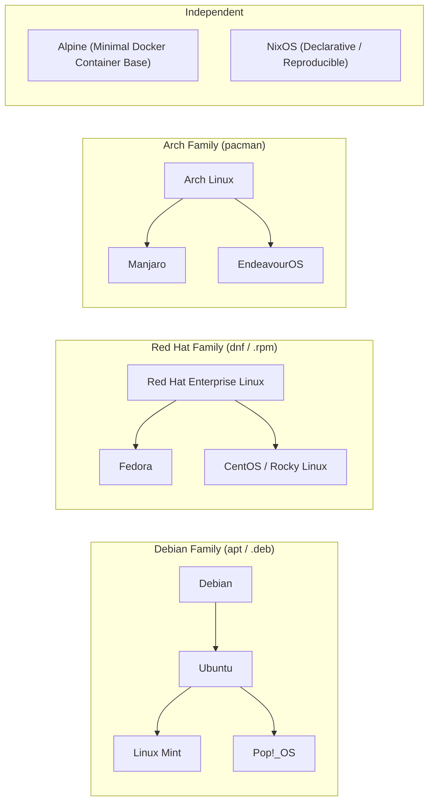

# Linux — Architecture, Filesystem & Shell Reference

**Linux** is a monolithic operating system **kernel** — the foundational software that communicates directly with your computer's hardware (CPU, RAM, Disks, Network Interfaces) and manages resource allocation for all running processes.

---

## 🖼️ Linux Filesystem Hierarchy & Permissions Architecture

![[linux-filesystem-hierarchy.svg]]

---

## Linux Distributions (Distro Families)



---

## Core Command Reference

### Navigation & Inspection
```bash
pwd          # Print current working directory
ls -la       # List all files including hidden dotfiles in long format
cd <dir>     # Change directory
cd ..        # Move up one directory level
cd ~         # Go to user's home directory (/home/<username>)
```

### File Operations
```bash
touch file.txt       # Create empty file or update timestamp
mkdir -p a/b/c       # Create nested directory tree
cp src.txt dest.txt  # Copy file
cp -r dirA dirB      # Copy directory recursively
mv old.txt new.txt   # Rename or move file
rm file.txt          # Permanently delete file
rm -rf directory/    # Force-delete directory and all contents (Danger!)
```

### Text Processing & Search
```bash
cat file.txt         # Print entire file to stdout
less file.txt        # Interactive scrollable viewer (q to exit)
head -n 20 file.txt  # View first 20 lines
tail -f app.log      # Follow log file in real-time
grep -rn "error" .   # Search recursively for "error" in current directory
find . -name "*.log" # Search filesystem by filename pattern
```

### File Permissions & Ownership
```bash
chmod 755 script.sh  # rwxr-xr-x (Owner: full, Group/Others: read+exec)
chmod 600 id_rsa     # rw------- (Owner: read+write only, SSH keys)
chmod +x run.sh      # Add execution permission for owner
chown user:group f   # Change file owner and group
```

### Process Management & Monitoring
```bash
ps aux               # List all currently running processes
top / htop           # Interactive live process and memory monitor
kill <PID>           # Gracefully terminate process (SIGTERM)
kill -9 <PID>        # Force-kill immediately (SIGKILL)
df -h                # Human-readable disk space usage
free -h              # System RAM and Swap memory usage
```

---

## 🔗 Related Concepts
- [[Git and GitHub]] — Version control executed via Linux shell
- [[Package Managers and Build Tools]] — Tooling installation on Linux
- [[System Design MOC]] — Linux server infrastructure and cloud deployment
