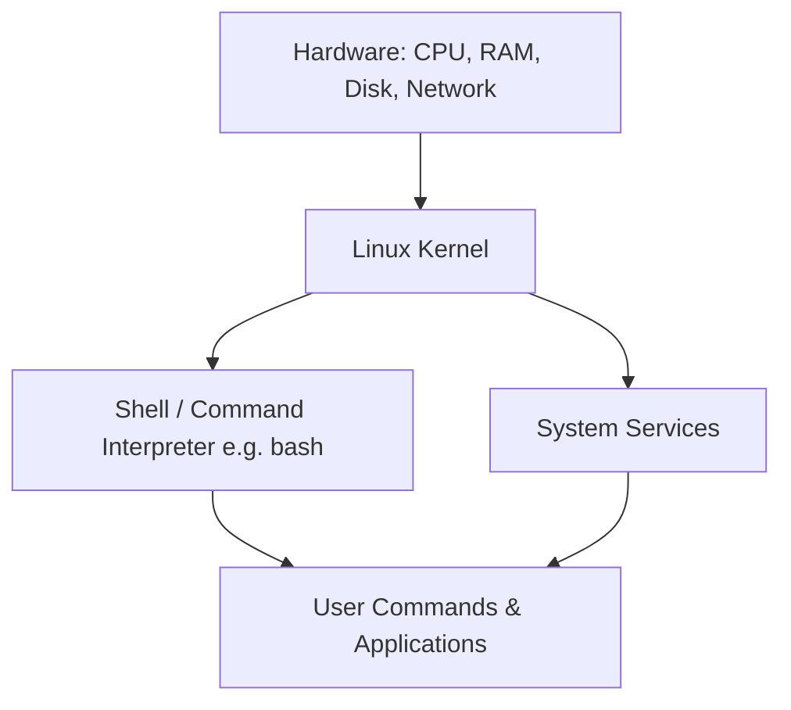
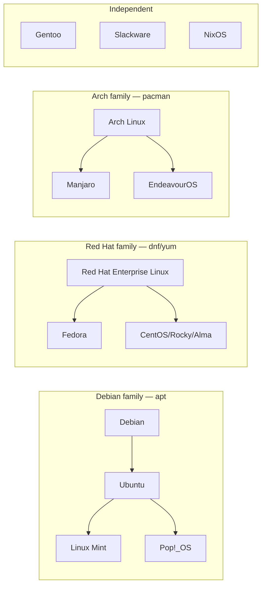
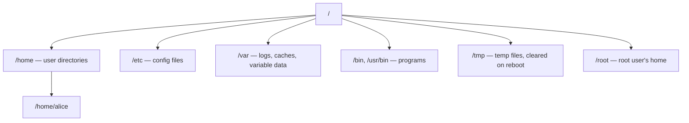

# Linux

## What is it?

**Linux** is a **kernel** — the core piece of software that talks directly to your computer's hardware (CPU, memory, disks, network card) and manages how programs share those resources. Linux itself is not a complete operating system you install; it's the engine underneath one.

A **Linux distribution ("distro")** is a complete, installable operating system built *around* the Linux kernel. A distro takes the kernel and bundles it with:
- A **shell** (command interpreter, e.g. `bash`) so humans can issue commands
- **GNU utilities** (`ls`, `cp`, `grep`, etc.) — the basic toolkit for working with files and text
- A **package manager** to install/update/remove software
- Optionally, a graphical desktop environment (GNOME, KDE, etc.)

This is why you never "install Linux" — you install a distro (Ubuntu, Fedora, Debian, Arch...) that happens to use the Linux kernel. This split is also why the ecosystem is so fragmented: hundreds of distros exist because anyone can combine the same kernel with different tools and defaults.



## Why does it exist?

Before Linux, Unix-like operating systems were expensive and closed-source. In 1991, Linus Torvalds released a free, open-source kernel as an alternative. Combined with the GNU project's free tools (already being built for the same reason), it became possible to run a full, free, Unix-like OS. Because the source code is open, anyone can inspect, modify, and redistribute it — which is why Linux ended up powering everything from smartphones (Android) to nearly all of the world's web servers and cloud infrastructure.

**Why it matters to you as a developer:** most servers, cloud VMs, Docker containers, and CI/CD pipelines run Linux. Knowing your way around a Linux shell is close to mandatory for backend, DevOps, and systems work.

## Linux Distributions (Distro Types)

Distros are usually grouped into **families** based on which package manager and base system they share. Picking a distro mostly means picking a family, since that determines how you install software and troubleshoot.



| Family | Package manager | Package format | Known for | Examples |
|---|---|---|---|---|
| **Debian-based** | `apt` | `.deb` | Stability, huge community, beginner-friendly | Ubuntu, Debian, Mint, Pop!_OS |
| **Red Hat-based** | `dnf` (was `yum`) | `.rpm` | Enterprise/production use, long support cycles | Fedora, RHEL, CentOS Stream, Rocky Linux |
| **Arch-based** | `pacman` | Arch package | Rolling releases (always latest software), full user control | Arch Linux, Manjaro, EndeavourOS |
| **Independent** | Varies | Varies | Specialized philosophies (source-built, minimal, reproducible) | Gentoo, Slackware, NixOS |

There are also **purpose-built distros** layered on top of these families for a specific job, e.g. **Kali Linux** (Debian-based, security testing), **Alpine** (tiny, used heavily in Docker images), **Raspberry Pi OS** (Debian-based, for Raspberry Pi hardware).

**How to pick one:**
- Learning Linux / general desktop use → **Ubuntu** or **Mint** (large community, most tutorials assume Debian-based)
- Servers / production / long-term stability → **Debian**, **RHEL**, or **Rocky Linux**
- Want latest packages and don't mind occasional breakage → **Arch**
- Docker/container base image → **Alpine** (minimal size)

## Filesystem Basics

Unlike Windows (`C:\`, `D:\`), Linux has **one single tree** starting at the **root directory** `/`. Every disk, USB drive, or network share gets *mounted* as a folder somewhere inside that tree rather than getting its own drive letter.



Key directories:
- `/home` — each regular user gets a subfolder here (e.g. `/home/alice`) for their personal files, similar to `C:\Users\alice`
- `/etc` — system-wide configuration files (mostly plain text, human-editable)
- `/var` — data that changes while the system runs: logs (`/var/log`), caches
- `/bin`, `/usr/bin` — where executable programs live
- `/tmp` — scratch space; the OS may wipe this on reboot
- `/root` — the home directory for the **root** (administrator) user — not the same as `/`

## The Shell

The **shell** is the program that reads the commands you type and runs them. `bash` is the most common default; `zsh` is a popular alternative. When you open a "terminal," you're really opening a window running a shell.

Two habits that make everything below easier:
- Almost every command has a `--help` flag or a manual page (`man command`).
- Paths can be **absolute** (start with `/`, e.g. `/home/alice/notes`) or **relative** (relative to your current directory, e.g. `../notes`).

## Command Reference

### Navigation
```
pwd          # print working directory — "where am I right now?"
ls -la       # list ALL files (including hidden dotfiles), in Long detailed format
cd path      # change directory
cd ..        # go up one directory
cd ~         # go to your home directory
cd -         # go back to the previous directory
```
Files/folders starting with `.` (e.g. `.bashrc`) are **hidden** — `ls` alone won't show them, `ls -a` will. This is a convention, not real security.

### File & Directory Operations
```
touch f           # create an empty file (or update its timestamp if it exists)
mkdir d           # create a directory
mkdir -p a/b/c    # create nested directories in one shot, no error if they exist
cp a b            # copy file a to b
cp -r dirA dirB   # copy a directory recursively
mv a b            # move OR rename (Linux treats rename as "move to a new name")
rm f              # delete a file — no recycle bin, this is permanent
rm -rf d          # delete a directory and everything inside it, no confirmation
```
`rm -rf` is the single most dangerous command beginners run — see **Common Mistakes** below.

### Viewing & Editing Files
```
cat f          # dump the whole file to the screen
less f         # scrollable viewer for long files (q to quit)
head -n 20 f   # first 20 lines
tail -n 20 f   # last 20 lines
tail -f f      # follow a file live as new lines are appended (great for logs)
nano f         # simple beginner-friendly terminal editor
vim f          # powerful but steeper-learning-curve editor
```

### Searching
```
grep "text" f            # search for "text" inside file f
grep -r "text" .         # search recursively through the current directory
grep -i "text" f         # case-insensitive search
find . -name "*.log"     # find files by name pattern, starting from current dir
find . -type d            # find only directories
```
`grep` searches **inside file contents**; `find` searches **file names/metadata**. Beginners often reach for the wrong one.

### Permissions
Every file has an **owner**, a **group**, and permission bits for **owner / group / others**, each with read (`r`), write (`w`), execute (`x`).

```
ls -l          # shows permissions like: -rwxr-xr-x
chmod 755 f    # set permissions using octal notation
chmod u+x f    # symbolic notation: add execute permission for the owner (u)
chown user f   # change the file's owner
chown user:group f   # change owner AND group
```
Octal notation: each digit is `r(4) + w(2) + x(1)` summed, in order **owner, group, others**.
- `755` → owner: `4+2+1=7` (rwx), group: `4+0+1=5` (r-x), others: `4+0+1=5` (r-x)
- `644` → owner: rw-, group: r--, others: r-- (typical for a data file — nobody but the owner can execute or write)

### Process Management
```
ps aux         # snapshot of all currently running processes
top            # live, auto-refreshing process monitor (q to quit)
htop           # nicer interactive version of top (may need installing)
kill PID       # ask a process to terminate gracefully (SIGTERM)
kill -9 PID    # force-kill immediately (SIGKILL) — last resort, no cleanup
command &      # run a command in the background, get your prompt back immediately
nohup command &   # run in background AND keep running after you close the terminal
jobs           # list background jobs started in this shell session
fg / bg        # bring a background job to foreground / resume it in background
```

### Package Management
Package managers install, update, and remove software — the Linux equivalent of an app store, but command-line first.
```
# Debian / Ubuntu family
sudo apt update            # refresh the list of available packages
sudo apt install x         # install package x
sudo apt remove x          # remove package x
sudo apt upgrade           # upgrade all installed packages

# Fedora / RHEL family
sudo dnf install x
sudo dnf remove x

# Arch family
sudo pacman -S x           # install
sudo pacman -R x           # remove
sudo pacman -Syu           # sync and upgrade everything
```
Always run the "update/sync" step before installing on Debian systems — `apt install` uses a locally cached package list that goes stale.

### Archiving & Compression
```
tar -czvf out.tar.gz dir/   # Create, gZip, Verbose, File — compress a folder
tar -xzvf out.tar.gz        # eXtract a .tar.gz archive
zip -r out.zip dir/         # zip a folder
unzip out.zip                # extract a .zip
```

### Networking
```
ping host              # test connectivity/latency to a host
curl url                # fetch a URL's content, test APIs from the terminal
wget url                 # download a file from a URL
ssh user@host           # open a secure remote shell on another machine
scp file user@host:/path  # securely copy a file to/from a remote machine
```

### System Info & Admin
```
sudo cmd       # run a single command with administrator (root) privileges
df -h          # disk space usage per mounted filesystem, human-readable (GB/MB)
du -sh dir     # total size of a folder, human-readable
free -h        # RAM usage
history        # your past commands in this shell
man cmd        # the manual page for a command — the built-in documentation
```

## Key Concepts

- **Piping (`|`)** — feeds one command's output directly into another's input, letting you chain small tools into a pipeline instead of writing custom scripts. Example: `ps aux | grep firefox` lists all processes, then filters that list down to lines mentioning "firefox."
- **Redirection** — `>` sends a command's output into a file, overwriting it; `>>` appends instead of overwriting; `<` feeds a file's contents in as a command's input. Example: `ls > files.txt` saves the listing to a file instead of printing it.
- **Environment variables** — named values the shell and programs can read, e.g. `$PATH` (the list of directories the shell searches to find a command like `ls`). Set with `export VAR=value`; view with `echo $VAR`.
- **`sudo` vs `root`** — `root` is the all-powerful administrator account. Rather than logging in as root (risky — any mistake affects the whole system), you normally stay logged in as yourself and prefix individual commands with `sudo` ("superuser do") to run just that one command with root privileges.
- **Symlinks** — a symbolic link (`ln -s target link`) is a pointer file to another file/folder, similar to a shortcut. Deleting the symlink doesn't delete the original.

## When to Use Linux

- Running servers, cloud VMs, and containers (the vast majority of production infrastructure)
- Development environments that need to closely match production
- Embedded systems and IoT devices (Linux is lightweight and highly configurable)
- Anywhere scripting and automation matter more than a polished GUI

## When Not to Use / Tradeoffs

- Mainstream gaming and some proprietary creative software (certain Adobe tools, some CAD software) still have gaps compared to Windows/macOS, though this is improving (Steam Proton, etc.)
- Hardware driver support for brand-new laptops can lag behind Windows
- Distro fragmentation means troubleshooting advice for one distro doesn't always apply to another

## Common Mistakes

- **`rm -rf /`** or `rm -rf *` in the wrong directory — no confirmation, no recycle bin, permanent data loss. Always double-check your current directory (`pwd`) before a recursive delete.
- **`chmod 777`** as a lazy fix for "permission denied" — this gives everyone full read/write/execute access, which is a real security hole, not just a Linux quirk to work around.
- **Forgetting quotes around variables in scripts** — `rm $file` breaks if `$file` contains a space; `rm "$file"` is safe.
- **Confusing `grep` and `find`** — searching file *contents* vs file *names*.
- **Editing config files without a backup** — a broken `/etc` file can prevent a service (or the whole system) from starting. Copy before you edit: `cp file file.bak`.

## Edge Cases / Important Details

- Linux is **case-sensitive**: `File.txt` and `file.txt` are different files — a common source of confusion coming from Windows.
- Hidden files (dotfiles) are a *convention*, not a security boundary — `ls -a` reveals them instantly.
- A **hard link** points to the same underlying data as the original file (deleting one doesn't remove the data until all hard links are gone); a **symlink** just points to a path and breaks if the target moves.
- Killing a process with `kill -9` skips its cleanup logic (e.g. it won't get a chance to save unsaved data), so prefer plain `kill` first and only escalate if the process doesn't respond.

## Related Concepts
- [[Command Line]] — the general interface these commands run in
- [[Bash Scripting]] — automating sequences of these commands
- [[File Permissions]] — deeper dive on the rwx/chmod model
- [[SSH]] — remote access protocol used above
- [[Package Managers]] — apt/dnf/pacman compared in more depth

## Open Questions / To Explore Later
- Bash scripting fundamentals (variables, loops, conditionals, functions)
- systemd and service management (`systemctl start/stop/enable`)
- Users and groups administration (`useradd`, `usermod`, `/etc/passwd`)
- Shell customization (aliases, `.bashrc`/`.zshrc`, prompt customization)
