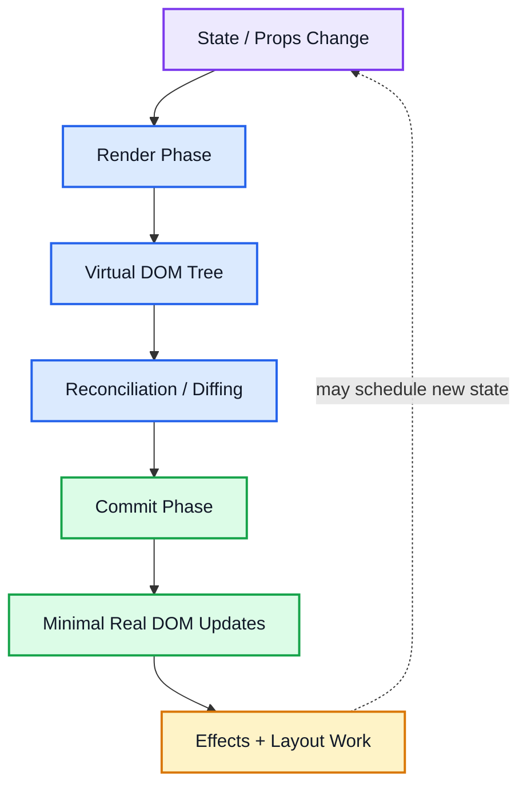

# React — Declarative UI & Component Architecture (MOC)

Welcome to the **Complete, Structured React Guide**. This curriculum is designed from top to bottom to give you both the deep theoretical foundation required to ace frontend placements/interviews, and the practical software engineering knowledge required to architect and build robust, modern production applications.

---

## 🖼️ Core React Architecture: The Big Picture

The diagram below outlines the core loop of React: how changes in state and props flow down the component tree, trigger Virtual DOM re-rendering, pass through the reconciliation algorithm (diffing), and execute minimal optimized paints on the Real DOM.

![[react-architecture-diagram.svg|960]]

---

## 🗺️ Step-by-Step Curriculum Roadmap (01 ──> 17)

These notes are structured sequentially. If you are learning React from scratch, follow them in numeric order. If you are preparing for interviews, pay special attention to the **Placement & Interview Q&A** section at the bottom of each file.

### 🏁 Chapter 1: The Foundations of Rendering
* **[[01 - Introduction to React & Virtual DOM]]**
  * *Focus:* Library vs. Framework, SPA architecture, Declarative vs. Imperative code comparisons, Virtual DOM, Reconciliation, Diffing Algorithm, and the React Fiber engine.
* **[[02 - JSX & Building Blocks]]**
  * *Focus:* JavaScript XML syntax extension, compilation via SWC/Babel to `createElement`, JSX rules (fragments, tag requirements), and embedding expressions.
* **[[03 - Components & Props]]**
  * *Focus:* Component nesting hierarchies, unidirectional top-down data flow, immutable read-only props, prop destructuring, children prop, and components as pure functions.

### 🔄 Chapter 2: Local Reactivity & Side Effects
* **[[04 - State & useState Hook]]**
  * *Focus:* Component memory, `useState` hook, state batching (React 18 automatic batching), functional updates vs standard setters, and immutable state updates (spread operators).
* **[[05 - Hooks & useEffect Hook]]**
  * *Focus:* Introduction to standard React hooks, rules of hooks, the `useEffect` lifecycle hook (Mount, Update, Unmount), the dependency array, and clean-up functions for network aborts, timers, and listeners.

### 🚀 Chapter 3: Advanced Hooks & Optimization
* **[[06 - Advanced Built-in Hooks]]**
  * *Focus:* Accessing raw DOM nodes and persistent mutable state with `useRef`, prop-drilling avoidance with `useContext`, performance optimization using `useMemo` and `useCallback`, and complex state machines with `useReducer`.
* **[[07 - Custom Hooks]]**
  * *Focus:* Designing reusable stateful logic, custom hook isolation mechanics, writing production-ready hooks (like `useFetch` with aborts, `useLocalStorage`, and listener-bound `useWindowSize`).
* **[[14 - React.memo (Component Memoization)]]**
  * *Focus:* Skipping unnecessary re-renders with `React.memo`, shallow prop comparison, and why it must be paired with `useMemo`/`useCallback` to actually work.

### 🏛️ Chapter 4: Single Page Application Architecture
* **[[08 - React Router & Navigation]]**
  * *Focus:* Client-side routing mechanics via HTML5 History API, setting up dynamic routes (`useParams`), query queries (`useSearchParams`), programmatic redirects (`useNavigate`), layouts (`<Outlet />`), and Auth-guarded Protected Routes.
* **[[09 - Global State Management & Context API]]**
  * *Focus:* Context API design patterns, resolving Context's global re-render bottleneck (splitting contexts, value memoization), and modern state stores (Zustand, Redux Toolkit).
* **[[15 - Lazy Loading, Suspense & Code Splitting]]**
  * *Focus:* `React.lazy` + `Suspense` for on-demand chunk loading, route-based code splitting, and when splitting helps vs. hurts.

### 🧩 Chapter 5: User Input & Resilience
* **[[12 - Forms & Controlled Components]]**
  * *Focus:* Controlled vs. uncontrolled inputs, the state ↔ input sync loop, `preventDefault`, and why file inputs can't be controlled.
* **[[13 - Error Boundaries]]**
  * *Focus:* Catching render-time errors with `getDerivedStateFromError`/`componentDidCatch`, what error boundaries do NOT catch (async, event handlers), and why they still require a class component.

### 🎨 Chapter 6: Styling
* **[[17 - Tailwind CSS with React]]**
  * *Focus:* Utility-first CSS philosophy, Vite + Tailwind v4 setup, responsive/state/dark-mode variants, conditional class composition with `clsx`, and the dynamic-class-name build-time pitfall.

### 🛠️ Chapter 7: Practical Engineering & Debugging
* **[[10 - Practical Project Guide - Todo List and Beyond]]**
  * *Focus:* A fully detailed walkthrough combining state, hooks, local storage sync, filter operations, and component refactoring into an advanced project, including key clean folder structures.
* **[[16 - Testing Basics (React Testing Library)]]**
  * *Focus:* Jest/Vitest + React Testing Library, querying by role/text over implementation details, `userEvent` vs `fireEvent`, and what's worth testing.
* **[[11 - React Common Mistakes & Tricky Interview Questions]]**
  * *Focus:* Interactive debugging of stale closures, infinite re-render loops, incorrect list keys, reference comparisons, and tricky output prediction problems frequently asked by top tech firms.

---

## 🧭 Placement Preparation & Project Building Philosophy

This folder was created with two simultaneous goals:
1. **To Help You Ace Placements:** Modern frontend interviews do not just ask you to write syntax. They test your understanding of **runtime execution**. Interviewers love asking questions on **Virtual DOM diffing**, **why state is batch-processed asynchronously**, **stale closures in `useEffect`**, and **Context API performance bottlenecks**. Every note includes dedicated sections covering these exact edge cases.
2. **To Help You Build High-Performance Projects:** Instead of building simple widgets, these notes teach you industry-standard patterns—including **request aborting**, **Immer-style state design**, **custom hook isolation**, **route-based code splitting**, and **modular routing schemas**—that will make your personal portfolio stand out.

---

## 🔗 Connected Concepts
* [[JavaScript MOC]] — The underlying engine powering React
* [[Package Managers and Build Tools]] — Bundlers (Vite, Webpack), runtime, and JSX compilation tools
* [[REST APIs]] & [[WebSocket]] — Connecting React frontends to dynamic backend servers
* [[CSS]] & [[HTML]] — Styling and layout fundamentals for React JSX outputs
* [[17 - Tailwind CSS with React]] — Utility-first styling approach used in modern React projects
