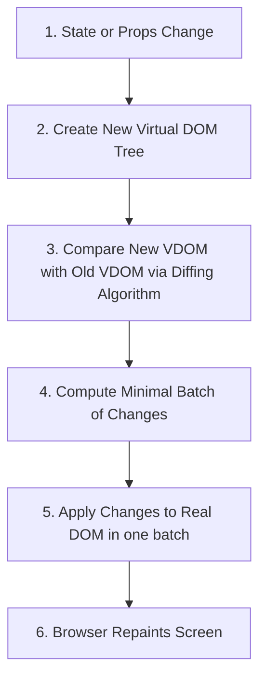

# 01 - Introduction to React & Virtual DOM

## 🌟 High-Level Overview

**React** is an open-source, component-based frontend JavaScript library developed by Meta (Facebook) in 2013. It is designed solely for building interactive, efficient user interfaces. 

### ⚔️ Library vs. Framework
* **React is a Library:** It focus solely on the "View" layer of an application. It does not dictate how you do routing, global state management, or API fetching. You have the freedom to choose your own tools (e.g., React Router, Zustand, Axios).
* **Frameworks (e.g., Angular, NestJS):** Provide a complete, opinionated, out-of-the-box solution (routing, HTTP client, state management, forms) with strict conventions.

### 🌐 SPA vs. MPA
* **Single Page Application (SPA):** React typically builds SPAs. The browser loads a single HTML file and dynamically updates the page using JavaScript as the user interacts. Transitions are instantaneous, with no full-page reloads.
* **Multi-Page Application (MPA):** Traditional sites where every click fetches a completely new HTML page from the server.

---

## 🖼️ React Architecture: Virtual DOM & Reconciliation

The core superpower of React is how it updates the browser efficiently.

![[react-architecture-diagram.svg|930]]

### 1. What is the Real DOM?
The **Document Object Model (DOM)** is the browser's tree representation of the HTML document. 
* **The Problem:** Modifying the Real DOM is **extremely slow and expensive**. When you update a DOM node, the browser has to recalculate the CSS/geometry (Recalculate Style), recalculate element positions (Layout), and redraw the screen (Paint). Doing this repeatedly for many elements causes lag.

### 2. What is the Virtual DOM (VDOM)?
The **Virtual DOM** is a lightweight, in-memory representation of the Real DOM. It is a plain JavaScript object tree.
```javascript
// A simple React Element (Virtual DOM node)
{
  type: 'button',
  props: {
    className: 'btn-blue',
    children: 'Click Me'
  }
}
```
Updating JavaScript objects is incredibly fast because it doesn't trigger browser style calculations or repaints.

### 3. The Reconciliation Process (Diffing Algorithm)
When state or props change, React updates the UI through a process called **Reconciliation**:



#### The Heuristic Diffing Algorithm ($O(N)$ Complexity)
Normally, comparing two trees has a complexity of $O(N^3)$. React implements an incredibly smart $O(N)$ heuristic algorithm based on two assumptions:
1. **Two elements of different types will produce different trees:** If a `<div>` is replaced by a `<span>`, React destroys the entire old subtree and builds a new one from scratch.
2. **Keys must be stable, predictable, and unique:** The developer can hint at which child elements are stable across renders using the `key` prop.

### 4. What is React Fiber?
Introduced in React 16, **React Fiber** is the rewrite of React's core reconciliation engine. 
* **The Stack Reconciler (Old):** Updates were synchronous and recursive. If a tree update took 100ms, the browser main thread would freeze for 100ms, causing dropped frames (jank).
* **The Fiber Reconciler (New):** It breaks reconciliation down into small, incremental work units ("fibers"). It can **pause, resume, discard, or reuse** work. This enables **Concurrent Rendering** (e.g., keeping typing inputs fluid while a heavy list renders in the background).

---

## 💡 Declarative vs. Imperative Mental Model

* **Imperative Programming (How to do it):** Step-by-step instructions. You manually manipulate DOM nodes.
* **Declarative Programming (What to do):** You describe the desired final state of the UI, and the framework takes care of applying the steps.

### 💻 Code Comparison: Creating a Loading Button

#### Imperative (Vanilla JS)
```html
<button id="submitBtn">Submit</button>
```
```javascript
const btn = document.getElementById("submitBtn");

function startLoading() {
  btn.disabled = true;
  btn.classList.add("loading");
  btn.innerText = "Loading...";
}

function stopLoading() {
  btn.disabled = false;
  btn.classList.remove("loading");
  btn.innerText = "Submit";
}
```
* **Risk:** High chance of synchronization bugs. If you forget to remove the `loading` class or re-enable the button, the UI gets stuck.

#### Declarative (React)
```jsx
function Button({ isLoading }) {
  return (
    <button disabled={isLoading} className={isLoading ? "loading" : ""}>
      {isLoading ? "Loading..." : "Submit"}
    </button>
  );
}
```
* **Benefit:** The UI is purely a function of state: `UI = f(state)`. If `isLoading` is true, the UI is *guaranteed* to look correct, with zero manual DOM manipulation.

---

## 💼 Placement & Interview Q&A

### Q1: Why is React fast if it ultimately has to update the slow Real DOM anyway?
**Answer:** React is fast because it minimizes direct interaction with the Real DOM. It batches multiple updates together and performs a "diff" in-memory (Virtual DOM) to calculate the absolute *minimum* amount of DOM manipulation needed. Instead of performing 10 separate expensive writes, it might perform 1 optimized batch write.

### Q2: What is the difference between Virtual DOM and Shadow DOM?
**Answer:** They are completely different concepts:
* **Virtual DOM** is a React-specific optimization technique to sync state modifications to the browser's DOM tree efficiently.
* **Shadow DOM** is a native browser technology used for encapsulation in Web Components. It scopes CSS styles and HTML trees inside a component so they don't leak out and affect the rest of the page (e.g., the built-in `<video>` tag controls are styled using Shadow DOM).

### Q3: What is "Reconciliation"?
**Answer:** Reconciliation is the internal process where React compares the newly generated Virtual DOM tree with the previous one, determines the exact differences (using its $O(N)$ Diffing Algorithm), and applies those differences to the Real DOM.

### Q4: Explain React Fiber.
**Answer:** React Fiber is the modern reconciliation engine of React. It organizes rendering tasks into a linked-list structure of work units ("fibers"). Its primary goal is to support incremental rendering—the ability to split rendering work into chunks and spread it across multiple frames to prevent freezing the main UI thread.

---

## 🔗 Related Concepts
- [[02 - JSX & Building Blocks]] — How we write declarative markup in React
- [[03 - Components & Props]] — Breaking down the declarative UI into reusable building blocks
- [[04 - State & useState Hook]] — The reactive variables that trigger VDOM updates
- [[11 - React Common Mistakes & Tricky Interview Questions]] — Real-world bugs and interview favorites