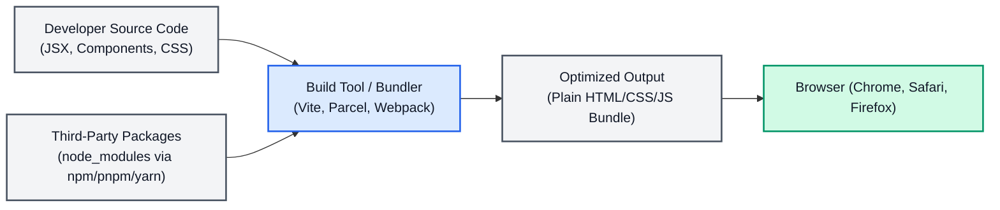
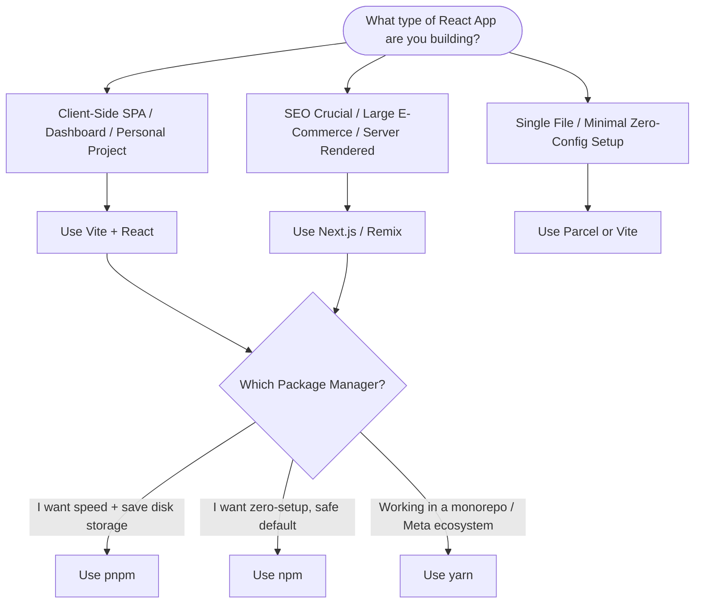

# 01a - React Installation & Project Setup

## 🌟 High-Level Overview

To build a modern React application, you need to understand the development pipeline. Setting up a project involves two **separate, independent layers of tooling** that beginners often confuse because they are run together:

1. **Package Managers (npm, pnpm, yarn):** These download, install, and manage third-party JS libraries (like React, React Router, or Tailwind CSS) inside your local workspace.
2. **Build Tools / Bundlers (Vite, Parcel, Create React App):** These compile JSX into browser-ready plain JS, bundle multiple module files together, optimize assets, and run a **development server** with live reload.



---

## 📦 Layer 1: Package Managers (npm vs. pnpm vs. yarn)

A package manager reads your project's `package.json` manifest file, fetches listed libraries from the npm registry, and stores them in your project's `node_modules` folder.

| Package Manager | Key Characteristics | Resolution Strategy | Install Performance | Disk Footprint |
| :--- | :--- | :--- | :--- | :--- |
| **npm** | • Node's official built-in default.<br>• Highly reliable and zero-config. | Flat dependency structure (can lead to phantom dependencies). | **Moderate** (Slowest of the three, but stable). | **High** (Duplicates packages across all projects on disk). |
| **pnpm** | • Performant npm.<br>• Highly recommended for modern workspaces. | Hard-links and symbolic links to a single global store. | **Extremely Fast** (Skips downloads if package was ever installed before). | **Extremely Low** (Saves massive disk space; installs each package version only once). |
| **yarn** | • Developed by Meta.<br>• Highly popular for monorepos (Yarn Berry). | Flat dependency structure (Classic) or PnP (Plug'n'Play in Berry). | **Fast** (Faster than npm, competitive with pnpm). | **High / Low** (Depends on whether Berry's PnP is used). |

### 🛠️ Key CLI Command Equivalents

| Action | `npm` | `pnpm` | `yarn` |
| :--- | :--- | :--- | :--- |
| **Initialize Project** | `npm init` | `pnpm init` | `yarn init` |
| **Install Dependencies** | `npm install` | `pnpm install` | `yarn install` |
| **Add a Package** | `npm install <pkg>` | `pnpm add <pkg>` | `yarn add <pkg>` |
| **Add Dev Dependency** | `npm install -D <pkg>` | `pnpm add -D <pkg>` | `yarn add -D <pkg>` |
| **Run Scripts** | `npm run <script>` | `pnpm <script>` or `pnpm run <script>` | `yarn <script>` or `yarn run <script>` |

---

## ⚙️ Layer 2: Build Tools & Bundlers (Vite vs. CRA vs. Parcel)

Browsers natively do not understand JSX syntax or imports of non-JS assets (like images or CSS). A **bundler** processes these files and packages them into clean, compiled static assets.

```mermaid
graph TD
    subgraph CRA_Webpack [Webpack / CRA Architecture (Bundle-based)]
        Start1[Start Dev Server] --> Entry1[Resolve Entry File]
        Entry1 --> Process1[Transpile & Bundle Entire Application]
        Process1 --> Ready1[Dev Server Ready]
        Ready1 --> Request1[Browser Requests Page - Instant Load]
    end

    subgraph Vite_Architecture [Vite Architecture (Native ESM-based)]
        Start2[Start Dev Server] --> Ready2[Dev Server Ready - Near Instant!]
        Ready2 --> Request2[Browser Requests Page / Module]
        Request2 --> Dynamic[Dynamic Compile requested file via esbuild]
        Dynamic --> Serve[Serve compiled module on-demand]
    end

    style Ready1 fill:#FEF3C7,stroke:#D97706,stroke-width:2px
    style Ready2 fill:#DCFCE7,stroke:#16A34A,stroke-width:2px
```

### 1. Vite (The Modern Default)
* **Under the Hood:** Uses native ES Modules (ESM) in the browser during development. Instead of bundling the entire codebase upfront, Vite serves files on-demand. High-speed compilation is handled by **esbuild** (written in Go).
* **Pros:** Instant cold server startup, lightning-fast Hot Module Replacement (HMR) regardless of project size.
* **Cons:** Production build (handled via Rollup) compiles differently than dev, which can rarely lead to dev-vs-prod bugs.

### 2. Create React App (CRA - Deprecated)
* **Under the Hood:** Built on top of **Webpack** and Babel. It compiles and bundles the entire application before starting the local development server.
* **Pros:** Was the official, easy-to-use template for years (2016–2022).
* **Cons:** **Officially deprecated.** Removed from the React documentation. Extremely slow to start and update as the codebase grows. It is no longer maintained.

### 3. Parcel (Zero Configuration)
* **Under the Hood:** An out-of-the-box compiler and bundler that requires zero configuration file (`vite.config.js` or `webpack.config.js`). It uses Rust-based compilers under the hood.
* **Pros:** Truly zero-config; works with React out-of-the-box by pointing directly to an `index.html` file.
* **Cons:** Less ecosystem adoption for React than Vite. Customizations can be difficult without an official configuration layer.

---

## 🚀 Step-by-Step Project Setup Guides

Before running these, ensure you have **Node.js** (LTS recommended) installed on your machine. Check using `node -v`.

### Option A: Setup with Vite (Recommended)

Vite is the standard, modern approach for standard Client-Side Single Page Applications (SPAs).

==== **Using npm** ====
```bash
# 1. Scaffold the project template
npm create vite@latest my-react-app -- --template react

# 2. Navigate to project folder
cd my-react-app

# 3. Install packages
npm install

# 4. Run the development server
npm run dev
```

==== **Using pnpm (Fastest)** ====
```bash
# 1. Scaffold the project template
pnpm create vite my-react-app --template react

# 2. Navigate to project folder
cd my-react-app

# 3. Install packages
pnpm install

# 4. Run the development server
pnpm dev
```

==== **Using yarn** ====
```bash
# 1. Scaffold the project template
yarn create vite my-react-app --template react

# 2. Navigate to project folder
cd my-react-app

# 3. Install packages
yarn install

# 4. Run the development server
yarn dev
```

---

### Option B: Setup with Parcel (Zero-Config Alternative)

Parcel doesn't use a scaffolding CLI tool; instead, you build the initial folder yourself.

```bash
# 1. Create directory and initialize project
mkdir my-parcel-app && cd my-parcel-app
npm init -y

# 2. Install React and Parcel
npm install react react-dom
npm install -D parcel

# 3. Create an index.html file
# In index.html, include: <div id="root"></div> and <script type="module" src="./src/index.js"></script>

# 4. Create your React entry point (src/index.js)
# import { createRoot } from 'react-dom/client';
# import App from './App';
# const root = createRoot(document.getElementById('root'));
# root.render(<App />);

# 5. Run development server
npx parcel index.html
```

---

### Option C: Setup with Create React App (CRA - Legacy/Deprecated)

*⚠️ Note: Included for completeness/interview context. Do not use for new projects.*

==== **Using npm** ====
```bash
npx create-react-app my-cra-app
cd my-cra-app
npm start
```

==== **Using pnpm** ====
```bash
pnpm dlx create-react-app my-cra-app
cd my-cra-app
pnpm start
```

==== **Using yarn** ====
```bash
yarn create react-app my-cra-app
cd my-cra-app
yarn start
```

---

## 🎯 Which to Use & When to Use (Decision Matrix)



### Summary Recommendations

1. **For 95% of standard React SPAs (Client-Side Rendering):** 
   * **Use Vite + pnpm.** This combination offers the fastest installation speeds, saves gigabytes of hard drive space across multiple projects, and boots up instantly.
   * If you don't have `pnpm` installed and want zero-overhead, use **Vite + npm**.

2. **For production, SEO-heavy, or commercial web apps:**
   * **Use Next.js (with npm/pnpm).** Next.js handles server-side rendering (SSR), image optimization, and static site generation (SSG) out-of-the-box, which are essential for web performance and Google search indexers.

3. **When to use Parcel:**
   * Use Parcel if you want to understand how a bundler works from scratch without writing configuration files, or if you are spinning up a highly experimental prototype with non-standard file types.

4. **When to use Create React App (CRA):**
   * **Never.** If you encounter CRA in a legacy corporate application, the recommended engineering path is to **migrate it to Vite** to improve developer experience, cut build times, and ensure long-term maintenance.

---

## 💼 Placement & Interview Q&A

### Q1: Why is Create React App (CRA) deprecated?
**Answer:** CRA was built using Webpack, which bundles the entire application before spinning up the local dev server. As projects grew, dev startup times stretched to minutes, and hot reload would lag. Furthermore, CRA's maintainers stopped updating its underlying dependencies, leaving security vulnerabilities in default setups. Modern tools like Vite solve this by leveraging native ES Modules and modern compilers like `esbuild` written in Go.

### Q2: Why is Vite significantly faster than traditional bundlers like Webpack during development?
**Answer:** Webpack is a **bundle-based** build tool: it must resolve, compile, and bundle every single file in the dependency graph before the browser can render a single page. 
Vite is **native-ESM-based**: it starts the server immediately without compiling everything. When the browser requests a specific page, Vite intercepts the request and compiles *only* the specific file/module requested on-demand. Furthermore, Vite handles heavy-lifting dependency pre-bundling using **esbuild** (written in Go), which is 10–100x faster than JavaScript-based compilers like Babel.

### Q3: What is the purpose of a lockfile (`package-lock.json`, `pnpm-lock.yaml`, or `yarn.lock`)?
**Answer:** While `package.json` specifies broad range versions of packages (e.g., `"react": "^18.2.0"` allowing minor updates), the **lockfile** records the *exact* dependency tree and cryptographic hashes of every package installed. This ensures **determinism**: every developer on the team, and the production build server, will install the exact same byte-for-byte dependencies, preventing "it works on my machine" bugs.

### Q4: Explain "Phantom Dependencies" and how `pnpm` solves this.
**Answer:** Standard `npm` and `yarn` classic flat-install dependencies. If you install Package A, and Package A depends on Package B, npm flattens both into the root `node_modules`. This allows your code to import Package B directly, even though you never explicitly declared it in `package.json`. If Package A later removes Package B, your app breaks immediately (a phantom dependency crash).
**pnpm** solves this by using a nested symbolic-link structure. It only exposes packages in the root of `node_modules` that are explicitly listed in your `package.json`, preventing phantom imports while keeping a single copy of Package B hard-linked internally.

### Q5: What is Hot Module Replacement (HMR)?
**Answer:** HMR is a bundler feature that replaces, adds, or removes modules of an application while it is running, without performing a full browser page reload. This preserves the local component state (e.g., input text, open modals, or count variables) while instantly applying code modifications to the viewport, drastically boosting developer productivity.

---

## 🔗 Related Concepts
- [[00 - React MOC]] — The master roadmap of React concepts
- [[01 - Introduction to React & Virtual DOM]] — What React is and how rendering works
- [[02 - JSX & Building Blocks]] — How bundlers convert your JSX to plain JS
- [[Package Managers and Build Tools]] — Deep-dive into JavaScript tooling foundations
