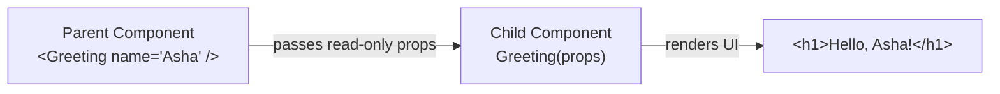

# Components and Props

## What is it?

A **component** is a JavaScript function that returns a description of UI (via [[02 - JSX & Building Blocks]]). Components can be nested inside each other, forming a tree, just like HTML elements nest.

**Props** ("properties") are how a parent component passes data down to a child component — similar to function arguments.

## Component Hierarchy & One-Way Data Flow

```mermaid
flowchart TD
    subgraph Tree["Component Tree & Unidirectional Data Flow (Top -> Down)"]
        App["App Component (Parent State Owner)"]
        Nav["Navbar (Child)"]
        Feed["Feed (Child)"]
        User["UserProfile (Grandchild)"]
        Post1["PostCard (Grandchild)"]
        Post2["PostCard (Grandchild)"]

        App -->|props: { username }| Nav
        App -->|props: { posts, onLike }| Feed
        Nav -->|props: { avatarUrl }| User
        Feed -->|props: { post: posts[0], onLike }| Post1
        Feed -->|props: { post: posts[1], onLike }| Post2
    end
```

## Why does it exist?

Breaking a UI into components lets you build small, independent, reusable pieces instead of one giant page description. Props are the mechanism that lets those independent pieces receive the data they need from whoever is using them, while keeping data flow predictable.

## How does it work?

### Components and nesting

```jsx
function Greeting() {
  return <h1>Hello, world!</h1>;
}

function App() {
  return (
    <div>
      <Greeting />
      <p>Welcome to React.</p>
    </div>
  );
}
```

`App` is the **parent**; `Greeting` is its **child**.

### Props: passing data down



```jsx
function Greeting(props) {
  return <h1>Hello, {props.name}!</h1>;
}

<Greeting name="Asha" />
<Greeting name="Ravi" />
```

Each `<Greeting />` call is independent and renders with its own `name`. Props are **read-only** — a component must never modify the props it receives; data flows **one-way**, from parent to child only.

## Common mistakes

- **Treating props as mutable**: `props.name = "new"` inside a component is a bug. If a child needs to change something, the parent must pass down a function (often paired with [[04 - State & useState Hook|state]]) that the child calls — the parent still owns the update.
- Forgetting that each rendered instance of a component (e.g. two `<Greeting />` calls) is fully independent — they don't share data unless explicitly passed the same props or state.

## Related concepts

- [[00 - React MOC]] — components are React's core building block
- [[02 - JSX & Building Blocks]] — what components return to describe their UI
- [[04 - State & useState Hook]] — data a component manages itself, as opposed to props received from a parent
- [[Functions in JavaScript]] — components are just JavaScript functions
