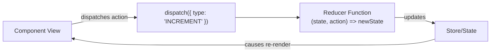

# 06 - Advanced Built-in Hooks

While `useState` and `useEffect` form the backbone of most React applications, React provides several advanced built-in hooks to manage complex state transitions, access native browser DOM nodes, and perform deep performance optimizations.

---

## 🔌 1. `useContext` — Global Shared State

### The Problem: Prop Drilling
When multiple components at different depths of your component tree need access to the same piece of data (like current user, active UI theme, or language localization), you have to pass that data as props through every single intermediate component. This is called **prop drilling** and makes components rigid and hard to reuse.

```
App ──(user)──> Header ──(user)──> Navbar ──(user)──> UserAvatar
```

### The Solution: `useContext`
`useContext` allows you to establish a direct "teleportation" channel for data, bypassing props entirely.

```
App [UserContext.Provider value={user}]
  │
  ├─> Header ─> Navbar (Does NOT need user prop)
  │      └─> UserAvatar [useContext(UserContext)]
```

#### Code Implementation
```jsx
import { createContext, useContext, useState } from "react";

// 1. Create the Context
const ThemeContext = createContext();

export function ThemeProvider({ children }) {
  const [theme, setTheme] = useState("light");
  const toggleTheme = () => setTheme(prev => prev === "light" ? "dark" : "light");

  return (
    // 2. Provide the Value
    <ThemeContext.Provider value={{ theme, toggleTheme }}>
      {children}
    </ThemeContext.Provider>
  );
}

// 3. Consume the Value in any Child Component
export function ThemeButton() {
  const { theme, toggleTheme } = useContext(ThemeContext);
  return (
    <button onClick={toggleTheme}>
      Active Theme: {theme}
    </button>
  );
}
```

*Note: For complete Global State design patterns, see [[09 - Global State Management & Context API]].*

---

## 🎯 2. `useRef` — Persistent Mutable Values & DOM Elements

`useRef` returns a mutable object with a single `.current` property. It has **two main use cases**:

### Use Case A: Accessing DOM Elements (Focus, Scroll, Measurements)
Sometimes you need to interact directly with a raw browser DOM element (e.g., to focus an input programmatically).

```jsx
import { useRef } from "react";

export function AutoFocusInput() {
  const inputRef = useRef(null); // Initialize with null

  const handleFocus = () => {
    // inputRef.current points directly to the real <input> element in the DOM
    inputRef.current.focus();
  };

  return (
    <div>
      <input ref={inputRef} type="text" placeholder="Type here..." />
      <button onClick={handleFocus}>Focus Input</button>
    </div>
  );
}
```

### Use Case B: Storing Mutable Values Across Renders Without Re-rendering
If you store a value in `useState`, updating it triggers a component re-render. If you store a value in `useRef` (by changing `ref.current = newValue`), **it does NOT trigger a re-render**. The value persists across renders.

#### Example: Track how many times a component renders
```jsx
import { useState, useRef } from "react";

export function RenderCounter() {
  const [text, setText] = useState("");
  const renderCount = useRef(0);

  // This runs on every render and increments the ref
  renderCount.current = renderCount.current + 1;

  return (
    <div>
      <input value={text} onChange={(e) => setText(e.target.value)} />
      <p>Component has rendered {renderCount.current} times.</p>
    </div>
  );
}
```
*If we used a `useState` counter here, updating it inside render would trigger another render, causing an **infinite render loop**!*

---

## 🚀 3. Performance Optimization Hooks: `useMemo` & `useCallback`

By default, on **every single render** of a component:
1. All complex calculations inside the component are re-evaluated.
2. All functions defined inside the component are **re-created** (allocated fresh memory addresses).

### 🥇 `useMemo` — Memoize Expensive Calculations
`useMemo` caches (memoizes) the **result** of a heavy function so it doesn't run again unless its dependencies change.

```jsx
import { useState, useMemo } from "react";

export function ExpensiveComponent({ items }) {
  const [filter, setFilter] = useState("");

  // This heavy operation will ONLY run when 'items' changes!
  // If 'filter' changes, we reuse the cached result.
  const expensiveCalculationResult = useMemo(() => {
    console.log("Running heavy calculation...");
    return items.filter(item => item.value > 100).reduce((acc, curr) => acc + curr.value, 0);
  }, [items]); // items is the dependency

  return <div>Result: {expensiveCalculationResult}</div>;
}
```

---

### 🥈 `useCallback` — Memoize Function Instances
`useCallback` caches the **function instance itself**, preventing it from being re-created on every render.
* **Why does this matter?** In JS, functions are objects, compared by reference (`fun1 === fun2` is false even if they do the same thing).
* If you pass a function as a prop to a child component, the child will see it as a **new prop** on every render, forcing the child to re-render, even if the child is wrapped in `React.memo`.

```jsx
import { useState, useCallback, memo } from "react";

// Child is memoized using React.memo — it only re-renders if props change
const ChildButton = memo(({ onClick }) => {
  console.log("ChildButton Rendered!");
  return <button onClick={onClick}>Click Me</button>;
});

export function Parent() {
  const [count, setCount] = useState(0);

  // useCallback caches this function.
  // It won't get a new memory address when Parent renders unless count changes.
  const handleClick = useCallback(() => {
    console.log("Button clicked!");
  }, []); // Empty dependencies: function instance remains identical forever

  return (
    <div>
      <p>Count: {count}</p>
      <button onClick={() => setCount(count + 1)}>Re-render Parent</button>
      <ChildButton onClick={handleClick} />
    </div>
  );
}
```

---

## 🎛️ 4. `useReducer` — Complex State Management

For state that involves multiple sub-values or where the next state depends heavily on the previous state and action type, `useReducer` is cleaner than having 5 separate `useState` hooks. It implements the Redux-like "State, Action, Reducer" pattern.



### Implementation Example: Shopping Cart
```jsx
import { useReducer } from "react";

// 1. Initial State
const initialState = { count: 0, items: [] };

// 2. Reducer Function (Pure function, returns new state)
function cartReducer(state, action) {
  switch (action.type) {
    case "ADD_ITEM":
      return {
        ...state,
        count: state.count + 1,
        items: [...state.items, action.payload]
      };
    case "REMOVE_ITEM":
      return {
        ...state,
        count: Math.max(0, state.count - 1),
        items: state.items.filter(item => item.id !== action.payload)
      };
    case "CLEAR_CART":
      return initialState;
    default:
      throw new Error(`Unhandled action type: ${action.type}`);
  }
}

export function ShoppingCart() {
  // 3. Setup useReducer
  const [state, dispatch] = useReducer(cartReducer, initialState);

  return (
    <div>
      <h3>Items in Cart: {state.count}</h3>
      <button onClick={() => dispatch({ type: "ADD_ITEM", payload: { id: 1, name: "Shoes" } })}>
        Add Shoes
      </button>
      <button onClick={() => dispatch({ type: "CLEAR_CART" })}>
        Clear Cart
      </button>
    </div>
  );
}
```

---

## 💼 Placement & Interview Q&A

### Q1: What is the difference between `useRef` and `useState`?
**Answer:** Both persist their stored value across renders. However:
1. Updating a `useState` variable triggers a **re-render** of the component. Updating a `useRef` (`ref.current = val`) does **not** trigger a re-render.
2. `useState` is used for holding data that determines what is painted on the screen. `useRef` is used for "behind the scenes" storage (DOM nodes, timer IDs, previous state references).

### Q2: How do you choose between `useMemo` and `useCallback`?
**Answer:** 
* `useMemo` is used to cache the **evaluated value** of an expensive calculation. It is for performance optimization of computations.
* `useCallback` is used to cache the **function definition itself** (retains reference identity) to prevent unnecessary re-rendering of child components that depend on reference-equality of functional props.

### Q3: Why is passing a function without `useCallback` to a memoized child component problematic?
**Answer:** In JS, functions are objects, compared by reference. When the parent component re-renders, any standard inline function is re-created with a new memory address. Thus, the child component (even if wrapped in `React.memo`) detects a "new" prop reference and forces a re-render, rendering `React.memo` useless.

### Q4: When should you use `useReducer` instead of `useState`?
**Answer:** Use `useReducer` when:
1. The state logic is complex, containing multiple sub-properties (e.g., dynamic forms, checkout carts).
2. The next state depends on the previous state (e.g., undo/redo).
3. Multiple state updates need to be executed together in response to a single action.
4. You want to separate state-transition logic (reducer pure function) from the UI components for easier testing.

---

## 🔗 Related Concepts
- [[04 - State & useState Hook]] — The foundational hook for state
- [[05 - Hooks & useEffect Hook]] — The foundational hook for side effects
- [[07 - Custom Hooks]] — Bundling built-in hooks to share reusable stateful logic
- [[09 - Global State Management & Context API]] — Architectural design pattern utilizing `useContext`