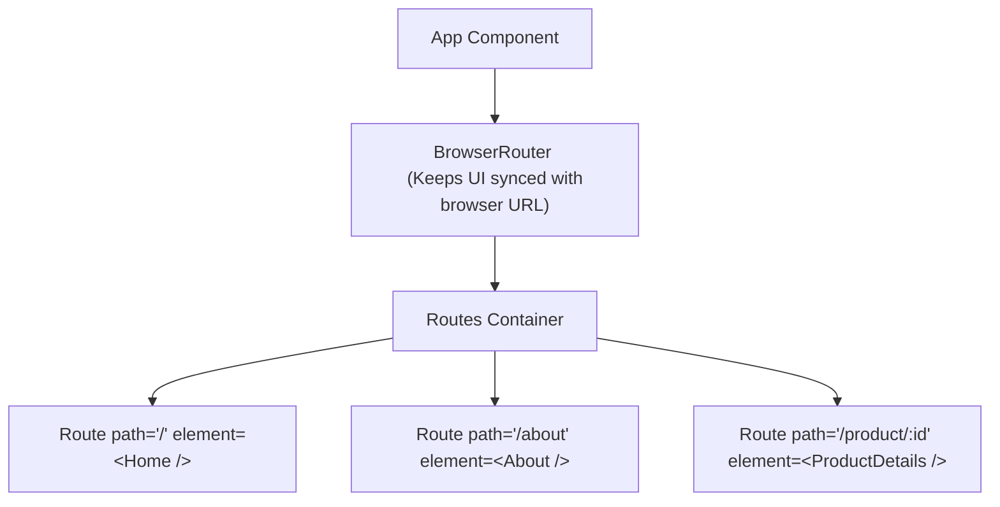

# 08 - React Router & Navigation

In traditional websites, navigating between pages requires fetching an entirely new HTML document from the server. In modern Single Page Applications (SPAs), navigation happens instantly in client-side memory. **React Router** (specifically `react-router-dom`) is the industry-standard library for client-side routing in React.

---

## 🧭 Client-Side vs. Server-Side Routing

| Feature | Server-Side Routing (Traditional) | Client-Side Routing (React Router) |
| :--- | :--- | :--- |
| **Request Cycle** | Clicking a link requests a brand-new page from the server. | Intercepts link clicks, updates browser URL via HTML5 History API, and renders appropriate React components. |
| **Page Flash** | Yes, browser clears the window and redraws the whole DOM. | No, only the changing parts of the page re-render seamlessly. |
| **Speed** | Slow (network-bound for every page click). | Instant (JavaScript swap-out of virtual nodes). |

---

## 🛠️ Setting Up React Router (v6+)

Install the package via npm/pnpm first:
```bash
npm install react-router-dom
```

### Basic Architecture Flow



### Complete Code Implementation
```jsx
import { BrowserRouter, Routes, Route, Link, NavLink } from "react-router-dom";

function Home() { return <h1>Welcome Home</h1>; }
function About() { return <h1>About Us</h1>; }

export default function App() {
  return (
    <BrowserRouter>
      <nav>
        {/* Link prevents page refresh, unlike <a href> */}
        <Link to="/">Home</Link>
        
        {/* NavLink automatically adds an "active" class when URL matches 'to' */}
        <NavLink to="/about" className={({ isActive }) => isActive ? "active-link" : ""}>
          About
        </NavLink>
      </nav>

      <Routes>
        <Route path="/" element={<Home />} />
        <Route path="/about" element={<About />} />
        <Route path="*" element={<h1>404 Page Not Found</h1>} />
      </Routes>
    </BrowserRouter>
  );
}
```

---

## 🌀 Dynamic Routing & Hooks

Real-world projects require routes that adapt to dynamic data (e.g., fetching a product based on its ID in the URL `/product/123`).

### 1. URL Parameters (`useParams`)
Define parameters in the path with a colon prefix (`:parameterName`).

```jsx
import { useParams } from "react-router-dom";

// Route declaration: <Route path="/product/:productId" element={<ProductDetail />} />
export function ProductDetail() {
  const { productId } = useParams(); // Extracts parameter from URL

  return (
    <div>
      <h2>Viewing details for Product ID: {productId}</h2>
    </div>
  );
}
```

### 2. Query Parameters (`useSearchParams`)
Used for optional routing data like search queries, page pagination, and filters (e.g. `/shop?category=shoes&sort=price`).

```jsx
import { useSearchParams } from "react-router-dom";

export function SearchPage() {
  const [searchParams, setSearchParams] = useSearchParams();
  const category = searchParams.get("category"); // Read parameter

  return (
    <div>
      <h3>Filtered Category: {category}</h3>
      <button onClick={() => setSearchParams({ category: "books" })}>
        Switch to Books
      </button>
    </div>
  );
}
```

### 3. Programmatic Navigation (`useNavigate`)
Sometimes, you need to redirect users to a new page automatically after an action (e.g., redirecting to the `/dashboard` after a successful login).

```jsx
import { useNavigate } from "react-router-dom";

export function LoginPage() {
  const navigate = useNavigate();

  const handleLogin = () => {
    // 1. Perform login API call logic...
    // 2. Redirect programmatically
    navigate("/dashboard", { replace: true }); // 'replace: true' overwrites history stack (prevents back button)
  };

  return <button onClick={handleLogin}>Log In</button>;
}
```

---

## 🗂️ Nested Routes & Layouts

Nested routing allows you to define sub-routes and display consistent layout frames (like navbars or sidebars) around child pages without duplicate code.

```jsx
import { Routes, Route, Outlet } from "react-router-dom";

// 1. Layout Component
function DashboardLayout() {
  return (
    <div className="dashboard-grid">
      <aside>Dashboard Sidebar Navigation</aside>
      <main>
        {/* Outlet acts as a slot where the matching sub-component is rendered */}
        <Outlet />
      </main>
    </div>
  );
}

// 2. Nested Route Setup
export function AppRouter() {
  return (
    <Routes>
      <Route path="/dashboard" element={<DashboardLayout />}>
        {/* Child paths resolve relative to /dashboard: */}
        <Route path="analytics" element={<Analytics />} /> {/* /dashboard/analytics */}
        <Route path="settings" element={<Settings />} />   {/* /dashboard/settings */}
      </Route>
    </Routes>
  );
}
```

---

## 🛡️ Protected / Guarded Routes

To secure dashboards from unauthorized guests, wrap secure routes in a custom `<ProtectedRoute>` component.

```jsx
import { Navigate, Outlet } from "react-router-dom";

// 1. Guard Component
function ProtectedRoute({ isAuthenticated }) {
  if (!isAuthenticated) {
    // Navigate acts as a declarative redirect component
    return <Navigate to="/login" replace />;
  }

  // If authenticated, render the children/outlets
  return <Outlet />;
}

// 2. Usage in Routes
export function App() {
  const userLoggedIn = false; // Mock Auth State

  return (
    <Routes>
      <Route path="/login" element={<LoginPage />} />
      
      {/* Protected Layout Area */}
      <Route element={<ProtectedRoute isAuthenticated={userLoggedIn} />}>
        <Route path="/dashboard" element={<Dashboard />} />
        <Route path="/profile" element={<Profile />} />
      </Route>
    </Routes>
  );
}
```

---

## 💼 Placement & Interview Q&A

### Q1: How does client-side routing work under the hood without reloading the browser page?
**Answer:** It uses the HTML5 **History API** (`history.pushState` and `history.replaceState`) and the `popstate` event. These features allow JavaScript to manipulate the browser’s address bar URL programmatically without forcing a server request. The router listens for URL changes and immediately swaps out the visible React component tree in memory.

### Q2: What is the purpose of the `<Outlet />` component?
**Answer:** The `<Outlet />` component is a placeholder component used in parent layouts. It tells React Router exactly where to render child components of a nested route. Without `<Outlet />`, the child routes of a nested path will not render on screen.

### Q3: What is the difference between `<Link>` and a traditional HTML `<a>` tag in React?
**Answer:** 
* A traditional `<a>` tag triggers a default browser reload behavior, clearing the current React application state and re-fetching the index HTML.
* The `<Link>` (and `<NavLink>`) component intercepts the default click event, blocks the browser reload, and updates the URL smoothly, maintaining the React in-memory state.

### Q4: What is the difference between `Link` and `NavLink`?
**Answer:** Both route to a destination. However, `<NavLink>` is a specialized subclass of `<Link>` that has access to the current routing match. It allows developers to dynamically apply custom styling or CSS active-classes (`.active`) to highlight which link corresponds to the currently active page.

### Q5: How do you handle redirection programmatically vs. declaratively in React Router?
**Answer:**
* **Programmatically:** Use the `useNavigate` hook inside click or submit event handler functions. Excellent for action-driven redirects (e.g., `navigate("/home")`).
* **Declaratively:** Use the `<Navigate to="/path" />` component within rendering code. Excellent for state-driven conditions (e.g., checking authentication inside a Protected Route structure and returning a redirect component).

---

## 🔗 Related Concepts
- [[03 - Components & Props]] — Passing configuration to guarded route layouts
- [[05 - Hooks & useEffect Hook]] — Query parameters trigger effects
- [[09 - Global State Management & Context API]] — Storing authentication state parsed by router guards
- [[10 - Practical Project Guide - Todo List and Beyond]] — Adding page-specific views to projects