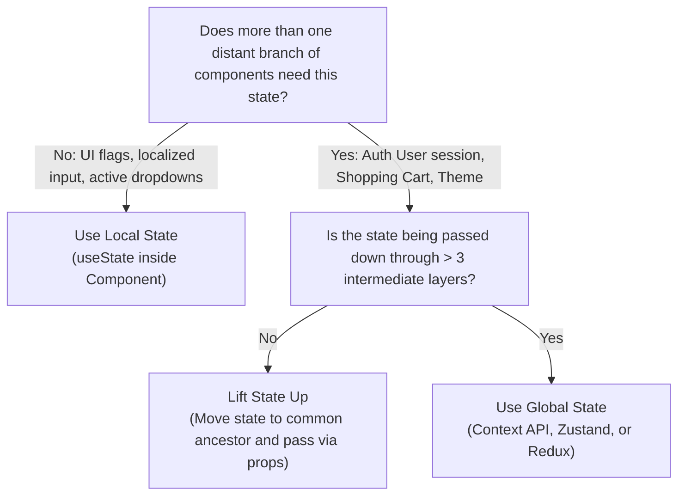

# 09 - Global State Management & Context API

As a React application expands, managing state can become complicated. State must often be accessed by distant components, leading to prop drilling. To solve this, developers use **Global State Management** patterns. This note covers React's built-in **Context API** and introduces modern alternative state-management libraries like **Zustand** and **Redux**.

---

## ⚖️ When to Use Local State vs. Global State

Before reaching for a global state solution, ask yourself: *"Who needs access to this state?"*



---

## 🛠️ Step-by-Step Context API Implementation

The **Context API** is React's built-in dependency injection system. It consists of:
1. **`createContext()`** — Defines the data container.
2. **`Provider`** — Wraps a subtree and provides the data.
3. **`useContext()`** — Consumes the data from any component in that subtree.

### Production-Ready Authentication Context Pattern

Here is the industry-standard folder structure pattern:

```jsx
// src/context/AuthContext.js
import { createContext, useContext, useState, useEffect } from "react";

// 1. Create the Context
const AuthContext = createContext(null);

// 2. Custom Provider Component
export function AuthProvider({ children }) {
  const [user, setUser] = useState(null);
  const [loading, setLoading] = useState(true);

  useEffect(() => {
    // Simulate reading active token on load
    const savedUser = localStorage.getItem("user");
    if (savedUser) setUser(JSON.parse(savedUser));
    setLoading(false);
  }, []);

  const login = (userData) => {
    setUser(userData);
    localStorage.setItem("user", JSON.stringify(userData));
  };

  const logout = () => {
    setUser(null);
    localStorage.removeItem("user");
  };

  return (
    <AuthContext.Provider value={{ user, loading, login, logout }}>
      {children}
    </AuthContext.Provider>
  );
}

// 3. Custom Hook for clean consumption + Safety Guard
export function useAuth() {
  const context = useContext(AuthContext);
  
  // Safety Guard: Throws error if used outside Provider
  if (!context) {
    throw new Error("useAuth must be used within an AuthProvider");
  }
  return context;
}
```

### Usage in Application
```jsx
// src/App.js
import { AuthProvider } from "./context/AuthContext";
import { MainComponent } from "./components/MainComponent";

export default function App() {
  return (
    <AuthProvider>
      <MainComponent />
    </AuthProvider>
  );
}
```

---

## ⚠️ The Performance Bottleneck of Context API

A common mistake is treating Context API as a generic state manager for highly active data (e.g. coordinates of a dragging slider or typing updates). 

### The Re-render Issue
When a Context Provider's `value` changes, **every single component that calls `useContext` for that context will re-render**. 

If your value object contains:
```javascript
value={{ user, login, logout, activeTheme }}
```
If only `activeTheme` changes, any component that only uses `user` (and doesn't care about the theme) is still forced to re-render.

### How to Mitigate Context Re-renders
1. **Split Contexts:** Create separate contexts for slow-changing variables (e.g. `AuthContext` vs. fast-changing UI interactions like `ThemeContext` or `CartContext`).
2. **Memoize Provider Values:** Wrap values in `useMemo` so reference comparisons do not fail on unrelated re-renders.
```jsx
const providerValue = useMemo(() => ({ user, login, logout }), [user]);
```

---

## 🪐 Modern State Management Libraries

For highly interactive, state-heavy, large-scale applications, external state managers are preferred because they support **selective rendering** (re-rendering *only* when the specific sliced state you are listening to changes).

### 🥇 Zustand (Highly Recommended)
Zustand is a fast, lightweight, and extremely developer-friendly state manager. It requires zero boilerplate compared to Redux, does not use providers, and uses selectors for performance.

```jsx
import { create } from "zustand";

// 1. Create a Store (Hook-based)
const useCartStore = create((set) => ({
  cart: [],
  addItem: (item) => set((state) => ({ cart: [...state.cart, item] })),
  clearCart: () => set({ cart: [] }),
}));

// 2. Component consumption using SELECTORS
export function CartCounter() {
  // Select only the 'cart' state. Component only re-renders if 'cart' changes.
  const cartSize = useCartStore((state) => state.cart.length);
  return <div>Items in Cart: {cartSize}</div>;
}

export function AddButton() {
  const addItem = useCartStore((state) => state.addItem);
  return <button onClick={() => addItem({ id: 1, name: "Apple" })}>Add Apple</button>;
}
```

---

### 🥈 Redux Toolkit (RTK)
Redux is an architectural standard in older or enterprise-level applications. **Redux Toolkit (RTK)** is the modern, official way to write Redux, eliminating historical boilerplate code.

* **Slices:** Bundles state, actions, and reducers together.
* **Store:** Holds the centralized global state tree.
* **Hooks:** `useSelector` to read state and `useDispatch` to send actions.

```jsx
import { createSlice, configureStore } from "@reduxjs/toolkit";

// 1. Create Slice
const counterSlice = createSlice({
  name: "counter",
  initialState: { value: 0 },
  reducers: {
    increment: (state) => { state.value += 1; }, // RTK allows safe "mutation-style" updates via Immer under-the-hood
  },
});

export const { increment } = counterSlice.actions;

// 2. Create Store
export const store = configureStore({
  reducer: { counter: counterSlice.reducer },
});
```

---

## 💼 Placement & Interview Q&A

### Q1: Is the Context API a State Management Tool?
**Answer:** **No.** This is a critical interview clarification. Context is a **dependency injection** mechanism. It is simply a way to transport data from point A to point B without manual prop drilling. The *state management* is still handled by React's standard `useState` or `useReducer` hooks inside the provider.

### Q2: Why is Zustand or Redux preferred over Context API for fast-updating state?
**Answer:** Because of **rendering performance**. Context API lacks "state selectors." If any part of the Context's value object is updated, *all* consumer components re-render. 
Zustand and Redux allow components to write **selectors** (e.g. `useCartStore(state => state.items)`). The component will *only* re-render if the specifically selected slice of state changes, preventing unnecessary rendering sweeps across the application.

### Q3: Why is throwing an error inside a Context hook if `context === null` a good practice?
**Answer:** It acts as a fail-safe. If someone tries to use the custom context hook (`useAuth()`) in a component that is not nested inside the provider (`<AuthProvider>`), React will throw a clear, descriptive error during development instead of failing silently with cryptic `Cannot read properties of null` runtime errors.

### Q4: What is "Prop Drilling" and how can it be avoided?
**Answer:** Prop drilling is the process of passing props down several levels of a component tree to a deeply nested child that needs it, forcing intermediate components to take props they don't use. It can be avoided using:
1. **Context API** (Injecting dependency directly to child).
2. **Zustand or Redux stores**.
3. **Component Composition:** Passing the nested child directly as a `children` prop down through the tree.

---

## 🔗 Related Concepts
- [[03 - Components & Props]] — Understanding prop drilling and composition
- [[04 - State & useState Hook]] — Context providers use state under-the-hood
- [[06 - Advanced Built-in Hooks]] — `useContext` and performance hooks
- [[10 - Practical Project Guide - Todo List and Beyond]] — Applying global state concepts to interactive apps