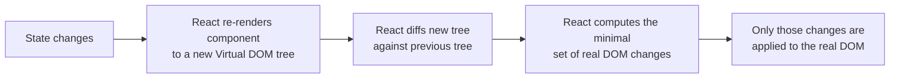

# React

## What is it?

**React** is a JavaScript library for building user interfaces, created by Facebook. Instead of manually writing code that finds a piece of a webpage and edits it (e.g. `document.getElementById("count").innerText = 5`), you describe **what the UI should look like for a given state**, and React figures out how to update the actual page to match.

This is called **declarative** UI programming, as opposed to the **imperative** style of plain JavaScript DOM manipulation:

- **Imperative** ("how"): "Find this element. Change its text. Add this class. Remove that child."
- **Declarative** ("what"): "When `count` is 5, the button should show `Count: 5`." You write this once; React handles the updating every time `count` changes.

## Why does it exist?

Before React, most sites updated the DOM (Document Object Model — the browser's in-memory tree representation of your HTML) directly and imperatively with plain JavaScript or jQuery. As applications grew — many interacting pieces of UI, each needing to update in response to data changes — this became hard to manage: you had to manually track *which* parts of the page needed updating *when* the underlying data changed, and bugs from forgetting to update some part of the DOM were common.

React solves this with two core ideas:

1. **Component-based architecture** — break the UI into small, independent, reusable pieces ([[Components and Props|components]]), each responsible for its own piece of the page.
2. **Declarative rendering** — you describe the UI as a function of your data (`UI = f(state)`). When the data changes, you don't touch the DOM yourself; you just update the data, and React re-renders the affected UI automatically.

## How does it work? The Virtual DOM

Directly manipulating the real DOM is relatively slow. React keeps a lightweight in-memory copy of the UI structure called the **Virtual DOM**. When state changes:

This diffing process is called **reconciliation**. The practical benefit: you write code as if the entire component re-renders from scratch on every change, which is simple to reason about, while React ensures only the parts that actually changed touch the slow real DOM.

## Core building blocks

React is learned in these pieces, each with its own note:

- [[JSX]] — the HTML-like syntax used to describe UI inside JavaScript
- [[Components and Props]] — reusable UI pieces and how data flows into them
- [[State (useState)]] — data a component owns and can update, which triggers re-renders
- [[Hooks and useEffect]] — functions that let components use state, side effects, and other React features
- [[React Common Mistakes and Edge Cases]] — pitfalls to know once you're writing real components
- [[Package Managers and Build Tools]] — how to actually scaffold and run a React project (npm/pnpm/yarn + Vite/Next.js)

## When to use

- Interactive UIs with lots of dynamic, changing data (dashboards, forms, feeds, chat apps)
- Applications built from reusable pieces (design systems, component libraries)
- Single-page applications (SPAs) where navigation happens without full page reloads
- When you want a huge ecosystem of libraries, tooling, and hiring pool (React is the most widely used frontend library as of 2026)

## When not to use

- A mostly static page (a landing page, a blog) — plain HTML/CSS or a static site generator is simpler and faster to ship
- Very small interactive widgets where the overhead of a build pipeline isn't worth it — vanilla JS or a lighter library may suffice
- SEO-critical content that needs to be crawlable without JavaScript execution — mitigated by frameworks like **Next.js** which add server-side rendering on top of React, but plain client-side React alone renders an empty page until JS loads

## Related concepts

- [[Functions in JavaScript]] — components are just JavaScript functions
- [[Closures]] — Hooks rely on closures to "remember" values across renders
- [[REST APIs]] — the typical way React apps fetch data from a backend
- [[JSON]] — the format data usually arrives in from those API calls

## Open Questions / To Explore Later

- Component composition patterns (children props, render props, compound components)
- Context API and global state management (Redux, Zustand)
- `useMemo` / `useCallback` / `React.memo` for performance optimization
- Next.js and server-side rendering / server components
- Custom hooks — extracting reusable stateful logic
- Routing (React Router / Next.js routing)
