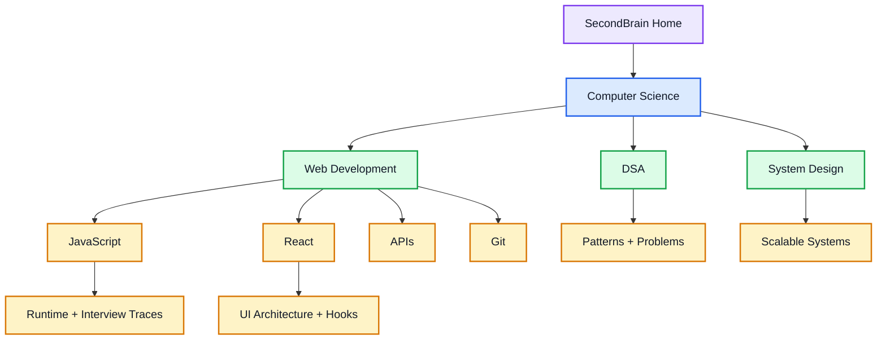
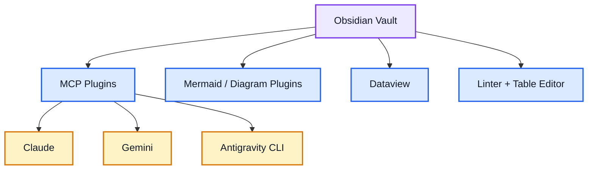

# SecondBrain — Vault Home

This vault is the central workspace for computer science notes, placement prep, DSA, system design, and web-development learning.

## 🧭 Vault Navigation Map



## 📌 Primary Maps of Content

- [[Computer Science/System Design/System Design MOC|System Design MOC]]
- [[Computer Science/Web Development/JavaScript/JavaScript MOC|JavaScript MOC]]
- [[Computer Science/Web Development/React/00 - React MOC|React MOC]]
- [[Computer Science/Web Development/APIs/API|API Master Guide]]

## 🔌 Connected Tooling



## Recently Updated Notes

```dataview
TABLE file.mtime AS "Modified", tags AS "Tags"
FROM "Computer Science"
SORT file.mtime DESC
LIMIT 12
```
